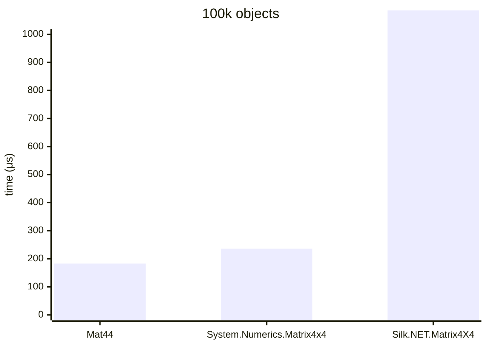
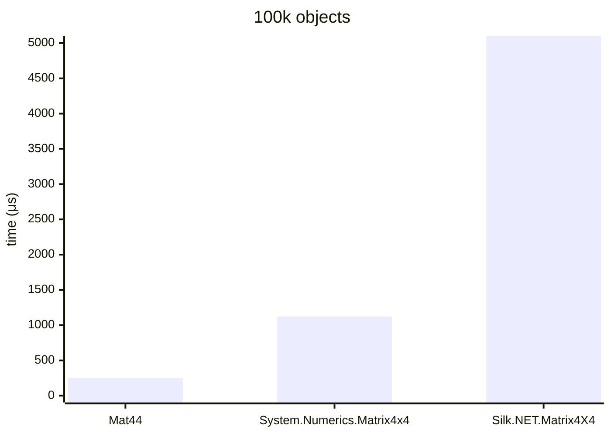
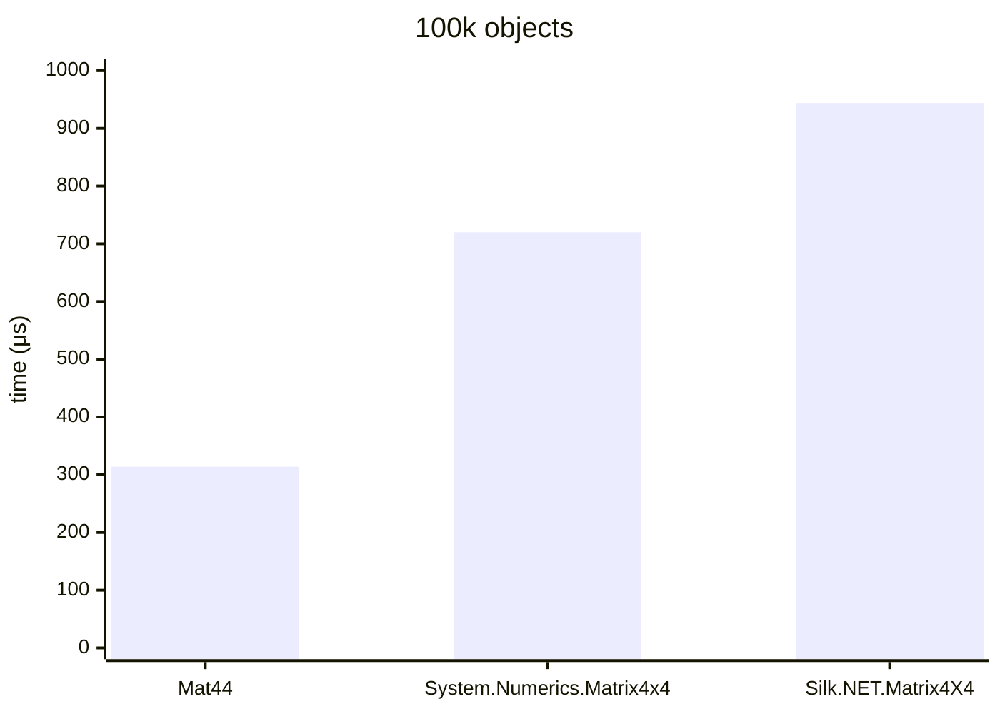

.NET 10.0.626.17701, X64 RyuJIT x86-64-v4, Windows 11 26200.8246, AMD Ryzen 9 7900X 4.70GHz

# Rotation (from quaternion)



### Mat44&lt;float&gt;

<details>
<summary>asm</summary>

```assembly
; System.Numerics.Bench.StressMat44WithQuat`1[[System.Single, System.Private.CoreLib]].Rotation()
       sub       rsp,28
       xor       eax,eax
       vbroadcastss xmm0,dword ptr [7FFF431CA970]
M00_L00:
       mov       rdx,[rcx+10]
       mov       r8,[rcx+18]
       cmp       eax,[r8+8]
       jae       near ptr M00_L01
       mov       r10d,eax
       mov       r9,r10
       shl       r9,4
       vmovups   xmm1,[r8+r9+10]
       vpshufd   xmm2,xmm1,0C9
       vpshufd   xmm3,xmm1,0FF
       vpshufd   xmm4,xmm1,0D2
       vmulps    xmm2,xmm2,xmm1
       vmulps    xmm3,xmm4,xmm3
       vmulps    xmm1,xmm1,xmm1
       vaddps    xmm5,xmm2,xmm3
       vsubps    xmm4,xmm2,xmm3
       vaddps    xmm5,xmm5,xmm5
       vaddps    xmm4,xmm4,xmm4
       vpshufd   xmm2,xmm1,0C9
       vaddps    xmm1,xmm2,xmm1
       vaddps    xmm1,xmm1,xmm1
       vsubps    xmm1,xmm0,xmm1
       vmovshdup xmm3,xmm1
       vinsertps xmm2,xmm4,xmm3,0
       vmovaps   xmm3,xmm5
       vinsertps xmm2,xmm2,xmm3,10
       vunpckhps xmm3,xmm1,xmm1
       vinsertps xmm3,xmm4,xmm3,10
       vmovshdup xmm16,xmm5
       vinsertps xmm3,xmm3,xmm16,20
       vunpckhps xmm5,xmm5,xmm5
       vinsertps xmm4,xmm4,xmm5,0
       vinsertps xmm4,xmm4,xmm1,20
       cmp       eax,[rdx+8]
       jae       short M00_L01
       shl       r10,6
       lea       rdx,[rdx+r10+10]
       vmovups   [rdx],xmm2
       vmovups   [rdx+10],xmm3
       vmovups   [rdx+20],xmm4
       vmovups   xmm1,[7FFF431CA980]
       vmovups   [rdx+30],xmm1
       inc       eax
       cmp       eax,186A0
       jl        near ptr M00_L00
       add       rsp,28
       ret
M00_L01:
       call      CORINFO_HELP_RNGCHKFAIL
       int       3
; Total bytes of code 234
```
</details>

### System.Numerics.Matrix4x4

<details>
<summary>asm</summary>

```assembly
; System.Numerics.Bench.StressMatrix4x4.Rotation()
       sub       rsp,28
       xor       eax,eax
       vmovss    xmm0,dword ptr [7FFF431AA9B0]
       vmovss    xmm1,dword ptr [7FFF431AA9B4]
       vmovups   xmm2,[7FFF431AA9C0]
M00_L00:
       mov       rdx,[rcx+10]
       mov       r8,[rcx+18]
       cmp       eax,[r8+8]
       jae       near ptr M00_L01
       mov       r10d,eax
       mov       r9,r10
       shl       r9,4
       vmovups   xmm3,[r8+r9+10]
       vmovaps   xmm4,xmm3
       vmulss    xmm5,xmm4,xmm4
       vmovshdup xmm16,xmm3
       vmulss    xmm17,xmm16,xmm16
       vunpckhps xmm18,xmm3,xmm3
       vmulss    xmm19,xmm18,xmm18
       vmulss    xmm20,xmm4,xmm16
       vshufps   xmm3,xmm3,xmm3,0FF
       vmulss    xmm21,xmm18,xmm3
       vmulss    xmm22,xmm18,xmm4
       vmulss    xmm23,xmm16,xmm3
       vmulss    xmm16,xmm16,xmm18
       vmulss    xmm3,xmm4,xmm3
       vaddss    xmm4,xmm17,xmm19
       vmulss    xmm4,xmm4,xmm0
       vsubss    xmm4,xmm1,xmm4
       vaddss    xmm18,xmm20,xmm21
       vmulss    xmm18,xmm18,xmm0
       vinsertps xmm4,xmm4,xmm18,10
       vsubss    xmm18,xmm22,xmm23
       vmulss    xmm18,xmm18,xmm0
       vinsertps xmm4,xmm4,xmm18,28
       vsubss    xmm18,xmm20,xmm21
       vmulss    xmm18,xmm18,xmm0
       vaddss    xmm19,xmm19,xmm5
       vmulss    xmm19,xmm19,xmm0
       vsubss    xmm19,xmm1,xmm19
       vinsertps xmm18,xmm18,xmm19,10
       vaddss    xmm19,xmm16,xmm3
       vmulss    xmm19,xmm19,xmm0
       vinsertps xmm18,xmm18,xmm19,28
       vaddss    xmm19,xmm22,xmm23
       vmulss    xmm19,xmm19,xmm0
       vsubss    xmm3,xmm16,xmm3
       vmulss    xmm3,xmm3,xmm0
       vinsertps xmm3,xmm19,xmm3,10
       vaddss    xmm5,xmm17,xmm5
       vmulss    xmm5,xmm5,xmm0
       vsubss    xmm5,xmm1,xmm5
       vinsertps xmm3,xmm3,xmm5,28
       cmp       eax,[rdx+8]
       jae       short M00_L01
       shl       r10,6
       lea       rdx,[rdx+r10+10]
       vmovups   [rdx],xmm4
       vmovups   [rdx+10],xmm18
       vmovups   [rdx+20],xmm3
       vmovups   xmm3,[7FFF431AA9C0]
       vmovups   [rdx+30],xmm3
       inc       eax
       cmp       eax,186A0
       jl        near ptr M00_L00
       add       rsp,28
       ret
M00_L01:
       call      CORINFO_HELP_RNGCHKFAIL
       int       3
; Total bytes of code 360
```
</details>

### Silk.NET.Matrix4X4&lt;float&gt;

<details>
<summary>asm</summary>

```assembly
; System.Numerics.Bench.StressMatrix4X4WithQuaternion`1[[System.Single, System.Private.CoreLib]].Rotation()
       push      rdi
       push      rsi
       push      rbx
       sub       rsp,70
       mov       rbx,rcx
       xor       esi,esi
M00_L00:
       mov       rdi,[rbx+10]
       mov       rdx,[rbx+28]
       cmp       esi,[rdx+8]
       jae       short M00_L01
       mov       rcx,rsi
       shl       rcx,4
       vmovups   xmm0,[rdx+rcx+10]
       vmovups   [rsp+20],xmm0
       lea       rdx,[rsp+20]
       lea       rcx,[rsp+30]
       call      qword ptr [7FFF43564D68]; Silk.NET.Maths.Matrix4X4.CreateFromQuaternion[[System.Single, System.Private.CoreLib]](Silk.NET.Maths.Quaternion`1<Single>)
       cmp       esi,[rdi+8]
       jae       short M00_L01
       mov       rax,rsi
       shl       rax,6
       vmovdqu32 zmm0,[rsp+30]
       vmovdqu32 [rdi+rax+10],zmm0
       inc       esi
       cmp       esi,186A0
       jl        short M00_L00
       vzeroupper
       add       rsp,70
       pop       rbx
       pop       rsi
       pop       rdi
       ret
M00_L01:
       call      CORINFO_HELP_RNGCHKFAIL
       int       3
; Total bytes of code 121
```
```assembly
; Silk.NET.Maths.Matrix4X4.CreateFromQuaternion[[System.Single, System.Private.CoreLib]](Silk.NET.Maths.Quaternion`1<Single>)
       sub       rsp,48
       vmovss    xmm0,dword ptr [rdx]
       vmovss    xmm1,dword ptr [rdx+4]
       vmovss    xmm2,dword ptr [rdx+8]
       vmovss    xmm3,dword ptr [rdx+0C]
       mov       rax,2D957F88D28
       vmovdqu32 zmm4,[rax]
       vmovdqu32 [rsp+8],zmm4
       vmulss    xmm4,xmm0,xmm0
       vmulss    xmm5,xmm1,xmm1
       vmulss    xmm16,xmm2,xmm2
       vmulss    xmm17,xmm0,xmm1
       vmulss    xmm18,xmm2,xmm3
       vmulss    xmm19,xmm2,xmm0
       vmulss    xmm20,xmm1,xmm3
       vmulss    xmm1,xmm1,xmm2
       vmulss    xmm0,xmm0,xmm3
       vmovdqu32 zmm2,[rsp+8]
       vmovdqu32 [rcx],zmm2
       vaddss    xmm2,xmm5,xmm16
       vmovss    xmm3,dword ptr [7FFF431BBAF0]
       vmulss    xmm2,xmm2,xmm3
       vmovss    xmm21,dword ptr [7FFF431BBAF4]
       vsubss    xmm2,xmm21,xmm2
       vmovss    dword ptr [rcx],xmm2
       vaddss    xmm2,xmm17,xmm18
       vmulss    xmm2,xmm2,xmm3
       vmovss    dword ptr [rcx+4],xmm2
       vsubss    xmm2,xmm19,xmm20
       vmulss    xmm2,xmm2,xmm3
       vmovss    dword ptr [rcx+8],xmm2
       vsubss    xmm2,xmm17,xmm18
       vmulss    xmm2,xmm2,xmm3
       vmovss    dword ptr [rcx+10],xmm2
       vaddss    xmm2,xmm16,xmm4
       vmulss    xmm2,xmm2,xmm3
       vsubss    xmm2,xmm21,xmm2
       vmovss    dword ptr [rcx+14],xmm2
       vaddss    xmm2,xmm1,xmm0
       vmulss    xmm2,xmm2,xmm3
       vmovss    dword ptr [rcx+18],xmm2
       vaddss    xmm2,xmm19,xmm20
       vmulss    xmm2,xmm2,xmm3
       vmovss    dword ptr [rcx+20],xmm2
       vsubss    xmm0,xmm1,xmm0
       vmulss    xmm0,xmm0,xmm3
       vmovss    dword ptr [rcx+24],xmm0
       vaddss    xmm0,xmm5,xmm4
       vmulss    xmm0,xmm0,xmm3
       vsubss    xmm0,xmm21,xmm0
       vmovss    dword ptr [rcx+28],xmm0
       mov       rax,rcx
       vzeroupper
       add       rsp,48
       ret
; Total bytes of code 288
```
</details></br>

# Affine (from quaternion, scale and translation vectors)



### Mat44&lt;float&gt;

<details>
<summary>asm</summary>

```assembly
; System.Numerics.Bench.StressMat44WithQuat`1[[System.Single, System.Private.CoreLib]].Affine()
       sub       rsp,48
       xor       eax,eax
       vbroadcastss xmm0,dword ptr [7FFF431CAB58]
M00_L00:
       mov       rdx,[rcx+10]
       mov       r8,[rcx+18]
       cmp       eax,[r8+8]
       jae       near ptr M00_L01
       mov       r10d,eax
       mov       r9,r10
       shl       r9,4
       vmovups   xmm1,[r8+r9+10]
       mov       r8,[rcx+20]
       cmp       eax,[r8+8]
       jae       near ptr M00_L01
       lea       r9,[r10+r10*2]
       mov       r11,[r8+r9*4+10]
       mov       [rsp+38],r11
       mov       r11d,[r8+r9*4+18]
       mov       [rsp+40],r11d
       mov       r8,[rcx+28]
       cmp       eax,[r8+8]
       jae       near ptr M00_L01
       mov       r11,[r8+r9*4+10]
       mov       [rsp+28],r11
       mov       r11d,[r8+r9*4+18]
       mov       [rsp+30],r11d
       vpshufd   xmm2,xmm1,0C9
       vpshufd   xmm3,xmm1,0FF
       vpshufd   xmm4,xmm1,0D2
       vmulps    xmm2,xmm2,xmm1
       vmulps    xmm3,xmm4,xmm3
       vmulps    xmm1,xmm1,xmm1
       vaddps    xmm5,xmm2,xmm3
       vsubps    xmm4,xmm2,xmm3
       vaddps    xmm5,xmm5,xmm5
       vaddps    xmm4,xmm4,xmm4
       vpshufd   xmm2,xmm1,0C9
       vaddps    xmm1,xmm2,xmm1
       vaddps    xmm1,xmm1,xmm1
       vsubps    xmm1,xmm0,xmm1
       vmovshdup xmm3,xmm1
       vinsertps xmm2,xmm4,xmm3,0
       vmovaps   xmm3,xmm5
       vinsertps xmm2,xmm2,xmm3,10
       vunpckhps xmm3,xmm1,xmm1
       vinsertps xmm3,xmm4,xmm3,10
       vmovshdup xmm16,xmm5
       vinsertps xmm3,xmm3,xmm16,20
       vunpckhps xmm5,xmm5,xmm5
       vinsertps xmm4,xmm4,xmm5,0
       vinsertps xmm4,xmm4,xmm1,20
       vmulps    xmm1,xmm2,dword bcst [rsp+38]
       vmulps    xmm2,xmm3,dword bcst [rsp+3C]
       vmulps    xmm3,xmm4,dword bcst [rsp+40]
       vmovsd    xmm4,qword ptr [rsp+28]
       vmovsd    xmm4,xmm0,xmm4
       vinsertps xmm4,xmm4,dword ptr [rsp+30],20
       cmp       eax,[rdx+8]
       jae       short M00_L01
       shl       r10,6
       lea       rdx,[rdx+r10+10]
       vmovups   [rdx],xmm1
       vmovups   [rdx+10],xmm2
       vmovups   [rdx+20],xmm3
       vmovups   [rdx+30],xmm4
       inc       eax
       cmp       eax,186A0
       jl        near ptr M00_L00
       add       rsp,48
       ret
M00_L01:
       call      CORINFO_HELP_RNGCHKFAIL
       int       3
; Total bytes of code 340
```
</details>

### System.Numerics.Matrix4x4

<details>
<summary>asm</summary>

```assembly
; System.Numerics.Bench.StressMatrix4x4.Affine()
       sub       rsp,118
       vmovaps   [rsp+100],xmm6
       vmovaps   [rsp+0F0],xmm7
       vmovaps   [rsp+0E0],xmm8
       vmovaps   [rsp+0D0],xmm9
       vmovaps   [rsp+0C0],xmm10
       vmovaps   [rsp+0B0],xmm11
       vmovaps   [rsp+0A0],xmm12
       vmovaps   [rsp+90],xmm13
       vmovaps   [rsp+80],xmm14
       vmovaps   [rsp+70],xmm15
       vxorps    xmm4,xmm4,xmm4
       vmovdqu32 [rsp+30],zmm4
       xor       eax,eax
       vmovups   xmm0,[7FFF431CC0D0]
       vmovaps   [rsp+20],xmm0
       vmovss    xmm1,dword ptr [7FFF431CC0E0]
       vmovss    xmm2,dword ptr [7FFF431CC0E0]
       vmovsd    xmm3,qword ptr [7FFF431CC0E8]
       vmovups   xmm4,[7FFF431CC0F0]
M00_L00:
       mov       rdx,[rcx+10]
       mov       r8,[rcx+20]
       cmp       eax,[r8+8]
       jae       near ptr M00_L01
       mov       r10d,eax
       lea       r9,[r10+r10*2]
       vmovsd    xmm5,qword ptr [r8+r9*4+10]
       vinsertps xmm5,xmm5,dword ptr [r8+r9*4+18],28
       vmovaps   xmm16,xmm5
       vinsertps xmm16,xmm16,xmm16,3E
       vmovaps   [rsp+30],xmm16
       vmovshdup xmm16,xmm5
       vinsertps xmm16,xmm16,xmm16,1D
       vmovaps   [rsp+40],xmm16
       vunpckhps xmm5,xmm5,xmm5
       vinsertps xmm5,xmm5,xmm5,2B
       vmovaps   [rsp+50],xmm5
       vmovaps   [rsp+60],xmm0
       vmovss    xmm5,dword ptr [rsp+30]
       vmovss    xmm16,dword ptr [rsp+34]
       vmovss    xmm17,dword ptr [rsp+38]
       vmovss    xmm18,dword ptr [rsp+3C]
       vmovss    xmm19,dword ptr [rsp+40]
       vmovss    xmm20,dword ptr [rsp+44]
       vmovss    xmm21,dword ptr [rsp+48]
       vmovss    xmm22,dword ptr [rsp+4C]
       vmovss    xmm23,dword ptr [rsp+50]
       vmovss    xmm24,dword ptr [rsp+54]
       vmovss    xmm25,dword ptr [rsp+58]
       vmovss    xmm26,dword ptr [rsp+5C]
       vmovss    xmm27,dword ptr [rsp+60]
       vmovss    xmm28,dword ptr [rsp+64]
       vmovss    xmm29,dword ptr [rsp+68]
       vmovss    xmm30,dword ptr [rsp+6C]
       mov       r8,[rcx+18]
       cmp       eax,[r8+8]
       jae       near ptr M00_L01
       mov       r11,r10
       shl       r11,4
       vmovups   xmm31,[r8+r11+10]
       vmovaps   xmm6,xmm31
       vaddss    xmm7,xmm6,xmm6
       vmovshdup xmm8,xmm31
       vaddss    xmm9,xmm8,xmm8
       vunpckhps xmm10,xmm31,xmm31
       vaddss    xmm11,xmm10,xmm10
       vshufps   xmm31,xmm31,xmm31,0FF
       vmulss    xmm12,xmm31,xmm7
       vmulss    xmm13,xmm31,xmm9
       vmulss    xmm31,xmm31,xmm11
       vmulss    xmm7,xmm6,xmm7
       vmulss    xmm14,xmm6,xmm11
       vmulss    xmm15,xmm8,xmm9
       vmulss    xmm8,xmm8,xmm11
       vmulss    xmm10,xmm10,xmm11
       vsubss    xmm11,xmm1,xmm15
       vsubss    xmm11,xmm11,xmm10
       vmulss    xmm6,xmm6,xmm9
       vsubss    xmm9,xmm6,xmm31
       vaddss    xmm0,xmm14,xmm13
       vaddss    xmm31,xmm6,xmm31
       vsubss    xmm6,xmm1,xmm7
       vsubss    xmm7,xmm6,xmm10
       vsubss    xmm10,xmm8,xmm12
       vsubss    xmm13,xmm14,xmm13
       vaddss    xmm8,xmm8,xmm12
       vsubss    xmm6,xmm6,xmm15
       vmulss    xmm12,xmm5,xmm11
       vmulss    xmm14,xmm16,xmm9
       vaddss    xmm12,xmm12,xmm14
       vmulss    xmm14,xmm17,xmm0
       vaddss    xmm12,xmm12,xmm14
       vmulss    xmm14,xmm5,xmm31
       vmulss    xmm15,xmm16,xmm7
       vaddss    xmm14,xmm14,xmm15
       vmulss    xmm15,xmm17,xmm10
       vaddss    xmm14,xmm14,xmm15
       vinsertps xmm12,xmm12,xmm14,10
       vmulss    xmm5,xmm5,xmm13
       vmulss    xmm16,xmm16,xmm8
       vaddss    xmm5,xmm5,xmm16
       vmulss    xmm16,xmm17,xmm6
       vaddss    xmm5,xmm5,xmm16
       vinsertps xmm5,xmm12,xmm5,20
       vinsertps xmm5,xmm5,xmm18,30
       vmulss    xmm16,xmm19,xmm11
       vmulss    xmm17,xmm20,xmm9
       vaddss    xmm16,xmm16,xmm17
       vmulss    xmm17,xmm21,xmm0
       vaddss    xmm16,xmm16,xmm17
       vmulss    xmm17,xmm19,xmm31
       vmulss    xmm18,xmm20,xmm7
       vaddss    xmm17,xmm17,xmm18
       vmulss    xmm18,xmm21,xmm10
       vaddss    xmm17,xmm17,xmm18
       vinsertps xmm16,xmm16,xmm17,10
       vmulss    xmm17,xmm19,xmm13
       vmulss    xmm18,xmm20,xmm8
       vaddss    xmm17,xmm17,xmm18
       vmulss    xmm18,xmm21,xmm6
       vaddss    xmm17,xmm17,xmm18
       vinsertps xmm16,xmm16,xmm17,20
       vinsertps xmm16,xmm16,xmm22,30
       vmulss    xmm17,xmm23,xmm11
       vmulss    xmm18,xmm24,xmm9
       vaddss    xmm17,xmm17,xmm18
       vmulss    xmm18,xmm25,xmm0
       vaddss    xmm17,xmm17,xmm18
       vmulss    xmm18,xmm23,xmm31
       vmulss    xmm19,xmm24,xmm7
       vaddss    xmm18,xmm18,xmm19
       vmulss    xmm19,xmm25,xmm10
       vaddss    xmm18,xmm18,xmm19
       vinsertps xmm17,xmm17,xmm18,10
       vmulss    xmm18,xmm23,xmm13
       vmulss    xmm19,xmm24,xmm8
       vaddss    xmm18,xmm18,xmm19
       vmulss    xmm19,xmm25,xmm6
       vaddss    xmm18,xmm18,xmm19
       vinsertps xmm17,xmm17,xmm18,20
       vinsertps xmm17,xmm17,xmm26,30
       vmulss    xmm18,xmm27,xmm11
       vmulss    xmm19,xmm28,xmm9
       vaddss    xmm18,xmm18,xmm19
       vmulss    xmm0,xmm29,xmm0
       vaddss    xmm0,xmm18,xmm0
       vmulss    xmm18,xmm27,xmm31
       vmulss    xmm19,xmm28,xmm7
       vaddss    xmm18,xmm18,xmm19
       vmulss    xmm19,xmm29,xmm10
       vaddss    xmm18,xmm18,xmm19
       vinsertps xmm0,xmm0,xmm18,10
       vmulss    xmm18,xmm27,xmm13
       vmulss    xmm19,xmm28,xmm8
       vaddss    xmm18,xmm18,xmm19
       vmulss    xmm19,xmm29,xmm6
       vaddss    xmm18,xmm18,xmm19
       vinsertps xmm0,xmm0,xmm18,20
       vinsertps xmm0,xmm0,xmm30,30
       mov       r8,[rcx+28]
       cmp       eax,[r8+8]
       jae       near ptr M00_L01
       vmovsd    xmm18,qword ptr [r8+r9*4+10]
       vinsertps xmm18,xmm18,dword ptr [r8+r9*4+18],28
       vmovaps   xmm19,xmm2
       vmovaps   xmm20,xmm3
       vmovaps   xmm21,xmm4
       vinsertps xmm18,xmm18,xmm1,30
       vunpckhps xmm22,xmm5,xmm5
       vbroadcastss xmm22,xmm22
       vmovshdup xmm23,xmm5
       vbroadcastss xmm23,xmm23
       vmovaps   xmm24,xmm5
       vbroadcastss xmm24,xmm24
       vmulps    xmm24,xmm24,xmm19
       vfmadd231ps xmm24,xmm23,xmm20
       vfmadd231ps xmm24,xmm22,xmm21
       vshufps   xmm5,xmm5,xmm5,0FF
       vbroadcastss xmm5,xmm5
       vfmadd231ps xmm24,xmm5,xmm18
       vunpckhps xmm5,xmm16,xmm16
       vbroadcastss xmm5,xmm5
       vmovshdup xmm22,xmm16
       vbroadcastss xmm22,xmm22
       vmovaps   xmm23,xmm16
       vbroadcastss xmm23,xmm23
       vmulps    xmm23,xmm23,xmm19
       vfmadd231ps xmm23,xmm22,xmm20
       vfmadd231ps xmm23,xmm5,xmm21
       vshufps   xmm5,xmm16,xmm16,0FF
       vbroadcastss xmm5,xmm5
       vfmadd231ps xmm23,xmm5,xmm18
       vunpckhps xmm5,xmm17,xmm17
       vbroadcastss xmm5,xmm5
       vmovshdup xmm16,xmm17
       vbroadcastss xmm16,xmm16
       vmovaps   xmm22,xmm17
       vbroadcastss xmm22,xmm22
       vmulps    xmm22,xmm22,xmm19
       vfmadd231ps xmm22,xmm16,xmm20
       vfmadd231ps xmm22,xmm5,xmm21
       vshufps   xmm5,xmm17,xmm17,0FF
       vbroadcastss xmm5,xmm5
       vfmadd231ps xmm22,xmm5,xmm18
       vunpckhps xmm5,xmm0,xmm0
       vbroadcastss xmm5,xmm5
       vmovshdup xmm16,xmm0
       vbroadcastss xmm16,xmm16
       vmovaps   xmm17,xmm0
       vbroadcastss xmm17,xmm17
       vmulps    xmm17,xmm17,xmm19
       vfmadd213ps xmm20,xmm16,xmm17
       vfmadd213ps xmm21,xmm5,xmm20
       vshufps   xmm0,xmm0,xmm0,0FF
       vbroadcastss xmm0,xmm0
       vfmadd213ps xmm18,xmm0,xmm21
       cmp       eax,[rdx+8]
       jae       near ptr M00_L01
       shl       r10,6
       lea       rdx,[rdx+r10+10]
       vmovups   [rdx],xmm24
       vmovups   [rdx+10],xmm23
       vmovups   [rdx+20],xmm22
       vmovups   [rdx+30],xmm18
       inc       eax
       cmp       eax,186A0
       vmovaps   xmm0,[rsp+20]
       jl        near ptr M00_L00
       vmovaps   xmm6,[rsp+100]
       vmovaps   xmm7,[rsp+0F0]
       vmovaps   xmm8,[rsp+0E0]
       vmovaps   xmm9,[rsp+0D0]
       vmovaps   xmm10,[rsp+0C0]
       vmovaps   xmm11,[rsp+0B0]
       vmovaps   xmm12,[rsp+0A0]
       vmovaps   xmm13,[rsp+90]
       vmovaps   xmm14,[rsp+80]
       vmovaps   xmm15,[rsp+70]
       add       rsp,118
       ret
M00_L01:
       call      CORINFO_HELP_RNGCHKFAIL
       int       3
; Total bytes of code 1476
```
</details>

### Silk.NET.Matrix4X4&lt;float&gt;

<details>
<summary>asm</summary>

```assembly
; System.Numerics.Bench.StressMatrix4X4WithQuaternion`1[[System.Single, System.Private.CoreLib]].Affine()
       push      rdi
       push      rsi
       push      rbp
       push      rbx
       sub       rsp,318
       vmovaps   [rsp+300],xmm6
       vmovaps   [rsp+2F0],xmm7
       vmovaps   [rsp+2E0],xmm8
       vmovaps   [rsp+2D0],xmm9
       vmovaps   [rsp+2C0],xmm10
       vmovaps   [rsp+2B0],xmm11
       vmovaps   [rsp+2A0],xmm12
       vmovaps   [rsp+290],xmm13
       vmovaps   [rsp+280],xmm14
       vmovaps   [rsp+270],xmm15
       vxorps    xmm4,xmm4,xmm4
       vmovdqu32 [rsp+1B0],zmm4
       mov       rbx,rcx
       xor       esi,esi
M00_L00:
       mov       rdi,[rbx+10]
       mov       r8,[rbx+18]
       cmp       esi,[r8+8]
       jae       near ptr M00_L01
       lea       rbp,[rsi+rsi*2]
       lea       r8,[r8+rbp*4+10]
       vmovss    xmm0,dword ptr [r8]
       vmovss    xmm1,dword ptr [r8+4]
       vmovss    xmm2,dword ptr [r8+8]
       mov       r8,24FCA7D8D28
       vmovdqu32 zmm3,[r8]
       vmovdqu32 [rsp+1B0],zmm3
       vmovss    dword ptr [rsp+1B0],xmm0
       vmovss    dword ptr [rsp+1C4],xmm1
       vmovss    dword ptr [rsp+1D8],xmm2
       mov       r8,[rbx+28]
       cmp       esi,[r8+8]
       jae       near ptr M00_L01
       mov       rdx,rsi
       shl       rdx,4
       vmovups   xmm0,[r8+rdx+10]
       vmovups   [rsp+40],xmm0
       lea       r8,[rsp+40]
       lea       rdx,[rsp+1B0]
       lea       rcx,[rsp+230]
       call      qword ptr [7FFF43554DB0]; Silk.NET.Maths.Matrix4X4.Transform[[System.Single, System.Private.CoreLib]](Silk.NET.Maths.Matrix4X4`1<Single>, Silk.NET.Maths.Quaternion`1<Single>)
       mov       rax,[rbx+20]
       cmp       esi,[rax+8]
       jae       near ptr M00_L01
       lea       rax,[rax+rbp*4+10]
       vmovss    xmm6,dword ptr [rax]
       vmovss    xmm7,dword ptr [rax+4]
       vmovss    xmm8,dword ptr [rax+8]
       vmovups   ymm0,[7FFF431B0F00]
       vmovups   [rsp+200],ymm0
       vmovss    xmm0,dword ptr [rsp+230]
       vmovss    xmm1,dword ptr [rsp+234]
       vmovss    xmm2,dword ptr [rsp+238]
       vmovss    xmm3,dword ptr [rsp+23C]
       vmovss    xmm4,dword ptr [rsp+240]
       vmovss    xmm5,dword ptr [rsp+244]
       vmovss    xmm16,dword ptr [rsp+248]
       vmovss    xmm17,dword ptr [rsp+24C]
       vmovss    xmm9,dword ptr [rsp+250]
       vmovss    xmm10,dword ptr [rsp+254]
       vmovss    xmm11,dword ptr [rsp+258]
       vmovss    xmm12,dword ptr [rsp+25C]
       vmovss    xmm13,dword ptr [rsp+260]
       vmovss    xmm14,dword ptr [rsp+264]
       vmovss    xmm15,dword ptr [rsp+268]
       vmovss    xmm18,dword ptr [rsp+26C]
       vmovss    dword ptr [rsp+54],xmm18
       vxorps    xmm19,xmm19,xmm19
       vmulss    xmm19,xmm0,xmm19
       vmovaps   xmm20,xmm19
       vmovss    xmm21,dword ptr [rsp+200]
       vmovss    xmm22,dword ptr [rsp+204]
       vmovss    xmm23,dword ptr [rsp+208]
       vmovss    xmm24,dword ptr [rsp+20C]
       vmulss    xmm21,xmm21,xmm1
       vmulss    xmm22,xmm22,xmm1
       vmulss    xmm23,xmm23,xmm1
       vmulss    xmm1,xmm24,xmm1
       vaddss    xmm0,xmm0,xmm21
       vaddss    xmm20,xmm20,xmm22
       vaddss    xmm21,xmm19,xmm23
       vaddss    xmm1,xmm19,xmm1
       vmovss    xmm19,dword ptr [rsp+210]
       vmovss    xmm22,dword ptr [rsp+214]
       vmovss    xmm23,dword ptr [rsp+218]
       vmovss    xmm24,dword ptr [rsp+21C]
       vmulss    xmm19,xmm19,xmm2
       vmulss    xmm22,xmm22,xmm2
       vmulss    xmm23,xmm23,xmm2
       vmulss    xmm2,xmm24,xmm2
       vaddss    xmm0,xmm0,xmm19
       vaddss    xmm19,xmm20,xmm22
       vaddss    xmm20,xmm21,xmm23
       vaddss    xmm1,xmm1,xmm2
       vmulss    xmm2,xmm6,xmm3
       vmulss    xmm21,xmm7,xmm3
       vmulss    xmm22,xmm8,xmm3
       vaddss    xmm0,xmm0,xmm2
       vmovss    dword ptr [rsp+9C],xmm0
       vaddss    xmm0,xmm19,xmm21
       vmovss    dword ptr [rsp+98],xmm0
       vaddss    xmm0,xmm20,xmm22
       vmovss    dword ptr [rsp+94],xmm0
       vaddss    xmm0,xmm1,xmm3
       vmovss    dword ptr [rsp+90],xmm0
       vxorps    xmm0,xmm0,xmm0
       vmulss    xmm0,xmm4,xmm0
       vmovaps   xmm1,xmm0
       vmovss    xmm21,dword ptr [rsp+200]
       vmovss    xmm22,dword ptr [rsp+204]
       vmovss    xmm23,dword ptr [rsp+208]
       vmovss    xmm24,dword ptr [rsp+20C]
       vmulss    xmm21,xmm21,xmm5
       vmulss    xmm22,xmm22,xmm5
       vmulss    xmm23,xmm23,xmm5
       vmulss    xmm5,xmm24,xmm5
       vaddss    xmm4,xmm4,xmm21
       vaddss    xmm1,xmm1,xmm22
       vaddss    xmm21,xmm0,xmm23
       vaddss    xmm0,xmm0,xmm5
       vmovss    xmm5,dword ptr [rsp+210]
       vmovss    xmm22,dword ptr [rsp+214]
       vmovss    xmm23,dword ptr [rsp+218]
       vmovss    xmm24,dword ptr [rsp+21C]
       vmulss    xmm5,xmm5,xmm16
       vmulss    xmm22,xmm22,xmm16
       vmulss    xmm23,xmm23,xmm16
       vmulss    xmm16,xmm24,xmm16
       vaddss    xmm4,xmm4,xmm5
       vaddss    xmm1,xmm1,xmm22
       vaddss    xmm5,xmm21,xmm23
       vaddss    xmm0,xmm0,xmm16
       vmulss    xmm16,xmm6,xmm17
       vmulss    xmm21,xmm7,xmm17
       vmulss    xmm22,xmm8,xmm17
       vaddss    xmm4,xmm4,xmm16
       vmovss    dword ptr [rsp+8C],xmm4
       vaddss    xmm1,xmm1,xmm21
       vmovss    dword ptr [rsp+88],xmm1
       vaddss    xmm1,xmm5,xmm22
       vmovss    dword ptr [rsp+84],xmm1
       vaddss    xmm0,xmm0,xmm17
       vmovss    dword ptr [rsp+80],xmm0
       vxorps    xmm0,xmm0,xmm0
       vmulss    xmm0,xmm9,xmm0
       vmovss    dword ptr [rsp+7C],xmm0
       vxorps    xmm0,xmm0,xmm0
       vmovaps   xmm1,xmm9
       call      qword ptr [7FFF43555368]; Silk.NET.Maths.Scalar.Multiply[[System.Single, System.Private.CoreLib]](Single, Single)
       vmovss    dword ptr [rsp+78],xmm0
       vxorps    xmm0,xmm0,xmm0
       vmovups   [rsp+68],xmm0
       vxorps    xmm0,xmm0,xmm0
       vmovaps   xmm1,xmm9
       call      qword ptr [7FFF43555368]; Silk.NET.Maths.Scalar.Multiply[[System.Single, System.Private.CoreLib]](Single, Single)
       vmovss    dword ptr [rsp+20],xmm0
       lea       rcx,[rsp+68]
       vmovaps   xmm1,xmm9
       vmovss    xmm2,dword ptr [rsp+7C]
       vmovss    xmm3,dword ptr [rsp+78]
       call      qword ptr [7FFF435552D8]; Silk.NET.Maths.Vector4D`1[[System.Single, System.Private.CoreLib]]..ctor(Single, Single, Single, Single)
       vmovups   xmm2,[rsp+68]
       vmovups   [rsp+1A0],xmm2
       vmovups   xmm2,[rsp+200]
       vmovups   [rsp+30],xmm2
       lea       rdx,[rsp+30]
       lea       rcx,[rsp+190]
       vmovaps   xmm2,xmm10
       call      qword ptr [7FFF43555950]; Silk.NET.Maths.Vector4D`1[[System.Single, System.Private.CoreLib]].op_Multiply(Silk.NET.Maths.Vector4D`1<Single>, Single)
       lea       rcx,[rsp+180]
       lea       rdx,[rsp+1A0]
       lea       r8,[rsp+190]
       call      qword ptr [7FFF43555908]; Silk.NET.Maths.Vector4D`1[[System.Single, System.Private.CoreLib]].op_Addition(Silk.NET.Maths.Vector4D`1<Single>, Silk.NET.Maths.Vector4D`1<Single>)
       vmovups   xmm2,[rsp+210]
       vmovups   [rsp+30],xmm2
       lea       rdx,[rsp+30]
       lea       rcx,[rsp+170]
       vmovaps   xmm2,xmm11
       call      qword ptr [7FFF43555950]; Silk.NET.Maths.Vector4D`1[[System.Single, System.Private.CoreLib]].op_Multiply(Silk.NET.Maths.Vector4D`1<Single>, Single)
       lea       rcx,[rsp+160]
       lea       rdx,[rsp+180]
       lea       r8,[rsp+170]
       call      qword ptr [7FFF43555908]; Silk.NET.Maths.Vector4D`1[[System.Single, System.Private.CoreLib]].op_Addition(Silk.NET.Maths.Vector4D`1<Single>, Silk.NET.Maths.Vector4D`1<Single>)
       vmovaps   xmm0,xmm6
       vmovaps   xmm1,xmm12
       call      qword ptr [7FFF43555368]; Silk.NET.Maths.Scalar.Multiply[[System.Single, System.Private.CoreLib]](Single, Single)
       vmovaps   xmm9,xmm0
       vmovaps   xmm0,xmm7
       vmovaps   xmm1,xmm12
       call      qword ptr [7FFF43555368]; Silk.NET.Maths.Scalar.Multiply[[System.Single, System.Private.CoreLib]](Single, Single)
       vmovaps   xmm10,xmm0
       vmovaps   xmm0,xmm8
       vmovaps   xmm1,xmm12
       call      qword ptr [7FFF43555368]; Silk.NET.Maths.Scalar.Multiply[[System.Single, System.Private.CoreLib]](Single, Single)
       vmovaps   xmm11,xmm0
       vxorps    xmm0,xmm0,xmm0
       vmovups   [rsp+58],xmm0
       vmovss    xmm0,dword ptr [7FFF431B0F20]
       vmovaps   xmm1,xmm12
       call      qword ptr [7FFF43555368]; Silk.NET.Maths.Scalar.Multiply[[System.Single, System.Private.CoreLib]](Single, Single)
       vmovss    dword ptr [rsp+20],xmm0
       lea       rcx,[rsp+58]
       vmovaps   xmm1,xmm9
       vmovaps   xmm2,xmm10
       vmovaps   xmm3,xmm11
       call      qword ptr [7FFF435552D8]; Silk.NET.Maths.Vector4D`1[[System.Single, System.Private.CoreLib]]..ctor(Single, Single, Single, Single)
       vmovups   xmm0,[rsp+58]
       vmovups   [rsp+30],xmm0
       lea       r8,[rsp+30]
       lea       rdx,[rsp+160]
       lea       rcx,[rsp+150]
       call      qword ptr [7FFF43555908]; Silk.NET.Maths.Vector4D`1[[System.Single, System.Private.CoreLib]].op_Addition(Silk.NET.Maths.Vector4D`1<Single>, Silk.NET.Maths.Vector4D`1<Single>)
       mov       dword ptr [rsp+1F0],3F800000
       xor       edx,edx
       mov       [rsp+1F4],edx
       mov       [rsp+1F8],edx
       mov       [rsp+1FC],edx
       vmovups   xmm2,[rsp+1F0]
       vmovups   [rsp+30],xmm2
       lea       rdx,[rsp+30]
       lea       rcx,[rsp+140]
       vmovaps   xmm2,xmm13
       call      qword ptr [7FFF43555950]; Silk.NET.Maths.Vector4D`1[[System.Single, System.Private.CoreLib]].op_Multiply(Silk.NET.Maths.Vector4D`1<Single>, Single)
       vmovups   xmm2,[rsp+200]
       vmovups   [rsp+30],xmm2
       lea       rdx,[rsp+30]
       lea       rcx,[rsp+130]
       vmovaps   xmm2,xmm14
       call      qword ptr [7FFF43555950]; Silk.NET.Maths.Vector4D`1[[System.Single, System.Private.CoreLib]].op_Multiply(Silk.NET.Maths.Vector4D`1<Single>, Single)
       lea       rcx,[rsp+120]
       lea       rdx,[rsp+140]
       lea       r8,[rsp+130]
       call      qword ptr [7FFF43555908]; Silk.NET.Maths.Vector4D`1[[System.Single, System.Private.CoreLib]].op_Addition(Silk.NET.Maths.Vector4D`1<Single>, Silk.NET.Maths.Vector4D`1<Single>)
       lea       rcx,[rsp+110]
       lea       rdx,[rsp+210]
       vmovaps   xmm2,xmm15
       call      qword ptr [7FFF43555950]; Silk.NET.Maths.Vector4D`1[[System.Single, System.Private.CoreLib]].op_Multiply(Silk.NET.Maths.Vector4D`1<Single>, Single)
       lea       rcx,[rsp+100]
       lea       rdx,[rsp+120]
       lea       r8,[rsp+110]
       call      qword ptr [7FFF43555908]; Silk.NET.Maths.Vector4D`1[[System.Single, System.Private.CoreLib]].op_Addition(Silk.NET.Maths.Vector4D`1<Single>, Silk.NET.Maths.Vector4D`1<Single>)
       vmovss    dword ptr [rsp+220],xmm6
       vmovss    dword ptr [rsp+224],xmm7
       vmovss    dword ptr [rsp+228],xmm8
       mov       dword ptr [rsp+22C],3F800000
       lea       rcx,[rsp+0F0]
       lea       rdx,[rsp+220]
       vmovss    xmm2,dword ptr [rsp+54]
       call      qword ptr [7FFF43555950]; Silk.NET.Maths.Vector4D`1[[System.Single, System.Private.CoreLib]].op_Multiply(Silk.NET.Maths.Vector4D`1<Single>, Single)
       vxorps    ymm0,ymm0,ymm0
       vmovups   [rsp+0D0],ymm0
       lea       rcx,[rsp+0A0]
       lea       rdx,[rsp+100]
       lea       r8,[rsp+0F0]
       call      qword ptr [7FFF43555908]; Silk.NET.Maths.Vector4D`1[[System.Single, System.Private.CoreLib]].op_Addition(Silk.NET.Maths.Vector4D`1<Single>, Silk.NET.Maths.Vector4D`1<Single>)
       vmovups   xmm0,[rsp+150]
       vmovups   [rsp+0D0],xmm0
       vmovups   xmm0,[rsp+0A0]
       vmovups   [rsp+0E0],xmm0
       cmp       esi,[rdi+8]
       jae       near ptr M00_L01
       mov       rax,rsi
       shl       rax,6
       lea       rax,[rdi+rax+10]
       vmovss    xmm6,dword ptr [rsp+9C]
       vmovss    dword ptr [rax],xmm6
       vmovss    xmm6,dword ptr [rsp+98]
       vmovss    dword ptr [rax+4],xmm6
       vmovss    xmm6,dword ptr [rsp+94]
       vmovss    dword ptr [rax+8],xmm6
       vmovss    xmm6,dword ptr [rsp+90]
       vmovss    dword ptr [rax+0C],xmm6
       vmovss    xmm6,dword ptr [rsp+8C]
       vmovss    dword ptr [rax+10],xmm6
       vmovss    xmm6,dword ptr [rsp+88]
       vmovss    dword ptr [rax+14],xmm6
       vmovss    xmm6,dword ptr [rsp+84]
       vmovss    dword ptr [rax+18],xmm6
       vmovss    xmm6,dword ptr [rsp+80]
       vmovss    dword ptr [rax+1C],xmm6
       vmovups   ymm0,[rsp+0D0]
       vmovups   [rax+20],ymm0
       inc       esi
       cmp       esi,186A0
       jl        near ptr M00_L00
       vzeroupper
       vmovaps   xmm6,[rsp+300]
       vmovaps   xmm7,[rsp+2F0]
       vmovaps   xmm8,[rsp+2E0]
       vmovaps   xmm9,[rsp+2D0]
       vmovaps   xmm10,[rsp+2C0]
       vmovaps   xmm11,[rsp+2B0]
       vmovaps   xmm12,[rsp+2A0]
       vmovaps   xmm13,[rsp+290]
       vmovaps   xmm14,[rsp+280]
       vmovaps   xmm15,[rsp+270]
       add       rsp,318
       pop       rbx
       pop       rbp
       pop       rsi
       pop       rdi
       ret
M00_L01:
       call      CORINFO_HELP_RNGCHKFAIL
       int       3
; Total bytes of code 1998
```
```assembly
; Silk.NET.Maths.Matrix4X4.Transform[[System.Single, System.Private.CoreLib]](Silk.NET.Maths.Matrix4X4`1<Single>, Silk.NET.Maths.Quaternion`1<Single>)
       sub       rsp,18
       vmovaps   [rsp],xmm6
       vmovss    xmm0,dword ptr [r8]
       vmovss    xmm1,dword ptr [r8+4]
       vmovss    xmm2,dword ptr [r8+8]
       vmovss    xmm3,dword ptr [r8+0C]
       vaddss    xmm4,xmm0,xmm0
       vaddss    xmm5,xmm1,xmm1
       vaddss    xmm16,xmm2,xmm2
       vmulss    xmm17,xmm3,xmm4
       vmulss    xmm18,xmm3,xmm5
       vmulss    xmm3,xmm3,xmm16
       vmulss    xmm4,xmm0,xmm4
       vmulss    xmm19,xmm0,xmm5
       vmulss    xmm0,xmm0,xmm16
       vmulss    xmm5,xmm1,xmm5
       vmulss    xmm1,xmm1,xmm16
       vmulss    xmm2,xmm2,xmm16
       vmovss    xmm16,dword ptr [7FFF431AC070]
       vsubss    xmm16,xmm16,xmm5
       vsubss    xmm16,xmm16,xmm2
       vsubss    xmm20,xmm19,xmm3
       vaddss    xmm21,xmm0,xmm18
       vaddss    xmm3,xmm19,xmm3
       vmovss    xmm19,dword ptr [7FFF431AC070]
       vsubss    xmm4,xmm19,xmm4
       vsubss    xmm2,xmm4,xmm2
       vsubss    xmm19,xmm1,xmm17
       vsubss    xmm0,xmm0,xmm18
       vaddss    xmm1,xmm1,xmm17
       vsubss    xmm4,xmm4,xmm5
       vmovss    xmm5,dword ptr [rdx]
       vmulss    xmm17,xmm16,xmm5
       vmulss    xmm18,xmm3,xmm5
       vmulss    xmm5,xmm0,xmm5
       vmovss    xmm22,dword ptr [rdx+4]
       vmulss    xmm23,xmm20,xmm22
       vmulss    xmm24,xmm2,xmm22
       vmulss    xmm22,xmm1,xmm22
       vaddss    xmm17,xmm17,xmm23
       vaddss    xmm18,xmm18,xmm24
       vaddss    xmm5,xmm5,xmm22
       vmovss    xmm22,dword ptr [rdx+8]
       vmulss    xmm23,xmm21,xmm22
       vmulss    xmm24,xmm19,xmm22
       vmulss    xmm22,xmm4,xmm22
       vaddss    xmm17,xmm17,xmm23
       vaddss    xmm18,xmm18,xmm24
       vaddss    xmm5,xmm5,xmm22
       vmovss    xmm22,dword ptr [rdx+0C]
       vmovss    xmm23,dword ptr [rdx+10]
       vmulss    xmm24,xmm16,xmm23
       vmulss    xmm25,xmm3,xmm23
       vmulss    xmm23,xmm0,xmm23
       vmovss    xmm26,dword ptr [rdx+14]
       vmulss    xmm27,xmm20,xmm26
       vmulss    xmm28,xmm2,xmm26
       vmulss    xmm26,xmm1,xmm26
       vaddss    xmm24,xmm24,xmm27
       vaddss    xmm25,xmm25,xmm28
       vaddss    xmm23,xmm23,xmm26
       vmovss    xmm26,dword ptr [rdx+18]
       vmulss    xmm27,xmm21,xmm26
       vmulss    xmm28,xmm19,xmm26
       vmulss    xmm26,xmm4,xmm26
       vaddss    xmm24,xmm24,xmm27
       vaddss    xmm25,xmm25,xmm28
       vaddss    xmm23,xmm23,xmm26
       vmovss    xmm26,dword ptr [rdx+1C]
       vmovss    xmm27,dword ptr [rdx+20]
       vmulss    xmm28,xmm16,xmm27
       vmulss    xmm29,xmm3,xmm27
       vmulss    xmm27,xmm0,xmm27
       vmovss    xmm30,dword ptr [rdx+24]
       vmulss    xmm31,xmm20,xmm30
       vmulss    xmm6,xmm2,xmm30
       vmulss    xmm30,xmm1,xmm30
       vaddss    xmm28,xmm28,xmm31
       vaddss    xmm29,xmm29,xmm6
       vaddss    xmm27,xmm27,xmm30
       vmovss    xmm30,dword ptr [rdx+28]
       vmulss    xmm31,xmm21,xmm30
       vmulss    xmm6,xmm19,xmm30
       vmulss    xmm30,xmm4,xmm30
       vaddss    xmm28,xmm28,xmm31
       vaddss    xmm29,xmm29,xmm6
       vaddss    xmm27,xmm27,xmm30
       vmovss    xmm30,dword ptr [rdx+2C]
       vmovss    xmm31,dword ptr [rdx+30]
       vmulss    xmm16,xmm16,xmm31
       vmulss    xmm3,xmm3,xmm31
       vmulss    xmm0,xmm0,xmm31
       vmovss    xmm31,dword ptr [rdx+34]
       vmulss    xmm20,xmm20,xmm31
       vmulss    xmm2,xmm2,xmm31
       vmulss    xmm1,xmm1,xmm31
       vaddss    xmm16,xmm16,xmm20
       vaddss    xmm2,xmm3,xmm2
       vaddss    xmm0,xmm0,xmm1
       vmovss    xmm1,dword ptr [rdx+38]
       vmulss    xmm3,xmm21,xmm1
       vmulss    xmm19,xmm19,xmm1
       vmulss    xmm1,xmm4,xmm1
       vaddss    xmm3,xmm16,xmm3
       vaddss    xmm2,xmm2,xmm19
       vaddss    xmm0,xmm0,xmm1
       vmovss    xmm1,dword ptr [rdx+3C]
       vmovss    dword ptr [rcx],xmm17
       vmovss    dword ptr [rcx+4],xmm18
       vmovss    dword ptr [rcx+8],xmm5
       vmovss    dword ptr [rcx+0C],xmm22
       vmovss    dword ptr [rcx+10],xmm24
       vmovss    dword ptr [rcx+14],xmm25
       vmovss    dword ptr [rcx+18],xmm23
       vmovss    dword ptr [rcx+1C],xmm26
       vmovss    dword ptr [rcx+20],xmm28
       vmovss    dword ptr [rcx+24],xmm29
       vmovss    dword ptr [rcx+28],xmm27
       vmovss    dword ptr [rcx+2C],xmm30
       vmovss    dword ptr [rcx+30],xmm3
       vmovss    dword ptr [rcx+34],xmm2
       vmovss    dword ptr [rcx+38],xmm0
       vmovss    dword ptr [rcx+3C],xmm1
       mov       rax,rcx
       vmovaps   xmm6,[rsp]
       add       rsp,18
       ret
; Total bytes of code 747
```
```assembly
; Silk.NET.Maths.Scalar.Multiply[[System.Single, System.Private.CoreLib]](Single, Single)
       vmulss    xmm0,xmm0,xmm1
       ret
; Total bytes of code 5
```
```assembly
; Silk.NET.Maths.Vector4D`1[[System.Single, System.Private.CoreLib]]..ctor(Single, Single, Single, Single)
       vmovss    dword ptr [rcx],xmm1
       vmovss    dword ptr [rcx+4],xmm2
       vmovss    dword ptr [rcx+8],xmm3
       vmovss    xmm0,dword ptr [rsp+28]
       vmovss    dword ptr [rcx+0C],xmm0
       ret
; Total bytes of code 26
```
```assembly
; Silk.NET.Maths.Vector4D`1[[System.Single, System.Private.CoreLib]].op_Multiply(Silk.NET.Maths.Vector4D`1<Single>, Single)
       vmulss    xmm0,xmm2,dword ptr [rdx]
       vmulss    xmm1,xmm2,dword ptr [rdx+4]
       vmulss    xmm3,xmm2,dword ptr [rdx+8]
       vmulss    xmm2,xmm2,dword ptr [rdx+0C]
       vmovss    dword ptr [rcx],xmm0
       vmovss    dword ptr [rcx+4],xmm1
       vmovss    dword ptr [rcx+8],xmm3
       vmovss    dword ptr [rcx+0C],xmm2
       mov       rax,rcx
       ret
; Total bytes of code 42
```
```assembly
; Silk.NET.Maths.Vector4D`1[[System.Single, System.Private.CoreLib]].op_Addition(Silk.NET.Maths.Vector4D`1<Single>, Silk.NET.Maths.Vector4D`1<Single>)
       vmovss    xmm0,dword ptr [rdx]
       vaddss    xmm0,xmm0,dword ptr [r8]
       vmovss    xmm1,dword ptr [rdx+4]
       vaddss    xmm1,xmm1,dword ptr [r8+4]
       vmovss    xmm2,dword ptr [rdx+8]
       vaddss    xmm2,xmm2,dword ptr [r8+8]
       vmovss    xmm3,dword ptr [rdx+0C]
       vaddss    xmm3,xmm3,dword ptr [r8+0C]
       vmovss    dword ptr [rcx],xmm0
       vmovss    dword ptr [rcx+4],xmm1
       vmovss    dword ptr [rcx+8],xmm2
       vmovss    dword ptr [rcx+0C],xmm3
       mov       rax,rcx
       ret
; Total bytes of code 65
```
</details></br>

# Rotate (transform by quaternion)

> [!NOTE]
Calculations and results are different, see tests.



### Mat44&lt;float&gt;

<details>
<summary>asm</summary>

```assembly
; System.Numerics.Bench.StressMat44WithQuat`1[[System.Single, System.Private.CoreLib]].Transform()
       sub       rsp,28
       xor       eax,eax
       vbroadcastss xmm0,dword ptr [7FFF431DA8C0]
M00_L00:
       mov       rdx,[rcx+10]
       mov       r8,[rcx+8]
       cmp       eax,[r8+8]
       jae       near ptr M00_L01
       mov       r10d,eax
       mov       r9,r10
       shl       r9,6
       lea       r8,[r8+r9+10]
       vmovups   xmm1,[r8]
       vmovups   xmm2,[r8+10]
       vmovups   xmm3,[r8+20]
       vmovups   xmm4,[r8+30]
       mov       r8,[rcx+18]
       cmp       eax,[r8+8]
       jae       near ptr M00_L01
       shl       r10,4
       vmovups   xmm5,[r8+r10+10]
       vpshufd   xmm16,xmm5,0C9
       vpshufd   xmm17,xmm5,0FF
       vpshufd   xmm18,xmm5,0D2
       vmulps    xmm19,xmm16,xmm16
       vmulps    xmm16,xmm16,xmm5
       vmulps    xmm17,xmm18,xmm17
       vaddps    xmm5,xmm16,xmm17
       vsubps    xmm18,xmm16,xmm17
       vpshufd   xmm5,xmm5,0D2
       vpshufd   xmm16,xmm19,0C9
       vaddps    xmm19,xmm16,xmm19
       vaddps    xmm5,xmm5,xmm5
       vaddps    xmm18,xmm18,xmm18
       vaddps    xmm19,xmm19,xmm19
       vsubps    xmm19,xmm0,xmm19
       vpshufd   xmm16,xmm1,0D2
       vpshufd   xmm17,xmm1,0C9
       vmulps    xmm20,xmm19,xmm1
       vfmadd213ps xmm17,xmm18,xmm20
       vfmadd213ps xmm16,xmm5,xmm17
       vshufps   xmm1,xmm1,xmm1,0FF
       vinsertps xmm1,xmm16,xmm1,30
       vpshufd   xmm16,xmm2,0D2
       vpshufd   xmm17,xmm2,0C9
       vmulps    xmm20,xmm19,xmm2
       vfmadd213ps xmm17,xmm18,xmm20
       vfmadd213ps xmm16,xmm5,xmm17
       vshufps   xmm2,xmm2,xmm2,0FF
       vinsertps xmm2,xmm16,xmm2,30
       vpshufd   xmm16,xmm3,0D2
       vpshufd   xmm17,xmm3,0C9
       vmulps    xmm20,xmm19,xmm3
       vfmadd213ps xmm17,xmm18,xmm20
       vfmadd213ps xmm16,xmm5,xmm17
       vshufps   xmm3,xmm3,xmm3,0FF
       vinsertps xmm3,xmm16,xmm3,30
       vpshufd   xmm16,xmm4,0D2
       vpshufd   xmm17,xmm4,0C9
       vmulps    xmm19,xmm19,xmm4
       vfmadd213ps xmm18,xmm17,xmm19
       vfmadd213ps xmm5,xmm16,xmm18
       vshufps   xmm4,xmm4,xmm4,0FF
       vinsertps xmm4,xmm5,xmm4,30
       cmp       eax,[rdx+8]
       jae       short M00_L01
       lea       rdx,[rdx+r9+10]
       vmovups   [rdx],xmm1
       vmovups   [rdx+10],xmm2
       vmovups   [rdx+20],xmm3
       vmovups   [rdx+30],xmm4
       inc       eax
       cmp       eax,186A0
       jl        near ptr M00_L00
       add       rsp,28
       ret
M00_L01:
       call      CORINFO_HELP_RNGCHKFAIL
       int       3
; Total bytes of code 415
```
</details>

### System.Numerics.Matrix4x4

<details>
<summary>asm</summary>

```assembly
; System.Numerics.Bench.StressMatrix4x4.Transform()
       sub       rsp,98
       vmovaps   [rsp+80],xmm6
       vmovaps   [rsp+70],xmm7
       vmovaps   [rsp+60],xmm8
       vmovaps   [rsp+50],xmm9
       vmovaps   [rsp+40],xmm10
       vmovaps   [rsp+30],xmm11
       vmovaps   [rsp+20],xmm12
       vmovss    xmm0,dword ptr [7FFF431AB348]
       xor       eax,eax
M00_L00:
       mov       rdx,[rcx+10]
       mov       r8,[rcx+8]
       cmp       eax,[r8+8]
       jae       near ptr M00_L01
       mov       r10,rax
       shl       r10,6
       lea       r8,[r8+r10+10]
       vmovss    xmm1,dword ptr [r8]
       vmovss    xmm2,dword ptr [r8+4]
       vmovss    xmm3,dword ptr [r8+8]
       vmovss    xmm4,dword ptr [r8+0C]
       vmovss    xmm5,dword ptr [r8+10]
       vmovss    xmm16,dword ptr [r8+14]
       vmovss    xmm17,dword ptr [r8+18]
       vmovss    xmm18,dword ptr [r8+1C]
       vmovss    xmm19,dword ptr [r8+20]
       vmovss    xmm20,dword ptr [r8+24]
       vmovss    xmm21,dword ptr [r8+28]
       vmovss    xmm22,dword ptr [r8+2C]
       vmovss    xmm23,dword ptr [r8+30]
       vmovss    xmm24,dword ptr [r8+34]
       vmovss    xmm25,dword ptr [r8+38]
       vmovss    xmm26,dword ptr [r8+3C]
       mov       r8,[rcx+18]
       cmp       eax,[r8+8]
       jae       near ptr M00_L01
       mov       r9,rax
       shl       r9,4
       vmovups   xmm27,[r8+r9+10]
       vmovaps   xmm28,xmm27
       vaddss    xmm29,xmm28,xmm28
       vmovshdup xmm30,xmm27
       vaddss    xmm31,xmm30,xmm30
       vunpckhps xmm6,xmm27,xmm27
       vaddss    xmm7,xmm6,xmm6
       vshufps   xmm27,xmm27,xmm27,0FF
       vmulss    xmm8,xmm27,xmm29
       vmulss    xmm9,xmm27,xmm31
       vmulss    xmm27,xmm27,xmm7
       vmulss    xmm29,xmm28,xmm29
       vmulss    xmm10,xmm28,xmm7
       vmulss    xmm11,xmm30,xmm31
       vmulss    xmm30,xmm30,xmm7
       vmulss    xmm6,xmm6,xmm7
       vsubss    xmm7,xmm0,xmm11
       vsubss    xmm7,xmm7,xmm6
       vmulss    xmm28,xmm28,xmm31
       vsubss    xmm31,xmm28,xmm27
       vaddss    xmm12,xmm10,xmm9
       vaddss    xmm27,xmm28,xmm27
       vsubss    xmm28,xmm0,xmm29
       vsubss    xmm29,xmm28,xmm6
       vsubss    xmm6,xmm30,xmm8
       vsubss    xmm9,xmm10,xmm9
       vaddss    xmm30,xmm30,xmm8
       vsubss    xmm28,xmm28,xmm11
       vmulss    xmm8,xmm1,xmm7
       vmulss    xmm10,xmm2,xmm31
       vaddss    xmm8,xmm8,xmm10
       vmulss    xmm10,xmm3,xmm12
       vaddss    xmm8,xmm8,xmm10
       vmulss    xmm10,xmm1,xmm27
       vmulss    xmm11,xmm2,xmm29
       vaddss    xmm10,xmm10,xmm11
       vmulss    xmm11,xmm3,xmm6
       vaddss    xmm10,xmm10,xmm11
       vinsertps xmm8,xmm8,xmm10,10
       vmulss    xmm1,xmm1,xmm9
       vmulss    xmm2,xmm2,xmm30
       vaddss    xmm1,xmm1,xmm2
       vmulss    xmm2,xmm3,xmm28
       vaddss    xmm1,xmm1,xmm2
       vinsertps xmm1,xmm8,xmm1,20
       vinsertps xmm1,xmm1,xmm4,30
       vmulss    xmm2,xmm5,xmm7
       vmulss    xmm3,xmm16,xmm31
       vaddss    xmm2,xmm2,xmm3
       vmulss    xmm3,xmm17,xmm12
       vaddss    xmm2,xmm2,xmm3
       vmulss    xmm3,xmm5,xmm27
       vmulss    xmm4,xmm16,xmm29
       vaddss    xmm3,xmm3,xmm4
       vmulss    xmm4,xmm17,xmm6
       vaddss    xmm3,xmm3,xmm4
       vinsertps xmm2,xmm2,xmm3,10
       vmulss    xmm3,xmm5,xmm9
       vmulss    xmm4,xmm16,xmm30
       vaddss    xmm3,xmm3,xmm4
       vmulss    xmm4,xmm17,xmm28
       vaddss    xmm3,xmm3,xmm4
       vinsertps xmm2,xmm2,xmm3,20
       vinsertps xmm2,xmm2,xmm18,30
       vmulss    xmm3,xmm19,xmm7
       vmulss    xmm4,xmm20,xmm31
       vaddss    xmm3,xmm3,xmm4
       vmulss    xmm4,xmm21,xmm12
       vaddss    xmm3,xmm3,xmm4
       vmulss    xmm4,xmm19,xmm27
       vmulss    xmm5,xmm20,xmm29
       vaddss    xmm4,xmm4,xmm5
       vmulss    xmm5,xmm21,xmm6
       vaddss    xmm4,xmm4,xmm5
       vinsertps xmm3,xmm3,xmm4,10
       vmulss    xmm4,xmm19,xmm9
       vmulss    xmm5,xmm20,xmm30
       vaddss    xmm4,xmm4,xmm5
       vmulss    xmm5,xmm21,xmm28
       vaddss    xmm4,xmm4,xmm5
       vinsertps xmm3,xmm3,xmm4,20
       vinsertps xmm3,xmm3,xmm22,30
       vmulss    xmm4,xmm23,xmm7
       vmulss    xmm5,xmm24,xmm31
       vaddss    xmm4,xmm4,xmm5
       vmulss    xmm5,xmm25,xmm12
       vaddss    xmm4,xmm4,xmm5
       vmulss    xmm5,xmm23,xmm27
       vmulss    xmm16,xmm24,xmm29
       vaddss    xmm5,xmm5,xmm16
       vmulss    xmm16,xmm25,xmm6
       vaddss    xmm5,xmm5,xmm16
       vinsertps xmm4,xmm4,xmm5,10
       vmulss    xmm5,xmm23,xmm9
       vmulss    xmm16,xmm24,xmm30
       vaddss    xmm5,xmm5,xmm16
       vmulss    xmm16,xmm25,xmm28
       vaddss    xmm5,xmm5,xmm16
       vinsertps xmm4,xmm4,xmm5,20
       vinsertps xmm4,xmm4,xmm26,30
       cmp       eax,[rdx+8]
       jae       short M00_L01
       lea       rdx,[rdx+r10+10]
       vmovups   [rdx],xmm1
       vmovups   [rdx+10],xmm2
       vmovups   [rdx+20],xmm3
       vmovups   [rdx+30],xmm4
       inc       eax
       cmp       eax,186A0
       jl        near ptr M00_L00
       vmovaps   xmm6,[rsp+80]
       vmovaps   xmm7,[rsp+70]
       vmovaps   xmm8,[rsp+60]
       vmovaps   xmm9,[rsp+50]
       vmovaps   xmm10,[rsp+40]
       vmovaps   xmm11,[rsp+30]
       vmovaps   xmm12,[rsp+20]
       add       rsp,98
       ret
M00_L01:
       call      CORINFO_HELP_RNGCHKFAIL
       int       3
; Total bytes of code 870
```
</details>

### Silk.NET.Matrix4X4&lt;float&gt;

<details>
<summary>asm</summary>

```assembly
; System.Numerics.Bench.StressMatrix4X4WithQuaternion`1[[System.Single, System.Private.CoreLib]].Transform()
       push      rdi
       push      rsi
       push      rbp
       push      rbx
       sub       rsp,0B8
       mov       rbx,rcx
       xor       esi,esi
M00_L00:
       mov       rdi,[rbx+10]
       mov       rdx,[rbx+8]
       cmp       esi,[rdx+8]
       jae       near ptr M00_L01
       mov       rbp,rsi
       shl       rbp,6
       vmovdqu32 zmm0,[rdx+rbp+10]
       vmovdqu32 [rsp+38],zmm0
       mov       rdx,[rbx+28]
       cmp       esi,[rdx+8]
       jae       short M00_L01
       mov       r8,rsi
       shl       r8,4
       vmovups   xmm0,[rdx+r8+10]
       vmovups   [rsp+28],xmm0
       lea       rdx,[rsp+38]
       lea       r8,[rsp+28]
       lea       rcx,[rsp+78]
       call      qword ptr [7FFF43574CA8]; Silk.NET.Maths.Matrix4X4.Transform[[System.Single, System.Private.CoreLib]](Silk.NET.Maths.Matrix4X4`1<Single>, Silk.NET.Maths.Quaternion`1<Single>)
       cmp       esi,[rdi+8]
       jae       short M00_L01
       vmovdqu32 zmm0,[rsp+78]
       vmovdqu32 [rdi+rbp+10],zmm0
       inc       esi
       cmp       esi,186A0
       jl        near ptr M00_L00
       vzeroupper
       add       rsp,0B8
       pop       rbx
       pop       rbp
       pop       rsi
       pop       rdi
       ret
M00_L01:
       call      CORINFO_HELP_RNGCHKFAIL
       int       3
; Total bytes of code 174
```
```assembly
; Silk.NET.Maths.Matrix4X4.Transform[[System.Single, System.Private.CoreLib]](Silk.NET.Maths.Matrix4X4`1<Single>, Silk.NET.Maths.Quaternion`1<Single>)
       sub       rsp,18
       vmovaps   [rsp],xmm6
       vmovss    xmm0,dword ptr [r8]
       vmovss    xmm1,dword ptr [r8+4]
       vmovss    xmm2,dword ptr [r8+8]
       vmovss    xmm3,dword ptr [r8+0C]
       vaddss    xmm4,xmm0,xmm0
       vaddss    xmm5,xmm1,xmm1
       vaddss    xmm16,xmm2,xmm2
       vmulss    xmm17,xmm3,xmm4
       vmulss    xmm18,xmm3,xmm5
       vmulss    xmm3,xmm3,xmm16
       vmulss    xmm4,xmm0,xmm4
       vmulss    xmm19,xmm0,xmm5
       vmulss    xmm0,xmm0,xmm16
       vmulss    xmm5,xmm1,xmm5
       vmulss    xmm1,xmm1,xmm16
       vmulss    xmm2,xmm2,xmm16
       vmovss    xmm16,dword ptr [7FFF431CA8A0]
       vsubss    xmm16,xmm16,xmm5
       vsubss    xmm16,xmm16,xmm2
       vsubss    xmm20,xmm19,xmm3
       vaddss    xmm21,xmm0,xmm18
       vaddss    xmm3,xmm19,xmm3
       vmovss    xmm19,dword ptr [7FFF431CA8A0]
       vsubss    xmm4,xmm19,xmm4
       vsubss    xmm2,xmm4,xmm2
       vsubss    xmm19,xmm1,xmm17
       vsubss    xmm0,xmm0,xmm18
       vaddss    xmm1,xmm1,xmm17
       vsubss    xmm4,xmm4,xmm5
       vmovss    xmm5,dword ptr [rdx]
       vmulss    xmm17,xmm16,xmm5
       vmulss    xmm18,xmm3,xmm5
       vmulss    xmm5,xmm0,xmm5
       vmovss    xmm22,dword ptr [rdx+4]
       vmulss    xmm23,xmm20,xmm22
       vmulss    xmm24,xmm2,xmm22
       vmulss    xmm22,xmm1,xmm22
       vaddss    xmm17,xmm17,xmm23
       vaddss    xmm18,xmm18,xmm24
       vaddss    xmm5,xmm5,xmm22
       vmovss    xmm22,dword ptr [rdx+8]
       vmulss    xmm23,xmm21,xmm22
       vmulss    xmm24,xmm19,xmm22
       vmulss    xmm22,xmm4,xmm22
       vaddss    xmm17,xmm17,xmm23
       vaddss    xmm18,xmm18,xmm24
       vaddss    xmm5,xmm5,xmm22
       vmovss    xmm22,dword ptr [rdx+0C]
       vmovss    xmm23,dword ptr [rdx+10]
       vmulss    xmm24,xmm16,xmm23
       vmulss    xmm25,xmm3,xmm23
       vmulss    xmm23,xmm0,xmm23
       vmovss    xmm26,dword ptr [rdx+14]
       vmulss    xmm27,xmm20,xmm26
       vmulss    xmm28,xmm2,xmm26
       vmulss    xmm26,xmm1,xmm26
       vaddss    xmm24,xmm24,xmm27
       vaddss    xmm25,xmm25,xmm28
       vaddss    xmm23,xmm23,xmm26
       vmovss    xmm26,dword ptr [rdx+18]
       vmulss    xmm27,xmm21,xmm26
       vmulss    xmm28,xmm19,xmm26
       vmulss    xmm26,xmm4,xmm26
       vaddss    xmm24,xmm24,xmm27
       vaddss    xmm25,xmm25,xmm28
       vaddss    xmm23,xmm23,xmm26
       vmovss    xmm26,dword ptr [rdx+1C]
       vmovss    xmm27,dword ptr [rdx+20]
       vmulss    xmm28,xmm16,xmm27
       vmulss    xmm29,xmm3,xmm27
       vmulss    xmm27,xmm0,xmm27
       vmovss    xmm30,dword ptr [rdx+24]
       vmulss    xmm31,xmm20,xmm30
       vmulss    xmm6,xmm2,xmm30
       vmulss    xmm30,xmm1,xmm30
       vaddss    xmm28,xmm28,xmm31
       vaddss    xmm29,xmm29,xmm6
       vaddss    xmm27,xmm27,xmm30
       vmovss    xmm30,dword ptr [rdx+28]
       vmulss    xmm31,xmm21,xmm30
       vmulss    xmm6,xmm19,xmm30
       vmulss    xmm30,xmm4,xmm30
       vaddss    xmm28,xmm28,xmm31
       vaddss    xmm29,xmm29,xmm6
       vaddss    xmm27,xmm27,xmm30
       vmovss    xmm30,dword ptr [rdx+2C]
       vmovss    xmm31,dword ptr [rdx+30]
       vmulss    xmm16,xmm16,xmm31
       vmulss    xmm3,xmm3,xmm31
       vmulss    xmm0,xmm0,xmm31
       vmovss    xmm31,dword ptr [rdx+34]
       vmulss    xmm20,xmm20,xmm31
       vmulss    xmm2,xmm2,xmm31
       vmulss    xmm1,xmm1,xmm31
       vaddss    xmm16,xmm16,xmm20
       vaddss    xmm2,xmm3,xmm2
       vaddss    xmm0,xmm0,xmm1
       vmovss    xmm1,dword ptr [rdx+38]
       vmulss    xmm3,xmm21,xmm1
       vmulss    xmm19,xmm19,xmm1
       vmulss    xmm1,xmm4,xmm1
       vaddss    xmm3,xmm16,xmm3
       vaddss    xmm2,xmm2,xmm19
       vaddss    xmm0,xmm0,xmm1
       vmovss    xmm1,dword ptr [rdx+3C]
       vmovss    dword ptr [rcx],xmm17
       vmovss    dword ptr [rcx+4],xmm18
       vmovss    dword ptr [rcx+8],xmm5
       vmovss    dword ptr [rcx+0C],xmm22
       vmovss    dword ptr [rcx+10],xmm24
       vmovss    dword ptr [rcx+14],xmm25
       vmovss    dword ptr [rcx+18],xmm23
       vmovss    dword ptr [rcx+1C],xmm26
       vmovss    dword ptr [rcx+20],xmm28
       vmovss    dword ptr [rcx+24],xmm29
       vmovss    dword ptr [rcx+28],xmm27
       vmovss    dword ptr [rcx+2C],xmm30
       vmovss    dword ptr [rcx+30],xmm3
       vmovss    dword ptr [rcx+34],xmm2
       vmovss    dword ptr [rcx+38],xmm0
       vmovss    dword ptr [rcx+3C],xmm1
       mov       rax,rcx
       vmovaps   xmm6,[rsp]
       add       rsp,18
       ret
; Total bytes of code 747
```
</details>
