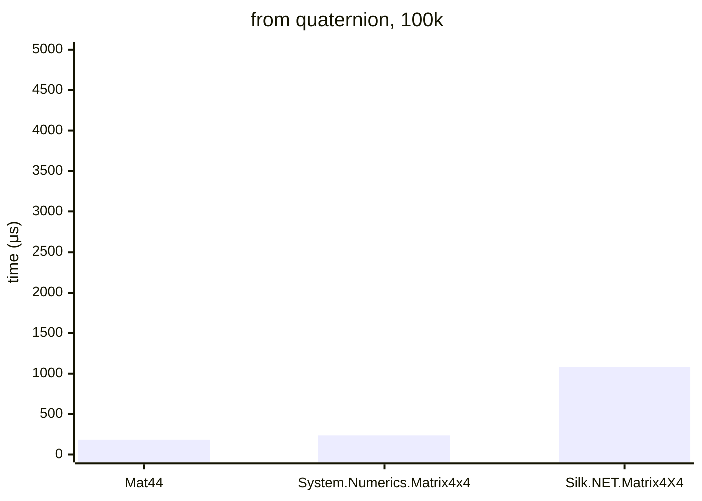

# .NET 10.0.626.17701, X64 RyuJIT x86-64-v4, Windows 11 26200.8246

# AMD Ryzen 9 7900X 4.70GHz



## Mat44&lt;float&gt;

<details>
<summary>asm</summary>

```assembly
; System.Numerics.Bench.StressMat44WithQuat`1[[System.Single, System.Private.CoreLib]].Rotation()
       sub       rsp,28
       xor       eax,eax
       vbroadcastss xmm0,dword ptr [7FFF431CA970]
M00_L00:
       mov       rdx,[rcx+10]
       mov       r8,[rcx+18]
       cmp       eax,[r8+8]
       jae       near ptr M00_L01
       mov       r10d,eax
       mov       r9,r10
       shl       r9,4
       vmovups   xmm1,[r8+r9+10]
       vpshufd   xmm2,xmm1,0C9
       vpshufd   xmm3,xmm1,0FF
       vpshufd   xmm4,xmm1,0D2
       vmulps    xmm2,xmm2,xmm1
       vmulps    xmm3,xmm4,xmm3
       vmulps    xmm1,xmm1,xmm1
       vaddps    xmm5,xmm2,xmm3
       vsubps    xmm4,xmm2,xmm3
       vaddps    xmm5,xmm5,xmm5
       vaddps    xmm4,xmm4,xmm4
       vpshufd   xmm2,xmm1,0C9
       vaddps    xmm1,xmm2,xmm1
       vaddps    xmm1,xmm1,xmm1
       vsubps    xmm1,xmm0,xmm1
       vmovshdup xmm3,xmm1
       vinsertps xmm2,xmm4,xmm3,0
       vmovaps   xmm3,xmm5
       vinsertps xmm2,xmm2,xmm3,10
       vunpckhps xmm3,xmm1,xmm1
       vinsertps xmm3,xmm4,xmm3,10
       vmovshdup xmm16,xmm5
       vinsertps xmm3,xmm3,xmm16,20
       vunpckhps xmm5,xmm5,xmm5
       vinsertps xmm4,xmm4,xmm5,0
       vinsertps xmm4,xmm4,xmm1,20
       cmp       eax,[rdx+8]
       jae       short M00_L01
       shl       r10,6
       lea       rdx,[rdx+r10+10]
       vmovups   [rdx],xmm2
       vmovups   [rdx+10],xmm3
       vmovups   [rdx+20],xmm4
       vmovups   xmm1,[7FFF431CA980]
       vmovups   [rdx+30],xmm1
       inc       eax
       cmp       eax,186A0
       jl        near ptr M00_L00
       add       rsp,28
       ret
M00_L01:
       call      CORINFO_HELP_RNGCHKFAIL
       int       3
; Total bytes of code 234
```
</details>

## System.Numerics.Matrix4x4

<details>
<summary>asm</summary>

```assembly
; System.Numerics.Bench.StressMatrix4x4.Rotation()
       sub       rsp,28
       xor       eax,eax
       vmovss    xmm0,dword ptr [7FFF431AA9B0]
       vmovss    xmm1,dword ptr [7FFF431AA9B4]
       vmovups   xmm2,[7FFF431AA9C0]
M00_L00:
       mov       rdx,[rcx+10]
       mov       r8,[rcx+18]
       cmp       eax,[r8+8]
       jae       near ptr M00_L01
       mov       r10d,eax
       mov       r9,r10
       shl       r9,4
       vmovups   xmm3,[r8+r9+10]
       vmovaps   xmm4,xmm3
       vmulss    xmm5,xmm4,xmm4
       vmovshdup xmm16,xmm3
       vmulss    xmm17,xmm16,xmm16
       vunpckhps xmm18,xmm3,xmm3
       vmulss    xmm19,xmm18,xmm18
       vmulss    xmm20,xmm4,xmm16
       vshufps   xmm3,xmm3,xmm3,0FF
       vmulss    xmm21,xmm18,xmm3
       vmulss    xmm22,xmm18,xmm4
       vmulss    xmm23,xmm16,xmm3
       vmulss    xmm16,xmm16,xmm18
       vmulss    xmm3,xmm4,xmm3
       vaddss    xmm4,xmm17,xmm19
       vmulss    xmm4,xmm4,xmm0
       vsubss    xmm4,xmm1,xmm4
       vaddss    xmm18,xmm20,xmm21
       vmulss    xmm18,xmm18,xmm0
       vinsertps xmm4,xmm4,xmm18,10
       vsubss    xmm18,xmm22,xmm23
       vmulss    xmm18,xmm18,xmm0
       vinsertps xmm4,xmm4,xmm18,28
       vsubss    xmm18,xmm20,xmm21
       vmulss    xmm18,xmm18,xmm0
       vaddss    xmm19,xmm19,xmm5
       vmulss    xmm19,xmm19,xmm0
       vsubss    xmm19,xmm1,xmm19
       vinsertps xmm18,xmm18,xmm19,10
       vaddss    xmm19,xmm16,xmm3
       vmulss    xmm19,xmm19,xmm0
       vinsertps xmm18,xmm18,xmm19,28
       vaddss    xmm19,xmm22,xmm23
       vmulss    xmm19,xmm19,xmm0
       vsubss    xmm3,xmm16,xmm3
       vmulss    xmm3,xmm3,xmm0
       vinsertps xmm3,xmm19,xmm3,10
       vaddss    xmm5,xmm17,xmm5
       vmulss    xmm5,xmm5,xmm0
       vsubss    xmm5,xmm1,xmm5
       vinsertps xmm3,xmm3,xmm5,28
       cmp       eax,[rdx+8]
       jae       short M00_L01
       shl       r10,6
       lea       rdx,[rdx+r10+10]
       vmovups   [rdx],xmm4
       vmovups   [rdx+10],xmm18
       vmovups   [rdx+20],xmm3
       vmovups   xmm3,[7FFF431AA9C0]
       vmovups   [rdx+30],xmm3
       inc       eax
       cmp       eax,186A0
       jl        near ptr M00_L00
       add       rsp,28
       ret
M00_L01:
       call      CORINFO_HELP_RNGCHKFAIL
       int       3
; Total bytes of code 360
```
</details>

## Silk.NET.Matrix4X4&lt;float&gt;

<details>
<summary>asm</summary>

```assembly
; System.Numerics.Bench.StressMatrix4X4WithQuaternion`1[[System.Single, System.Private.CoreLib]].Rotation()
       push      rdi
       push      rsi
       push      rbx
       sub       rsp,70
       mov       rbx,rcx
       xor       esi,esi
M00_L00:
       mov       rdi,[rbx+10]
       mov       rdx,[rbx+28]
       cmp       esi,[rdx+8]
       jae       short M00_L01
       mov       rcx,rsi
       shl       rcx,4
       vmovups   xmm0,[rdx+rcx+10]
       vmovups   [rsp+20],xmm0
       lea       rdx,[rsp+20]
       lea       rcx,[rsp+30]
       call      qword ptr [7FFF43564D68]; Silk.NET.Maths.Matrix4X4.CreateFromQuaternion[[System.Single, System.Private.CoreLib]](Silk.NET.Maths.Quaternion`1<Single>)
       cmp       esi,[rdi+8]
       jae       short M00_L01
       mov       rax,rsi
       shl       rax,6
       vmovdqu32 zmm0,[rsp+30]
       vmovdqu32 [rdi+rax+10],zmm0
       inc       esi
       cmp       esi,186A0
       jl        short M00_L00
       vzeroupper
       add       rsp,70
       pop       rbx
       pop       rsi
       pop       rdi
       ret
M00_L01:
       call      CORINFO_HELP_RNGCHKFAIL
       int       3
; Total bytes of code 121
```
```assembly
; Silk.NET.Maths.Matrix4X4.CreateFromQuaternion[[System.Single, System.Private.CoreLib]](Silk.NET.Maths.Quaternion`1<Single>)
       sub       rsp,48
       vmovss    xmm0,dword ptr [rdx]
       vmovss    xmm1,dword ptr [rdx+4]
       vmovss    xmm2,dword ptr [rdx+8]
       vmovss    xmm3,dword ptr [rdx+0C]
       mov       rax,2D957F88D28
       vmovdqu32 zmm4,[rax]
       vmovdqu32 [rsp+8],zmm4
       vmulss    xmm4,xmm0,xmm0
       vmulss    xmm5,xmm1,xmm1
       vmulss    xmm16,xmm2,xmm2
       vmulss    xmm17,xmm0,xmm1
       vmulss    xmm18,xmm2,xmm3
       vmulss    xmm19,xmm2,xmm0
       vmulss    xmm20,xmm1,xmm3
       vmulss    xmm1,xmm1,xmm2
       vmulss    xmm0,xmm0,xmm3
       vmovdqu32 zmm2,[rsp+8]
       vmovdqu32 [rcx],zmm2
       vaddss    xmm2,xmm5,xmm16
       vmovss    xmm3,dword ptr [7FFF431BBAF0]
       vmulss    xmm2,xmm2,xmm3
       vmovss    xmm21,dword ptr [7FFF431BBAF4]
       vsubss    xmm2,xmm21,xmm2
       vmovss    dword ptr [rcx],xmm2
       vaddss    xmm2,xmm17,xmm18
       vmulss    xmm2,xmm2,xmm3
       vmovss    dword ptr [rcx+4],xmm2
       vsubss    xmm2,xmm19,xmm20
       vmulss    xmm2,xmm2,xmm3
       vmovss    dword ptr [rcx+8],xmm2
       vsubss    xmm2,xmm17,xmm18
       vmulss    xmm2,xmm2,xmm3
       vmovss    dword ptr [rcx+10],xmm2
       vaddss    xmm2,xmm16,xmm4
       vmulss    xmm2,xmm2,xmm3
       vsubss    xmm2,xmm21,xmm2
       vmovss    dword ptr [rcx+14],xmm2
       vaddss    xmm2,xmm1,xmm0
       vmulss    xmm2,xmm2,xmm3
       vmovss    dword ptr [rcx+18],xmm2
       vaddss    xmm2,xmm19,xmm20
       vmulss    xmm2,xmm2,xmm3
       vmovss    dword ptr [rcx+20],xmm2
       vsubss    xmm0,xmm1,xmm0
       vmulss    xmm0,xmm0,xmm3
       vmovss    dword ptr [rcx+24],xmm0
       vaddss    xmm0,xmm5,xmm4
       vmulss    xmm0,xmm0,xmm3
       vsubss    xmm0,xmm21,xmm0
       vmovss    dword ptr [rcx+28],xmm0
       mov       rax,rcx
       vzeroupper
       add       rsp,48
       ret
; Total bytes of code 288
```
</details>
