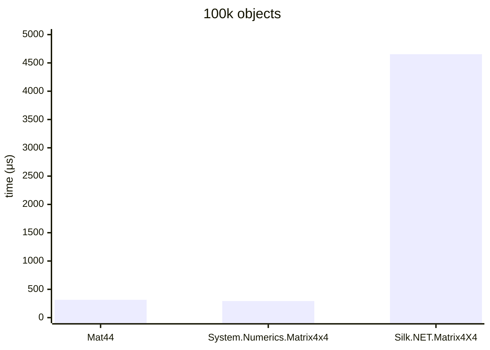

.NET 10.0.626.17701, X64 RyuJIT x86-64-v4, Windows 11 26200.8246, AMD Ryzen 9 7900X 4.70GHz

# Multiply



### Mat44&lt;float&gt;

<details>
<summary>asm</summary>

```assembly
; System.Numerics.Bench.StressMat44`1[[System.Single, System.Private.CoreLib]].Multiply()
       sub       rsp,28
       xor       eax,eax
M00_L00:
       mov       rdx,[rcx+10]
       mov       r8,[rcx+8]
       mov       r10,r8
       mov       r9d,[r10+8]
       cmp       eax,r9d
       jae       near ptr M00_L01
       mov       r11,rax
       shl       r11,6
       lea       r10,[r10+r11+10]
       vmovups   xmm0,[r10]
       vmovups   xmm1,[r10+10]
       vmovups   xmm2,[r10+20]
       vmovups   xmm3,[r10+30]
       lea       r10d,[rax+1]
       cmp       r10d,r9d
       jae       near ptr M00_L01
       mov       r9d,r10d
       shl       r9,6
       lea       r8,[r8+r9+10]
       vmovups   xmm4,[r8]
       vmovups   xmm5,[r8+10]
       vmovups   xmm16,[r8+20]
       vmovups   xmm17,[r8+30]
       vmovaps   xmm18,xmm0
       vbroadcastss xmm18,xmm18
       vmovshdup xmm19,xmm0
       vbroadcastss xmm19,xmm19
       vunpckhps xmm20,xmm0,xmm0
       vbroadcastss xmm20,xmm20
       vshufps   xmm0,xmm0,xmm0,0FF
       vbroadcastss xmm0,xmm0
       vmulps    xmm19,xmm19,xmm5
       vfmadd213ps xmm18,xmm4,xmm19
       vmulps    xmm0,xmm0,xmm17
       vfmadd213ps xmm20,xmm16,xmm0
       vaddps    xmm0,xmm20,xmm18
       vmovaps   xmm18,xmm1
       vbroadcastss xmm18,xmm18
       vmovshdup xmm19,xmm1
       vbroadcastss xmm19,xmm19
       vunpckhps xmm20,xmm1,xmm1
       vbroadcastss xmm20,xmm20
       vshufps   xmm1,xmm1,xmm1,0FF
       vbroadcastss xmm1,xmm1
       vmulps    xmm19,xmm19,xmm5
       vfmadd213ps xmm18,xmm4,xmm19
       vmulps    xmm1,xmm1,xmm17
       vfmadd213ps xmm20,xmm16,xmm1
       vaddps    xmm1,xmm20,xmm18
       vmovaps   xmm18,xmm2
       vbroadcastss xmm18,xmm18
       vmovshdup xmm19,xmm2
       vbroadcastss xmm19,xmm19
       vunpckhps xmm20,xmm2,xmm2
       vbroadcastss xmm20,xmm20
       vshufps   xmm2,xmm2,xmm2,0FF
       vbroadcastss xmm2,xmm2
       vmulps    xmm19,xmm19,xmm5
       vfmadd213ps xmm18,xmm4,xmm19
       vmulps    xmm2,xmm2,xmm17
       vfmadd213ps xmm20,xmm16,xmm2
       vaddps    xmm2,xmm20,xmm18
       vmovaps   xmm18,xmm3
       vbroadcastss xmm18,xmm18
       vmovshdup xmm19,xmm3
       vbroadcastss xmm19,xmm19
       vunpckhps xmm20,xmm3,xmm3
       vbroadcastss xmm20,xmm20
       vshufps   xmm3,xmm3,xmm3,0FF
       vbroadcastss xmm3,xmm3
       vmulps    xmm5,xmm19,xmm5
       vfmadd213ps xmm4,xmm18,xmm5
       vmulps    xmm3,xmm3,xmm17
       vfmadd213ps xmm16,xmm20,xmm3
       vaddps    xmm3,xmm16,xmm4
       cmp       eax,[rdx+8]
       jae       short M00_L01
       lea       rax,[rdx+r11+10]
       vmovups   [rax],xmm0
       vmovups   [rax+10],xmm1
       vmovups   [rax+20],xmm2
       vmovups   [rax+30],xmm3
       mov       eax,r10d
       cmp       eax,1869F
       jl        near ptr M00_L00
       add       rsp,28
       ret
M00_L01:
       call      CORINFO_HELP_RNGCHKFAIL
       int       3
; Total bytes of code 473
```
</details>

### System.Numerics.Matrix4x4

<details>
<summary>asm</summary>

```assembly
; System.Numerics.Bench.StressMatrix4x4.Multiply()
       sub       rsp,28
       xor       eax,eax
M00_L00:
       mov       rdx,[rcx+8]
       mov       r8,rdx
       mov       r10d,[r8+8]
       cmp       eax,r10d
       jae       near ptr M00_L01
       mov       r9,rax
       shl       r9,6
       lea       r8,[r8+r9+10]
       mov       r9,r8
       vmovups   xmm0,[r9]
       vmovups   xmm1,[r9+10]
       vmovups   xmm2,[r9+20]
       vmovups   xmm3,[r9+30]
       inc       eax
       cmp       eax,r10d
       jae       near ptr M00_L01
       mov       r10d,eax
       shl       r10,6
       lea       rdx,[rdx+r10+10]
       vmovups   xmm4,[rdx]
       vmovups   xmm5,[rdx+10]
       vmovups   xmm16,[rdx+20]
       vmovups   xmm17,[rdx+30]
       vunpckhps xmm18,xmm0,xmm0
       vbroadcastss xmm18,xmm18
       vmovshdup xmm19,xmm0
       vbroadcastss xmm19,xmm19
       vmovaps   xmm20,xmm0
       vbroadcastss xmm20,xmm20
       vmulps    xmm20,xmm20,xmm4
       vfmadd231ps xmm20,xmm19,xmm5
       vfmadd231ps xmm20,xmm18,xmm16
       vshufps   xmm0,xmm0,xmm0,0FF
       vbroadcastss xmm0,xmm0
       vfmadd231ps xmm20,xmm0,xmm17
       vunpckhps xmm0,xmm1,xmm1
       vbroadcastss xmm0,xmm0
       vmovshdup xmm18,xmm1
       vbroadcastss xmm18,xmm18
       vmovaps   xmm19,xmm1
       vbroadcastss xmm19,xmm19
       vmulps    xmm19,xmm19,xmm4
       vfmadd231ps xmm19,xmm18,xmm5
       vfmadd231ps xmm19,xmm0,xmm16
       vshufps   xmm0,xmm1,xmm1,0FF
       vbroadcastss xmm0,xmm0
       vfmadd231ps xmm19,xmm0,xmm17
       vunpckhps xmm0,xmm2,xmm2
       vbroadcastss xmm0,xmm0
       vmovshdup xmm1,xmm2
       vbroadcastss xmm1,xmm1
       vmovaps   xmm18,xmm2
       vbroadcastss xmm18,xmm18
       vmulps    xmm18,xmm18,xmm4
       vfmadd231ps xmm18,xmm1,xmm5
       vfmadd231ps xmm18,xmm0,xmm16
       vshufps   xmm0,xmm2,xmm2,0FF
       vbroadcastss xmm0,xmm0
       vfmadd231ps xmm18,xmm0,xmm17
       vunpckhps xmm0,xmm3,xmm3
       vbroadcastss xmm0,xmm0
       vmovshdup xmm1,xmm3
       vbroadcastss xmm1,xmm1
       vmovaps   xmm2,xmm3
       vbroadcastss xmm2,xmm2
       vmulps    xmm2,xmm2,xmm4
       vfmadd213ps xmm5,xmm1,xmm2
       vfmadd213ps xmm16,xmm0,xmm5
       vshufps   xmm0,xmm3,xmm3,0FF
       vbroadcastss xmm0,xmm0
       vfmadd213ps xmm17,xmm0,xmm16
       vmovups   [r8],xmm20
       vmovups   [r8+10],xmm19
       vmovups   [r8+20],xmm18
       vmovups   [r8+30],xmm17
       mov       eax,eax
       cmp       eax,1869F
       jl        near ptr M00_L00
       add       rsp,28
       ret
M00_L01:
       call      CORINFO_HELP_RNGCHKFAIL
       int       3
; Total bytes of code 420
```
</details>

### Silk.NET.Matrix4X4&lt;float&gt;

<details>
<summary>asm</summary>

```assembly
; System.Numerics.Bench.StressMatrix4X4`1[[System.Single, System.Private.CoreLib]].Multiply()
       push      r14
       push      rdi
       push      rsi
       push      rbp
       push      rbx
       sub       rsp,2C0
       vmovaps   [rsp+2B0],xmm6
       vmovaps   [rsp+2A0],xmm7
       vmovaps   [rsp+290],xmm8
       vmovaps   [rsp+280],xmm9
       vmovaps   [rsp+270],xmm10
       vmovaps   [rsp+260],xmm11
       vmovaps   [rsp+250],xmm12
       vmovaps   [rsp+240],xmm13
       vmovaps   [rsp+230],xmm14
       vmovaps   [rsp+220],xmm15
       mov       rbx,rcx
       xor       esi,esi
M00_L00:
       mov       rdi,[rbx+10]
       mov       rdx,[rbx+8]
       mov       r8,rdx
       mov       ecx,[r8+8]
       cmp       esi,ecx
       jae       near ptr M00_L01
       mov       rbp,rsi
       shl       rbp,6
       lea       r8,[r8+rbp+10]
       vmovss    xmm0,dword ptr [r8]
       vmovss    xmm1,dword ptr [r8+4]
       vmovss    xmm2,dword ptr [r8+8]
       vmovss    xmm3,dword ptr [r8+0C]
       vmovss    xmm4,dword ptr [r8+10]
       vmovss    xmm5,dword ptr [r8+14]
       vmovss    xmm16,dword ptr [r8+18]
       vmovss    xmm6,dword ptr [r8+1C]
       vmovss    xmm7,dword ptr [r8+20]
       vmovss    xmm8,dword ptr [r8+24]
       vmovss    dword ptr [rsp+74],xmm8
       vmovss    xmm9,dword ptr [r8+28]
       vmovss    dword ptr [rsp+70],xmm9
       vmovss    xmm10,dword ptr [r8+2C]
       vmovss    dword ptr [rsp+6C],xmm10
       vmovss    xmm11,dword ptr [r8+30]
       vmovss    dword ptr [rsp+68],xmm11
       vmovss    xmm12,dword ptr [r8+34]
       vmovss    dword ptr [rsp+64],xmm12
       vmovss    xmm13,dword ptr [r8+38]
       vmovss    dword ptr [rsp+60],xmm13
       vmovss    xmm14,dword ptr [r8+3C]
       lea       r14d,[rsi+1]
       cmp       r14d,ecx
       jae       near ptr M00_L01
       mov       r8d,r14d
       shl       r8,6
       lea       rdx,[rdx+r8+10]
       vmovss    xmm15,dword ptr [rdx+30]
       vmovss    xmm17,dword ptr [rdx+34]
       vmovss    dword ptr [rsp+5C],xmm17
       vmovss    xmm18,dword ptr [rdx+38]
       vmovss    dword ptr [rsp+58],xmm18
       vmovss    xmm19,dword ptr [rdx+3C]
       vmovss    dword ptr [rsp+54],xmm19
       vmovdqu32 zmm20,[rdx]
       vmovdqu32 [rsp+1E0],zmm20
       vmovss    xmm20,dword ptr [rsp+1E0]
       vmovaps   xmm21,xmm20
       vmovss    xmm22,dword ptr [rsp+1E4]
       vmovaps   xmm23,xmm22
       vmovss    xmm24,dword ptr [rsp+1E8]
       vmovaps   xmm25,xmm24
       vmovss    xmm26,dword ptr [rsp+1EC]
       vmovaps   xmm27,xmm26
       vmulss    xmm21,xmm21,xmm0
       vmulss    xmm23,xmm23,xmm0
       vmulss    xmm25,xmm25,xmm0
       vmulss    xmm0,xmm27,xmm0
       vmovss    xmm27,dword ptr [rsp+1F0]
       vmovaps   xmm28,xmm27
       vmovss    xmm29,dword ptr [rsp+1F4]
       vmovaps   xmm30,xmm29
       vmovss    xmm31,dword ptr [rsp+1F8]
       vmovaps   xmm13,xmm31
       vmovss    xmm12,dword ptr [rsp+1FC]
       vmovaps   xmm11,xmm12
       vmulss    xmm28,xmm28,xmm1
       vmulss    xmm30,xmm30,xmm1
       vmulss    xmm13,xmm13,xmm1
       vmulss    xmm1,xmm11,xmm1
       vaddss    xmm21,xmm21,xmm28
       vaddss    xmm23,xmm23,xmm30
       vaddss    xmm25,xmm25,xmm13
       vaddss    xmm0,xmm0,xmm1
       vmovss    xmm1,dword ptr [rsp+200]
       vmovaps   xmm28,xmm1
       vmovss    xmm30,dword ptr [rsp+204]
       vmovaps   xmm11,xmm30
       vmovss    xmm13,dword ptr [rsp+208]
       vmovaps   xmm10,xmm13
       vmovss    xmm9,dword ptr [rsp+20C]
       vmovaps   xmm8,xmm9
       vmulss    xmm28,xmm28,xmm2
       vmulss    xmm11,xmm11,xmm2
       vmulss    xmm10,xmm10,xmm2
       vmulss    xmm2,xmm8,xmm2
       vaddss    xmm21,xmm21,xmm28
       vaddss    xmm23,xmm23,xmm11
       vaddss    xmm25,xmm25,xmm10
       vaddss    xmm0,xmm0,xmm2
       vmulss    xmm2,xmm15,xmm3
       vmulss    xmm28,xmm17,xmm3
       vmulss    xmm8,xmm18,xmm3
       vmulss    xmm3,xmm19,xmm3
       vaddss    xmm10,xmm21,xmm2
       vaddss    xmm11,xmm23,xmm28
       vaddss    xmm8,xmm25,xmm8
       vaddss    xmm0,xmm0,xmm3
       vmovss    dword ptr [rsp+9C],xmm0
       vmulss    xmm2,xmm20,xmm4
       vmulss    xmm3,xmm22,xmm4
       vmulss    xmm20,xmm24,xmm4
       vmulss    xmm4,xmm26,xmm4
       vmulss    xmm21,xmm27,xmm5
       vmulss    xmm22,xmm29,xmm5
       vmulss    xmm23,xmm31,xmm5
       vmulss    xmm5,xmm12,xmm5
       vaddss    xmm2,xmm2,xmm21
       vaddss    xmm3,xmm3,xmm22
       vaddss    xmm20,xmm20,xmm23
       vaddss    xmm4,xmm4,xmm5
       vmulss    xmm1,xmm1,xmm16
       vmulss    xmm5,xmm30,xmm16
       vmulss    xmm21,xmm13,xmm16
       vmulss    xmm16,xmm9,xmm16
       vmovss    dword ptr [rsp+40],xmm2
       vmovss    dword ptr [rsp+44],xmm3
       vmovss    dword ptr [rsp+48],xmm20
       vmovss    dword ptr [rsp+4C],xmm4
       vmovss    dword ptr [rsp+30],xmm1
       vmovss    dword ptr [rsp+34],xmm5
       vmovss    dword ptr [rsp+38],xmm21
       vmovss    dword ptr [rsp+3C],xmm16
       lea       rdx,[rsp+40]
       lea       r8,[rsp+30]
       lea       rcx,[rsp+1D0]
       call      qword ptr [7FFF43564DE0]; Silk.NET.Maths.Vector4D`1[[System.Single, System.Private.CoreLib]].op_Addition(Silk.NET.Maths.Vector4D`1<Single>, Silk.NET.Maths.Vector4D`1<Single>)
       vmovaps   xmm0,xmm15
       vmovaps   xmm1,xmm6
       call      qword ptr [7FFF43564F60]; Silk.NET.Maths.Scalar.Multiply[[System.Single, System.Private.CoreLib]](Single, Single)
       vmovaps   xmm9,xmm0
       vmovss    xmm0,dword ptr [rsp+5C]
       vmovaps   xmm1,xmm6
       call      qword ptr [7FFF43564F60]; Silk.NET.Maths.Scalar.Multiply[[System.Single, System.Private.CoreLib]](Single, Single)
       vmovaps   xmm12,xmm0
       vmovss    xmm0,dword ptr [rsp+58]
       vmovaps   xmm1,xmm6
       call      qword ptr [7FFF43564F60]; Silk.NET.Maths.Scalar.Multiply[[System.Single, System.Private.CoreLib]](Single, Single)
       vmovaps   xmm13,xmm0
       vxorps    xmm0,xmm0,xmm0
       vmovups   [rsp+88],xmm0
       vmovss    xmm0,dword ptr [rsp+54]
       vmovaps   xmm1,xmm6
       call      qword ptr [7FFF43564F60]; Silk.NET.Maths.Scalar.Multiply[[System.Single, System.Private.CoreLib]](Single, Single)
       vmovss    dword ptr [rsp+20],xmm0
       lea       rcx,[rsp+88]
       vmovaps   xmm1,xmm9
       vmovaps   xmm2,xmm12
       vmovaps   xmm3,xmm13
       call      qword ptr [7FFF43565050]; Silk.NET.Maths.Vector4D`1[[System.Single, System.Private.CoreLib]]..ctor(Single, Single, Single, Single)
       vmovups   xmm0,[rsp+88]
       vmovups   [rsp+40],xmm0
       lea       r8,[rsp+40]
       lea       rdx,[rsp+1D0]
       lea       rcx,[rsp+1C0]
       call      qword ptr [7FFF43564DE0]; Silk.NET.Maths.Vector4D`1[[System.Single, System.Private.CoreLib]].op_Addition(Silk.NET.Maths.Vector4D`1<Single>, Silk.NET.Maths.Vector4D`1<Single>)
       vmovups   xmm2,[rsp+1E0]
       vmovups   [rsp+40],xmm2
       lea       rdx,[rsp+40]
       lea       rcx,[rsp+1B0]
       vmovaps   xmm2,xmm7
       call      qword ptr [7FFF43565068]; Silk.NET.Maths.Vector4D`1[[System.Single, System.Private.CoreLib]].op_Multiply(Silk.NET.Maths.Vector4D`1<Single>, Single)
       vmovups   xmm2,[rsp+1F0]
       vmovups   [rsp+40],xmm2
       lea       rdx,[rsp+40]
       lea       rcx,[rsp+1A0]
       vmovss    xmm2,dword ptr [rsp+74]
       call      qword ptr [7FFF43565068]; Silk.NET.Maths.Vector4D`1[[System.Single, System.Private.CoreLib]].op_Multiply(Silk.NET.Maths.Vector4D`1<Single>, Single)
       lea       rcx,[rsp+190]
       lea       rdx,[rsp+1B0]
       lea       r8,[rsp+1A0]
       call      qword ptr [7FFF43564DE0]; Silk.NET.Maths.Vector4D`1[[System.Single, System.Private.CoreLib]].op_Addition(Silk.NET.Maths.Vector4D`1<Single>, Silk.NET.Maths.Vector4D`1<Single>)
       vmovups   xmm2,[rsp+200]
       vmovups   [rsp+40],xmm2
       lea       rdx,[rsp+40]
       lea       rcx,[rsp+180]
       vmovss    xmm2,dword ptr [rsp+70]
       call      qword ptr [7FFF43565068]; Silk.NET.Maths.Vector4D`1[[System.Single, System.Private.CoreLib]].op_Multiply(Silk.NET.Maths.Vector4D`1<Single>, Single)
       lea       rcx,[rsp+170]
       lea       rdx,[rsp+190]
       lea       r8,[rsp+180]
       call      qword ptr [7FFF43564DE0]; Silk.NET.Maths.Vector4D`1[[System.Single, System.Private.CoreLib]].op_Addition(Silk.NET.Maths.Vector4D`1<Single>, Silk.NET.Maths.Vector4D`1<Single>)
       vmovss    dword ptr [rsp+210],xmm15
       vmovss    xmm6,dword ptr [rsp+5C]
       vmovss    dword ptr [rsp+214],xmm6
       vmovss    xmm7,dword ptr [rsp+58]
       vmovss    dword ptr [rsp+218],xmm7
       vmovss    xmm9,dword ptr [rsp+54]
       vmovss    dword ptr [rsp+21C],xmm9
       vmovups   xmm2,[rsp+210]
       vmovups   [rsp+40],xmm2
       lea       rdx,[rsp+40]
       lea       rcx,[rsp+160]
       vmovss    xmm2,dword ptr [rsp+6C]
       call      qword ptr [7FFF43565068]; Silk.NET.Maths.Vector4D`1[[System.Single, System.Private.CoreLib]].op_Multiply(Silk.NET.Maths.Vector4D`1<Single>, Single)
       lea       rcx,[rsp+150]
       lea       rdx,[rsp+170]
       lea       r8,[rsp+160]
       call      qword ptr [7FFF43564DE0]; Silk.NET.Maths.Vector4D`1[[System.Single, System.Private.CoreLib]].op_Addition(Silk.NET.Maths.Vector4D`1<Single>, Silk.NET.Maths.Vector4D`1<Single>)
       vmovups   xmm2,[rsp+1E0]
       vmovups   [rsp+40],xmm2
       lea       rdx,[rsp+40]
       lea       rcx,[rsp+140]
       vmovss    xmm2,dword ptr [rsp+68]
       call      qword ptr [7FFF43565068]; Silk.NET.Maths.Vector4D`1[[System.Single, System.Private.CoreLib]].op_Multiply(Silk.NET.Maths.Vector4D`1<Single>, Single)
       vmovups   xmm2,[rsp+1F0]
       vmovups   [rsp+40],xmm2
       lea       rdx,[rsp+40]
       lea       rcx,[rsp+130]
       vmovss    xmm2,dword ptr [rsp+64]
       call      qword ptr [7FFF43565068]; Silk.NET.Maths.Vector4D`1[[System.Single, System.Private.CoreLib]].op_Multiply(Silk.NET.Maths.Vector4D`1<Single>, Single)
       lea       rcx,[rsp+120]
       lea       rdx,[rsp+140]
       lea       r8,[rsp+130]
       call      qword ptr [7FFF43564DE0]; Silk.NET.Maths.Vector4D`1[[System.Single, System.Private.CoreLib]].op_Addition(Silk.NET.Maths.Vector4D`1<Single>, Silk.NET.Maths.Vector4D`1<Single>)
       lea       rcx,[rsp+110]
       lea       rdx,[rsp+200]
       vmovss    xmm2,dword ptr [rsp+60]
       call      qword ptr [7FFF43565068]; Silk.NET.Maths.Vector4D`1[[System.Single, System.Private.CoreLib]].op_Multiply(Silk.NET.Maths.Vector4D`1<Single>, Single)
       lea       rcx,[rsp+100]
       lea       rdx,[rsp+120]
       lea       r8,[rsp+110]
       call      qword ptr [7FFF43564DE0]; Silk.NET.Maths.Vector4D`1[[System.Single, System.Private.CoreLib]].op_Addition(Silk.NET.Maths.Vector4D`1<Single>, Silk.NET.Maths.Vector4D`1<Single>)
       vmovaps   xmm0,xmm15
       vmovaps   xmm1,xmm14
       call      qword ptr [7FFF43564F60]; Silk.NET.Maths.Scalar.Multiply[[System.Single, System.Private.CoreLib]](Single, Single)
       vmovaps   xmm12,xmm0
       vmovaps   xmm0,xmm6
       vmovaps   xmm1,xmm14
       call      qword ptr [7FFF43564F60]; Silk.NET.Maths.Scalar.Multiply[[System.Single, System.Private.CoreLib]](Single, Single)
       vmovaps   xmm6,xmm0
       vmovaps   xmm0,xmm7
       vmovaps   xmm1,xmm14
       call      qword ptr [7FFF43564F60]; Silk.NET.Maths.Scalar.Multiply[[System.Single, System.Private.CoreLib]](Single, Single)
       vmovaps   xmm7,xmm0
       vxorps    xmm0,xmm0,xmm0
       vmovups   [rsp+78],xmm0
       vmovaps   xmm0,xmm9
       vmovaps   xmm1,xmm14
       call      qword ptr [7FFF43564F60]; Silk.NET.Maths.Scalar.Multiply[[System.Single, System.Private.CoreLib]](Single, Single)
       vmovss    dword ptr [rsp+20],xmm0
       lea       rcx,[rsp+78]
       vmovaps   xmm1,xmm12
       vmovaps   xmm2,xmm6
       vmovaps   xmm3,xmm7
       call      qword ptr [7FFF43565050]; Silk.NET.Maths.Vector4D`1[[System.Single, System.Private.CoreLib]]..ctor(Single, Single, Single, Single)
       vmovups   xmm0,[rsp+78]
       vmovups   [rsp+0F0],xmm0
       vxorps    ymm0,ymm0,ymm0
       vmovdqu32 [rsp+0B0],zmm0
       lea       rcx,[rsp+0A0]
       lea       rdx,[rsp+100]
       lea       r8,[rsp+0F0]
       call      qword ptr [7FFF43564DE0]; Silk.NET.Maths.Vector4D`1[[System.Single, System.Private.CoreLib]].op_Addition(Silk.NET.Maths.Vector4D`1<Single>, Silk.NET.Maths.Vector4D`1<Single>)
       vmovss    dword ptr [rsp+40],xmm10
       vmovss    dword ptr [rsp+44],xmm11
       vmovss    dword ptr [rsp+48],xmm8
       vmovss    xmm6,dword ptr [rsp+9C]
       vmovss    dword ptr [rsp+4C],xmm6
       lea       rdx,[rsp+0A0]
       mov       [rsp+20],rdx
       lea       rdx,[rsp+40]
       lea       rcx,[rsp+0B0]
       lea       r8,[rsp+1C0]
       lea       r9,[rsp+150]
       call      qword ptr [7FFF43564F48]; Silk.NET.Maths.Matrix4X4`1[[System.Single, System.Private.CoreLib]]..ctor(Silk.NET.Maths.Vector4D`1<Single>, Silk.NET.Maths.Vector4D`1<Single>, Silk.NET.Maths.Vector4D`1<Single>, Silk.NET.Maths.Vector4D`1<Single>)
       cmp       esi,[rdi+8]
       jae       near ptr M00_L01
       vmovdqu32 zmm0,[rsp+0B0]
       vmovdqu32 [rdi+rbp+10],zmm0
       mov       esi,r14d
       cmp       esi,1869F
       jl        near ptr M00_L00
       vzeroupper
       vmovaps   xmm6,[rsp+2B0]
       vmovaps   xmm7,[rsp+2A0]
       vmovaps   xmm8,[rsp+290]
       vmovaps   xmm9,[rsp+280]
       vmovaps   xmm10,[rsp+270]
       vmovaps   xmm11,[rsp+260]
       vmovaps   xmm12,[rsp+250]
       vmovaps   xmm13,[rsp+240]
       vmovaps   xmm14,[rsp+230]
       vmovaps   xmm15,[rsp+220]
       add       rsp,2C0
       pop       rbx
       pop       rbp
       pop       rsi
       pop       rdi
       pop       r14
       ret
M00_L01:
       call      CORINFO_HELP_RNGCHKFAIL
       int       3
; Total bytes of code 1887
```
```assembly
; Silk.NET.Maths.Vector4D`1[[System.Single, System.Private.CoreLib]].op_Addition(Silk.NET.Maths.Vector4D`1<Single>, Silk.NET.Maths.Vector4D`1<Single>)
       vmovss    xmm0,dword ptr [rdx]
       vaddss    xmm0,xmm0,dword ptr [r8]
       vmovss    xmm1,dword ptr [rdx+4]
       vaddss    xmm1,xmm1,dword ptr [r8+4]
       vmovss    xmm2,dword ptr [rdx+8]
       vaddss    xmm2,xmm2,dword ptr [r8+8]
       vmovss    xmm3,dword ptr [rdx+0C]
       vaddss    xmm3,xmm3,dword ptr [r8+0C]
       vmovss    dword ptr [rcx],xmm0
       vmovss    dword ptr [rcx+4],xmm1
       vmovss    dword ptr [rcx+8],xmm2
       vmovss    dword ptr [rcx+0C],xmm3
       mov       rax,rcx
       ret
; Total bytes of code 65
```
```assembly
; Silk.NET.Maths.Scalar.Multiply[[System.Single, System.Private.CoreLib]](Single, Single)
       vmulss    xmm0,xmm0,xmm1
       ret
; Total bytes of code 5
```
```assembly
; Silk.NET.Maths.Vector4D`1[[System.Single, System.Private.CoreLib]]..ctor(Single, Single, Single, Single)
       vmovss    dword ptr [rcx],xmm1
       vmovss    dword ptr [rcx+4],xmm2
       vmovss    dword ptr [rcx+8],xmm3
       vmovss    xmm0,dword ptr [rsp+28]
       vmovss    dword ptr [rcx+0C],xmm0
       ret
; Total bytes of code 26
```
```assembly
; Silk.NET.Maths.Vector4D`1[[System.Single, System.Private.CoreLib]].op_Multiply(Silk.NET.Maths.Vector4D`1<Single>, Single)
       vmulss    xmm0,xmm2,dword ptr [rdx]
       vmulss    xmm1,xmm2,dword ptr [rdx+4]
       vmulss    xmm3,xmm2,dword ptr [rdx+8]
       vmulss    xmm2,xmm2,dword ptr [rdx+0C]
       vmovss    dword ptr [rcx],xmm0
       vmovss    dword ptr [rcx+4],xmm1
       vmovss    dword ptr [rcx+8],xmm3
       vmovss    dword ptr [rcx+0C],xmm2
       mov       rax,rcx
       ret
; Total bytes of code 42
```
```assembly
; Silk.NET.Maths.Matrix4X4`1[[System.Single, System.Private.CoreLib]]..ctor(Silk.NET.Maths.Vector4D`1<Single>, Silk.NET.Maths.Vector4D`1<Single>, Silk.NET.Maths.Vector4D`1<Single>, Silk.NET.Maths.Vector4D`1<Single>)
       mov       rax,[rsp+28]
       vmovups   xmm0,[rdx]
       vmovups   [rcx],xmm0
       vmovups   xmm0,[r8]
       vmovups   [rcx+10],xmm0
       vmovups   xmm0,[r9]
       vmovups   [rcx+20],xmm0
       vmovups   xmm0,[rax]
       vmovups   [rcx+30],xmm0
       ret
; Total bytes of code 43
```
</details>
