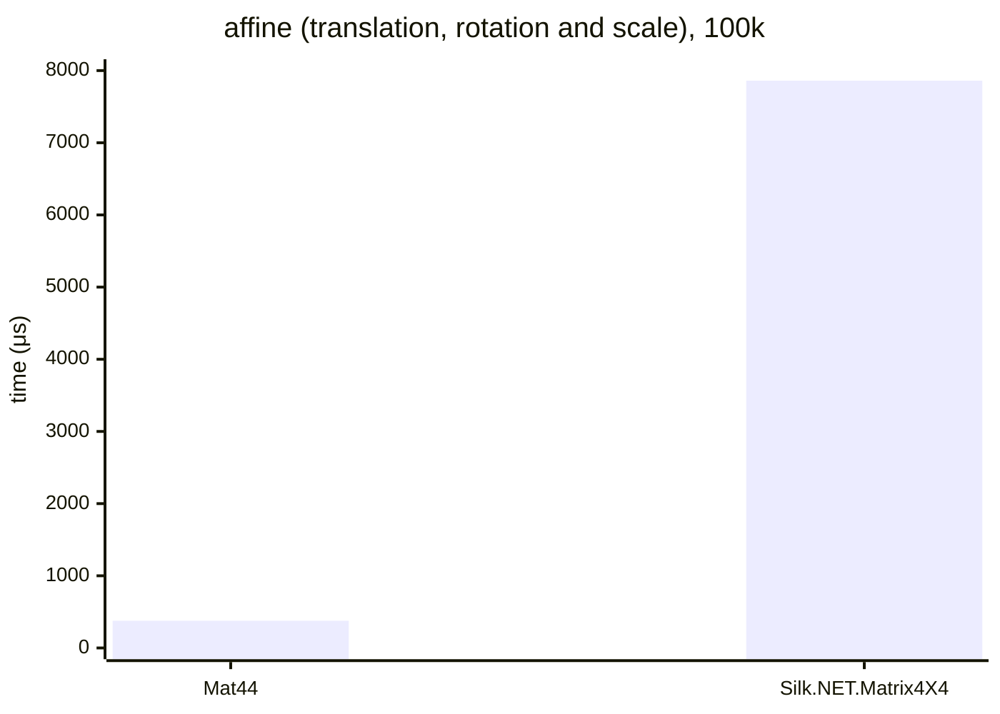

# .NET 10.0.626.17701, X64 RyuJIT x86-64-v4, Windows 11 26200.8246

# AMD Ryzen 9 7900X 4.70GHz



## Mat44&lt;double&gt;

<details>
<summary>asm</summary>

```assembly
; System.Numerics.Bench.StressMat44WithQuat`1[[System.Double, System.Private.CoreLib]].Affine()
       sub       rsp,58
       xor       eax,eax
       vbroadcastsd ymm0,qword ptr [7FFF431BAEA8]
M00_L00:
       mov       rdx,[rcx+10]
       mov       r8,[rcx+18]
       cmp       eax,[r8+8]
       jae       near ptr M00_L01
       mov       r10d,eax
       mov       r9,r10
       shl       r9,5
       vmovups   ymm1,[r8+r9+10]
       mov       r8,[rcx+20]
       cmp       eax,[r8+8]
       jae       near ptr M00_L01
       lea       r9,[r10+r10*2]
       vmovdqu   xmm2,xmmword ptr [r8+r9*8+10]
       vmovdqu   xmmword ptr [rsp+40],xmm2
       mov       r11,[r8+r9*8+20]
       mov       [rsp+50],r11
       mov       r8,[rcx+28]
       cmp       eax,[r8+8]
       jae       near ptr M00_L01
       vmovdqu   xmm2,xmmword ptr [r8+r9*8+10]
       vmovdqu   xmmword ptr [rsp+28],xmm2
       mov       r11,[r8+r9*8+20]
       mov       [rsp+38],r11
       vpermq    ymm2,ymm1,0C9
       vpermq    ymm3,ymm1,0FF
       vpermq    ymm4,ymm1,0D2
       vmulpd    ymm2,ymm2,ymm1
       vmulpd    ymm3,ymm4,ymm3
       vmulpd    ymm1,ymm1,ymm1
       vaddpd    ymm5,ymm2,ymm3
       vsubpd    ymm4,ymm2,ymm3
       vaddpd    ymm5,ymm5,ymm5
       vaddpd    ymm4,ymm4,ymm4
       vpermq    ymm2,ymm1,0C9
       vaddpd    ymm1,ymm2,ymm1
       vaddpd    ymm1,ymm1,ymm1
       vsubpd    ymm1,ymm0,ymm1
       vmovaps   ymm3,ymm1
       vmovaps   ymm2,ymm4
       vunpckhpd xmm3,xmm3,xmm3
       vmovsd    xmm2,xmm2,xmm3
       vinsertf128 ymm2,ymm4,xmm2,0
       vmovaps   ymm3,ymm2
       vmovaps   ymm16,ymm5
       vunpcklpd xmm3,xmm3,xmm16
       vinsertf128 ymm2,ymm2,xmm3,0
       vextractf128 xmm3,ymm1,1
       vmovaps   ymm16,ymm4
       vunpcklpd xmm3,xmm16,xmm3
       vinsertf128 ymm3,ymm4,xmm3,0
       vmovaps   ymm16,ymm5
       vextractf32x4 xmm17,ymm3,1
       vunpckhpd xmm16,xmm16,xmm16
       vmovsd    xmm16,xmm17,xmm16
       vinsertf32x4 ymm3,ymm3,xmm16,1
       vextractf128 xmm5,ymm5,1
       vmovaps   ymm16,ymm4
       vmovsd    xmm5,xmm16,xmm5
       vinsertf128 ymm4,ymm4,xmm5,0
       vextractf128 xmm5,ymm4,1
       vmovsd    xmm1,xmm5,xmm1
       vinsertf128 ymm4,ymm4,xmm1,1
       vmulpd    ymm1,ymm2,qword bcst [rsp+40]
       vmulpd    ymm2,ymm3,qword bcst [rsp+48]
       vmulpd    ymm3,ymm4,qword bcst [rsp+50]
       vmovaps   ymm4,ymm0
       vmovsd    xmm5,qword ptr [rsp+28]
       vmovsd    xmm4,xmm4,xmm5
       vinsertf128 ymm4,ymm0,xmm4,0
       vmovaps   ymm5,ymm4
       vmovsd    xmm16,qword ptr [rsp+30]
       vunpcklpd xmm5,xmm5,xmm16
       vinsertf128 ymm4,ymm4,xmm5,0
       vextractf128 xmm5,ymm4,1
       vmovsd    xmm16,qword ptr [rsp+38]
       vmovsd    xmm5,xmm5,xmm16
       vinsertf128 ymm4,ymm4,xmm5,1
       cmp       eax,[rdx+8]
       jae       short M00_L01
       shl       r10,7
       lea       rdx,[rdx+r10+10]
       vmovups   [rdx],ymm1
       vmovups   [rdx+20],ymm2
       vmovups   [rdx+40],ymm3
       vmovups   [rdx+60],ymm4
       inc       eax
       cmp       eax,186A0
       jl        near ptr M00_L00
       vzeroupper
       add       rsp,58
       ret
M00_L01:
       call      CORINFO_HELP_RNGCHKFAIL
       int       3
; Total bytes of code 486
```
</details>

## Silk.NET.Matrix4X4&lt;double&gt;

<details>
<summary>asm</summary>

```assembly
; System.Numerics.Bench.StressMatrix4X4WithQuaternion`1[[System.Double, System.Private.CoreLib]].Affine()
       push      rdi
       push      rsi
       push      rbp
       push      rbx
       sub       rsp,4D8
       vmovaps   [rsp+4C0],xmm6
       vmovaps   [rsp+4B0],xmm7
       vmovaps   [rsp+4A0],xmm8
       vmovaps   [rsp+490],xmm9
       vmovaps   [rsp+480],xmm10
       vmovaps   [rsp+470],xmm11
       vmovaps   [rsp+460],xmm12
       vmovaps   [rsp+450],xmm13
       vmovaps   [rsp+440],xmm14
       vmovaps   [rsp+430],xmm15
       mov       rbx,rcx
       xor       esi,esi
M00_L00:
       mov       rdi,[rbx+10]
       mov       rax,[rbx+18]
       cmp       esi,[rax+8]
       jae       near ptr M00_L01
       lea       rbp,[rsi+rsi*2]
       lea       rax,[rax+rbp*8+10]
       vmovsd    xmm0,qword ptr [rax]
       vmovsd    xmm1,qword ptr [rax+8]
       vmovsd    xmm6,qword ptr [rax+10]
       mov       rax,[rbx+28]
       cmp       esi,[rax+8]
       jae       near ptr M00_L01
       mov       rcx,rsi
       shl       rcx,5
       lea       rax,[rax+rcx+10]
       vmovsd    xmm2,qword ptr [rax]
       vmovsd    xmm3,qword ptr [rax+8]
       vmovsd    xmm4,qword ptr [rax+10]
       vmovsd    xmm5,qword ptr [rax+18]
       vaddsd    xmm16,xmm2,xmm2
       vaddsd    xmm17,xmm3,xmm3
       vaddsd    xmm18,xmm4,xmm4
       vmulsd    xmm19,xmm5,xmm16
       vmulsd    xmm20,xmm5,xmm17
       vmulsd    xmm5,xmm5,xmm18
       vmulsd    xmm16,xmm2,xmm16
       vmulsd    xmm21,xmm2,xmm17
       vmulsd    xmm2,xmm2,xmm18
       vmulsd    xmm17,xmm3,xmm17
       vmulsd    xmm3,xmm3,xmm18
       vmulsd    xmm4,xmm4,xmm18
       vmovsd    xmm18,qword ptr [7FFF431A16A0]
       vsubsd    xmm18,xmm18,xmm17
       vsubsd    xmm7,xmm18,xmm4
       vsubsd    xmm8,xmm21,xmm5
       vaddsd    xmm9,xmm2,xmm20
       vaddsd    xmm10,xmm21,xmm5
       vmovsd    xmm5,qword ptr [7FFF431A16A0]
       vsubsd    xmm5,xmm5,xmm16
       vsubsd    xmm11,xmm5,xmm4
       vsubsd    xmm12,xmm3,xmm19
       vsubsd    xmm13,xmm2,xmm20
       vaddsd    xmm14,xmm3,xmm19
       vsubsd    xmm15,xmm5,xmm17
       vmulsd    xmm2,xmm7,xmm0
       vmulsd    xmm3,xmm10,xmm0
       vmulsd    xmm0,xmm13,xmm0
       vxorps    xmm4,xmm4,xmm4
       vmulsd    xmm4,xmm8,xmm4
       vmovaps   xmm5,xmm4
       vxorps    xmm16,xmm16,xmm16
       vmulsd    xmm16,xmm11,xmm16
       vmovaps   xmm17,xmm16
       vxorps    xmm18,xmm18,xmm18
       vmulsd    xmm18,xmm14,xmm18
       vmovaps   xmm19,xmm18
       vaddsd    xmm2,xmm2,xmm5
       vaddsd    xmm3,xmm3,xmm17
       vaddsd    xmm0,xmm0,xmm19
       vxorps    xmm5,xmm5,xmm5
       vmulsd    xmm5,xmm9,xmm5
       vmovaps   xmm17,xmm5
       vxorps    xmm19,xmm19,xmm19
       vmulsd    xmm19,xmm12,xmm19
       vmovaps   xmm20,xmm19
       vxorps    xmm21,xmm21,xmm21
       vmulsd    xmm21,xmm15,xmm21
       vmovaps   xmm22,xmm21
       vaddsd    xmm2,xmm2,xmm17
       vmovsd    qword ptr [rsp+138],xmm2
       vaddsd    xmm3,xmm3,xmm20
       vmovsd    qword ptr [rsp+130],xmm3
       vaddsd    xmm0,xmm0,xmm22
       vmovsd    qword ptr [rsp+128],xmm0
       vxorps    xmm0,xmm0,xmm0
       vmulsd    xmm0,xmm7,xmm0
       vmovaps   xmm20,xmm0
       vxorps    xmm22,xmm22,xmm22
       vmulsd    xmm22,xmm10,xmm22
       vmovaps   xmm23,xmm22
       vxorps    xmm24,xmm24,xmm24
       vmulsd    xmm24,xmm13,xmm24
       vmovaps   xmm25,xmm24
       vmulsd    xmm26,xmm8,xmm1
       vmulsd    xmm27,xmm11,xmm1
       vmulsd    xmm1,xmm14,xmm1
       vaddsd    xmm20,xmm20,xmm26
       vaddsd    xmm23,xmm23,xmm27
       vaddsd    xmm1,xmm25,xmm1
       vaddsd    xmm5,xmm20,xmm5
       vmovsd    qword ptr [rsp+120],xmm5
       vaddsd    xmm19,xmm23,xmm19
       vmovsd    qword ptr [rsp+118],xmm19
       vaddsd    xmm1,xmm1,xmm21
       vmovsd    qword ptr [rsp+110],xmm1
       vmovsd    qword ptr [rsp+108],xmm24
       vmovsd    qword ptr [rsp+100],xmm18
       vaddsd    xmm0,xmm0,xmm4
       vmovsd    qword ptr [rsp+0F8],xmm0
       vmovaps   xmm0,xmm22
       vmovaps   xmm1,xmm16
       call      qword ptr [7FFF43545200]; Silk.NET.Maths.Scalar.Add[[System.Double, System.Private.CoreLib]](Double, Double)
       vmovsd    qword ptr [rsp+0F0],xmm0
       vxorps    xmm0,xmm0,xmm0
       vmovdqu   xmmword ptr [rsp+0D8],xmm0
       vmovdqu32 [rsp+0E0],xmm0
       vmovsd    xmm0,qword ptr [rsp+108]
       vmovsd    xmm1,qword ptr [rsp+100]
       call      qword ptr [7FFF43545200]; Silk.NET.Maths.Scalar.Add[[System.Double, System.Private.CoreLib]](Double, Double)
       vmovaps   xmm3,xmm0
       lea       rcx,[rsp+0D8]
       vmovsd    xmm1,qword ptr [rsp+0F8]
       vmovsd    xmm2,qword ptr [rsp+0F0]
       call      qword ptr [7FFF4330F0A8]; Silk.NET.Maths.Vector3D`1[[System.Double, System.Private.CoreLib]]..ctor(Double, Double, Double)
       vmovsd    xmm2,qword ptr [rsp+0D8]
       vmovsd    qword ptr [rsp+0B8],xmm2
       vmovsd    xmm2,qword ptr [rsp+0E0]
       vmovsd    qword ptr [rsp+0B0],xmm2
       vmovsd    xmm2,qword ptr [rsp+0E8]
       vmovsd    qword ptr [rsp+0A8],xmm2
       vmovsd    qword ptr [rsp+90],xmm9
       vmovsd    qword ptr [rsp+98],xmm12
       vmovsd    qword ptr [rsp+0A0],xmm15
       lea       rdx,[rsp+90]
       lea       rcx,[rsp+298]
       vmovaps   xmm2,xmm6
       call      qword ptr [7FFF435458A8]; Silk.NET.Maths.Vector3D`1[[System.Double, System.Private.CoreLib]].op_Multiply(Silk.NET.Maths.Vector3D`1<Double>, Double)
       vmovsd    xmm6,qword ptr [rsp+0B8]
       vmovsd    qword ptr [rsp+90],xmm6
       vmovsd    xmm6,qword ptr [rsp+0B0]
       vmovsd    qword ptr [rsp+98],xmm6
       vmovsd    xmm6,qword ptr [rsp+0A8]
       vmovsd    qword ptr [rsp+0A0],xmm6
       lea       rdx,[rsp+90]
       lea       rcx,[rsp+280]
       lea       r8,[rsp+298]
       call      qword ptr [7FFF435453B0]; Silk.NET.Maths.Vector3D`1[[System.Double, System.Private.CoreLib]].op_Addition(Silk.NET.Maths.Vector3D`1<Double>, Silk.NET.Maths.Vector3D`1<Double>)
       vxorps    ymm2,ymm2,ymm2
       vmovdqu32 [rsp+260],ymm2
       lea       rcx,[rsp+260]
       lea       rdx,[rsp+280]
       vxorps    xmm2,xmm2,xmm2
       call      qword ptr [7FFF435453F8]; Silk.NET.Maths.Vector4D`1[[System.Double, System.Private.CoreLib]]..ctor(Silk.NET.Maths.Vector3D`1<Double>, Double)
       vmovdqu32 ymm0,[rsp+260]
       vmovdqu32 [rsp+240],ymm0
       vmovaps   xmm0,xmm7
       vxorps    xmm1,xmm1,xmm1
       call      qword ptr [7FFF43545230]; Silk.NET.Maths.Scalar.Multiply[[System.Double, System.Private.CoreLib]](Double, Double)
       vmovaps   xmm6,xmm0
       vmovaps   xmm0,xmm10
       vxorps    xmm1,xmm1,xmm1
       call      qword ptr [7FFF43545230]; Silk.NET.Maths.Scalar.Multiply[[System.Double, System.Private.CoreLib]](Double, Double)
       vmovaps   xmm7,xmm0
       vxorps    xmm0,xmm0,xmm0
       vmovdqu32 [rsp+0C0],xmm0
       vmovdqu   xmmword ptr [rsp+0C8],xmm0
       vmovaps   xmm0,xmm13
       vxorps    xmm1,xmm1,xmm1
       call      qword ptr [7FFF43545230]; Silk.NET.Maths.Scalar.Multiply[[System.Double, System.Private.CoreLib]](Double, Double)
       vmovaps   xmm3,xmm0
       lea       rcx,[rsp+0C0]
       vmovaps   xmm1,xmm6
       vmovaps   xmm2,xmm7
       call      qword ptr [7FFF4330F0A8]; Silk.NET.Maths.Vector3D`1[[System.Double, System.Private.CoreLib]]..ctor(Double, Double, Double)
       vmovsd    xmm6,qword ptr [rsp+0C0]
       vmovsd    xmm7,qword ptr [rsp+0C8]
       vmovsd    xmm10,qword ptr [rsp+0D0]
       vmovsd    qword ptr [rsp+90],xmm8
       vmovsd    qword ptr [rsp+98],xmm11
       vmovsd    qword ptr [rsp+0A0],xmm14
       lea       rdx,[rsp+90]
       lea       rcx,[rsp+228]
       vxorps    xmm2,xmm2,xmm2
       call      qword ptr [7FFF435458A8]; Silk.NET.Maths.Vector3D`1[[System.Double, System.Private.CoreLib]].op_Multiply(Silk.NET.Maths.Vector3D`1<Double>, Double)
       vmovsd    qword ptr [rsp+90],xmm6
       vmovsd    qword ptr [rsp+98],xmm7
       vmovsd    qword ptr [rsp+0A0],xmm10
       lea       rdx,[rsp+90]
       lea       rcx,[rsp+210]
       lea       r8,[rsp+228]
       call      qword ptr [7FFF435453B0]; Silk.NET.Maths.Vector3D`1[[System.Double, System.Private.CoreLib]].op_Addition(Silk.NET.Maths.Vector3D`1<Double>, Silk.NET.Maths.Vector3D`1<Double>)
       vmovsd    qword ptr [rsp+90],xmm9
       vmovsd    qword ptr [rsp+98],xmm12
       vmovsd    qword ptr [rsp+0A0],xmm15
       lea       rdx,[rsp+90]
       lea       rcx,[rsp+1F8]
       vxorps    xmm2,xmm2,xmm2
       call      qword ptr [7FFF435458A8]; Silk.NET.Maths.Vector3D`1[[System.Double, System.Private.CoreLib]].op_Multiply(Silk.NET.Maths.Vector3D`1<Double>, Double)
       lea       rcx,[rsp+1E0]
       lea       rdx,[rsp+210]
       lea       r8,[rsp+1F8]
       call      qword ptr [7FFF435453B0]; Silk.NET.Maths.Vector3D`1[[System.Double, System.Private.CoreLib]].op_Addition(Silk.NET.Maths.Vector3D`1<Double>, Silk.NET.Maths.Vector3D`1<Double>)
       vxorps    ymm2,ymm2,ymm2
       vmovdqu32 [rsp+1C0],ymm2
       lea       rcx,[rsp+1C0]
       lea       rdx,[rsp+1E0]
       vmovsd    xmm2,qword ptr [7FFF431A16A0]
       call      qword ptr [7FFF435453F8]; Silk.NET.Maths.Vector4D`1[[System.Double, System.Private.CoreLib]]..ctor(Silk.NET.Maths.Vector3D`1<Double>, Double)
       vxorps    ymm0,ymm0,ymm0
       vmovdqu32 [rsp+140],zmm0
       vmovdqu32 [rsp+180],zmm0
       vmovsd    xmm6,qword ptr [rsp+138]
       vmovsd    qword ptr [rsp+70],xmm6
       vmovsd    xmm6,qword ptr [rsp+130]
       vmovsd    qword ptr [rsp+78],xmm6
       vmovsd    xmm6,qword ptr [rsp+128]
       vmovsd    qword ptr [rsp+80],xmm6
       xor       edx,edx
       mov       [rsp+88],rdx
       vmovsd    xmm6,qword ptr [rsp+120]
       vmovsd    qword ptr [rsp+50],xmm6
       vmovsd    xmm6,qword ptr [rsp+118]
       vmovsd    qword ptr [rsp+58],xmm6
       vmovsd    xmm6,qword ptr [rsp+110]
       vmovsd    qword ptr [rsp+60],xmm6
       mov       [rsp+68],rdx
       vmovdqu32 ymm0,[rsp+1C0]
       vmovdqu   ymmword ptr [rsp+30],ymm0
       lea       rdx,[rsp+70]
       lea       r8,[rsp+50]
       lea       r9,[rsp+30]
       mov       [rsp+20],r9
       lea       r9,[rsp+240]
       lea       rcx,[rsp+140]
       call      qword ptr [7FFF43545530]; Silk.NET.Maths.Matrix4X4`1[[System.Double, System.Private.CoreLib]]..ctor(Silk.NET.Maths.Vector4D`1<Double>, Silk.NET.Maths.Vector4D`1<Double>, Silk.NET.Maths.Vector4D`1<Double>, Silk.NET.Maths.Vector4D`1<Double>)
       vmovdqu32 zmm0,[rsp+140]
       vmovdqu32 [rsp+3B0],zmm0
       vmovdqu32 zmm0,[rsp+180]
       vmovdqu32 [rsp+3F0],zmm0
       mov       rdx,[rbx+20]
       cmp       esi,[rdx+8]
       jae       near ptr M00_L01
       vmovdqu   xmm0,xmmword ptr [rdx+rbp*8+10]
       vmovdqu32 [rsp+90],xmm0
       mov       rcx,[rdx+rbp*8+20]
       mov       [rsp+0A0],rcx
       lea       rdx,[rsp+90]
       lea       rcx,[rsp+330]
       call      qword ptr [7FFF43544C78]; Silk.NET.Maths.Matrix4X4.CreateTranslation[[System.Double, System.Private.CoreLib]](Silk.NET.Maths.Vector3D`1<Double>)
       lea       rcx,[rsp+2B0]
       lea       rdx,[rsp+3B0]
       lea       r8,[rsp+330]
       call      qword ptr [7FFF43544D38]; Silk.NET.Maths.Matrix4X4`1[[System.Double, System.Private.CoreLib]].op_Multiply(Silk.NET.Maths.Matrix4X4`1<Double>, Silk.NET.Maths.Matrix4X4`1<Double>)
       cmp       esi,[rdi+8]
       jae       near ptr M00_L01
       mov       rax,rsi
       shl       rax,7
       vmovdqu32 zmm0,[rsp+2B0]
       vmovdqu32 [rdi+rax+10],zmm0
       vmovdqu32 zmm0,[rsp+2F0]
       vmovdqu32 [rdi+rax+50],zmm0
       inc       esi
       cmp       esi,186A0
       jl        near ptr M00_L00
       vzeroupper
       vmovaps   xmm6,[rsp+4C0]
       vmovaps   xmm7,[rsp+4B0]
       vmovaps   xmm8,[rsp+4A0]
       vmovaps   xmm9,[rsp+490]
       vmovaps   xmm10,[rsp+480]
       vmovaps   xmm11,[rsp+470]
       vmovaps   xmm12,[rsp+460]
       vmovaps   xmm13,[rsp+450]
       vmovaps   xmm14,[rsp+440]
       vmovaps   xmm15,[rsp+430]
       add       rsp,4D8
       pop       rbx
       pop       rbp
       pop       rsi
       pop       rdi
       ret
M00_L01:
       call      CORINFO_HELP_RNGCHKFAIL
       int       3
; Total bytes of code 1820
```
```assembly
; Silk.NET.Maths.Scalar.Add[[System.Double, System.Private.CoreLib]](Double, Double)
       vaddsd    xmm0,xmm0,xmm1
       ret
; Total bytes of code 5
```
```assembly
; Silk.NET.Maths.Vector3D`1[[System.Double, System.Private.CoreLib]]..ctor(Double, Double, Double)
       vmovsd    qword ptr [rcx],xmm1
       vmovsd    qword ptr [rcx+8],xmm2
       vmovsd    qword ptr [rcx+10],xmm3
       ret
; Total bytes of code 15
```
```assembly
; Silk.NET.Maths.Vector3D`1[[System.Double, System.Private.CoreLib]].op_Multiply(Silk.NET.Maths.Vector3D`1<Double>, Double)
       vmulsd    xmm0,xmm2,qword ptr [rdx]
       vmulsd    xmm1,xmm2,qword ptr [rdx+8]
       vmulsd    xmm2,xmm2,qword ptr [rdx+10]
       vmovsd    qword ptr [rcx],xmm0
       vmovsd    qword ptr [rcx+8],xmm1
       vmovsd    qword ptr [rcx+10],xmm2
       mov       rax,rcx
       ret
; Total bytes of code 32
```
```assembly
; Silk.NET.Maths.Vector3D`1[[System.Double, System.Private.CoreLib]].op_Addition(Silk.NET.Maths.Vector3D`1<Double>, Silk.NET.Maths.Vector3D`1<Double>)
       vmovsd    xmm0,qword ptr [rdx]
       vaddsd    xmm0,xmm0,qword ptr [r8]
       vmovsd    xmm1,qword ptr [rdx+8]
       vaddsd    xmm1,xmm1,qword ptr [r8+8]
       vmovsd    xmm2,qword ptr [rdx+10]
       vaddsd    xmm2,xmm2,qword ptr [r8+10]
       vmovsd    qword ptr [rcx],xmm0
       vmovsd    qword ptr [rcx+8],xmm1
       vmovsd    qword ptr [rcx+10],xmm2
       mov       rax,rcx
       ret
; Total bytes of code 49
```
```assembly
; Silk.NET.Maths.Vector4D`1[[System.Double, System.Private.CoreLib]]..ctor(Silk.NET.Maths.Vector3D`1<Double>, Double)
       vmovsd    xmm0,qword ptr [rdx]
       vmovsd    xmm1,qword ptr [rdx+8]
       vmovsd    xmm3,qword ptr [rdx+10]
       vmovsd    qword ptr [rcx],xmm0
       vmovsd    qword ptr [rcx+8],xmm1
       vmovsd    qword ptr [rcx+10],xmm3
       vmovsd    qword ptr [rcx+18],xmm2
       ret
; Total bytes of code 34
```
```assembly
; Silk.NET.Maths.Scalar.Multiply[[System.Double, System.Private.CoreLib]](Double, Double)
       vmulsd    xmm0,xmm0,xmm1
       ret
; Total bytes of code 5
```
```assembly
; Silk.NET.Maths.Matrix4X4`1[[System.Double, System.Private.CoreLib]]..ctor(Silk.NET.Maths.Vector4D`1<Double>, Silk.NET.Maths.Vector4D`1<Double>, Silk.NET.Maths.Vector4D`1<Double>, Silk.NET.Maths.Vector4D`1<Double>)
       mov       rax,[rsp+28]
       vmovdqu   ymm0,ymmword ptr [rdx]
       vmovdqu   ymmword ptr [rcx],ymm0
       vmovdqu   ymm0,ymmword ptr [r8]
       vmovdqu   ymmword ptr [rcx+20],ymm0
       vmovdqu   ymm0,ymmword ptr [r9]
       vmovdqu   ymmword ptr [rcx+40],ymm0
       vmovdqu   ymm0,ymmword ptr [rax]
       vmovdqu   ymmword ptr [rcx+60],ymm0
       vzeroupper
       ret
; Total bytes of code 46
```
```assembly
; Silk.NET.Maths.Matrix4X4.CreateTranslation[[System.Double, System.Private.CoreLib]](Silk.NET.Maths.Vector3D`1<Double>)
       sub       rsp,88
       mov       rax,1FAA43A8DE0
       vmovdqu32 zmm0,[rax]
       vmovdqu32 [rsp+8],zmm0
       vmovdqu32 zmm0,[rax+40]
       vmovdqu32 [rsp+48],zmm0
       vmovdqu32 zmm0,[rsp+8]
       vmovdqu32 [rcx],zmm0
       vmovdqu32 zmm0,[rsp+48]
       vmovdqu32 [rcx+40],zmm0
       vmovsd    xmm0,qword ptr [rdx]
       vmovsd    qword ptr [rcx+60],xmm0
       vmovsd    xmm0,qword ptr [rdx+8]
       vmovsd    qword ptr [rcx+68],xmm0
       vmovsd    xmm0,qword ptr [rdx+10]
       vmovsd    qword ptr [rcx+70],xmm0
       mov       rax,rcx
       vzeroupper
       add       rsp,88
       ret
; Total bytes of code 130
```
```assembly
; Silk.NET.Maths.Matrix4X4`1[[System.Double, System.Private.CoreLib]].op_Multiply(Silk.NET.Maths.Matrix4X4`1<Double>, Silk.NET.Maths.Matrix4X4`1<Double>)
       push      rsi
       push      rbx
       sub       rsp,388
       vmovaps   [rsp+370],xmm6
       vmovaps   [rsp+360],xmm7
       vmovaps   [rsp+350],xmm8
       vmovaps   [rsp+340],xmm9
       vmovaps   [rsp+330],xmm10
       vmovaps   [rsp+320],xmm11
       vmovaps   [rsp+310],xmm12
       vmovaps   [rsp+300],xmm13
       vmovaps   [rsp+2F0],xmm14
       vmovaps   [rsp+2E0],xmm15
       mov       rsi,rcx
       mov       rbx,rdx
       vmovsd    xmm1,qword ptr [rbx]
       vmovsd    xmm6,qword ptr [r8]
       vmovsd    xmm7,qword ptr [r8+8]
       vmovsd    xmm8,qword ptr [r8+10]
       vmovsd    xmm9,qword ptr [r8+18]
       vmulsd    xmm2,xmm6,xmm1
       vmulsd    xmm3,xmm7,xmm1
       vmulsd    xmm0,xmm8,xmm1
       vmulsd    xmm1,xmm9,xmm1
       vmovsd    xmm4,qword ptr [rbx+8]
       vmovsd    xmm10,qword ptr [r8+20]
       vmovsd    xmm11,qword ptr [r8+28]
       vmovsd    xmm12,qword ptr [r8+30]
       vmovsd    xmm13,qword ptr [r8+38]
       vmulsd    xmm5,xmm10,xmm4
       vmulsd    xmm16,xmm11,xmm4
       vmulsd    xmm17,xmm12,xmm4
       vmulsd    xmm4,xmm13,xmm4
       vaddsd    xmm2,xmm2,xmm5
       vaddsd    xmm3,xmm3,xmm16
       vaddsd    xmm0,xmm0,xmm17
       vaddsd    xmm1,xmm1,xmm4
       vmovsd    xmm4,qword ptr [rbx+10]
       vmovsd    xmm14,qword ptr [r8+40]
       vmovsd    xmm15,qword ptr [r8+48]
       vmovsd    xmm5,qword ptr [r8+50]
       vmovsd    qword ptr [rsp+58],xmm5
       vmovsd    xmm16,qword ptr [r8+58]
       vmovsd    qword ptr [rsp+50],xmm16
       vmulsd    xmm17,xmm14,xmm4
       vmulsd    xmm18,xmm15,xmm4
       vmulsd    xmm19,xmm5,xmm4
       vmulsd    xmm4,xmm16,xmm4
       vaddsd    xmm2,xmm2,xmm17
       vaddsd    xmm3,xmm3,xmm18
       vaddsd    xmm0,xmm0,xmm19
       vaddsd    xmm1,xmm1,xmm4
       vmovsd    xmm4,qword ptr [rbx+18]
       vmovsd    xmm17,qword ptr [r8+60]
       vmovsd    qword ptr [rsp+48],xmm17
       vmovsd    xmm18,qword ptr [r8+68]
       vmovsd    qword ptr [rsp+40],xmm18
       vmovsd    xmm19,qword ptr [r8+70]
       vmovsd    qword ptr [rsp+38],xmm19
       vmovsd    xmm20,qword ptr [r8+78]
       vmovsd    qword ptr [rsp+30],xmm20
       vmulsd    xmm21,xmm17,xmm4
       vmulsd    xmm22,xmm18,xmm4
       vmulsd    xmm23,xmm19,xmm4
       vmulsd    xmm4,xmm20,xmm4
       vaddsd    xmm2,xmm2,xmm21
       vaddsd    xmm3,xmm3,xmm22
       vaddsd    xmm0,xmm0,xmm23
       vaddsd    xmm1,xmm1,xmm4
       vmovsd    qword ptr [rsp+2C0],xmm2
       vmovsd    qword ptr [rsp+2C8],xmm3
       vmovsd    qword ptr [rsp+2D0],xmm0
       vmovsd    qword ptr [rsp+2D8],xmm1
       vmovsd    xmm1,qword ptr [rbx+20]
       vmulsd    xmm2,xmm6,xmm1
       vmulsd    xmm3,xmm7,xmm1
       vmulsd    xmm0,xmm8,xmm1
       vmulsd    xmm1,xmm9,xmm1
       vmovsd    xmm4,qword ptr [rbx+28]
       vmulsd    xmm21,xmm10,xmm4
       vmulsd    xmm22,xmm11,xmm4
       vmulsd    xmm23,xmm12,xmm4
       vmulsd    xmm4,xmm13,xmm4
       vaddsd    xmm2,xmm2,xmm21
       vaddsd    xmm3,xmm3,xmm22
       vaddsd    xmm0,xmm0,xmm23
       vaddsd    xmm1,xmm1,xmm4
       vmovsd    xmm4,qword ptr [rbx+30]
       vmulsd    xmm21,xmm14,xmm4
       vmulsd    xmm22,xmm15,xmm4
       vmulsd    xmm23,xmm5,xmm4
       vmulsd    xmm4,xmm16,xmm4
       vaddsd    xmm2,xmm2,xmm21
       vaddsd    xmm3,xmm3,xmm22
       vaddsd    xmm0,xmm0,xmm23
       vaddsd    xmm1,xmm1,xmm4
       vmovsd    xmm4,qword ptr [rbx+38]
       vmulsd    xmm21,xmm17,xmm4
       vmulsd    xmm22,xmm18,xmm4
       vmulsd    xmm23,xmm19,xmm4
       vmulsd    xmm4,xmm20,xmm4
       vaddsd    xmm2,xmm2,xmm21
       vaddsd    xmm3,xmm3,xmm22
       vaddsd    xmm0,xmm0,xmm23
       vaddsd    xmm1,xmm1,xmm4
       vmovsd    qword ptr [rsp+2A0],xmm2
       vmovsd    qword ptr [rsp+2A8],xmm3
       vmovsd    qword ptr [rsp+2B0],xmm0
       vmovsd    qword ptr [rsp+2B8],xmm1
       vmovsd    xmm1,qword ptr [rbx+40]
       vmulsd    xmm2,xmm6,xmm1
       vmulsd    xmm3,xmm7,xmm1
       vmulsd    xmm0,xmm8,xmm1
       vmulsd    xmm1,xmm9,xmm1
       vmovsd    xmm4,qword ptr [rbx+48]
       vmulsd    xmm21,xmm10,xmm4
       vmulsd    xmm22,xmm11,xmm4
       vmulsd    xmm23,xmm12,xmm4
       vmulsd    xmm4,xmm13,xmm4
       vaddsd    xmm2,xmm2,xmm21
       vaddsd    xmm3,xmm3,xmm22
       vaddsd    xmm0,xmm0,xmm23
       vaddsd    xmm1,xmm1,xmm4
       vmovsd    xmm4,qword ptr [rbx+50]
       vmulsd    xmm21,xmm14,xmm4
       vmulsd    xmm22,xmm15,xmm4
       vmulsd    xmm23,xmm5,xmm4
       vmulsd    xmm4,xmm16,xmm4
       vaddsd    xmm2,xmm2,xmm21
       vaddsd    xmm3,xmm3,xmm22
       vaddsd    xmm0,xmm0,xmm23
       vaddsd    xmm1,xmm1,xmm4
       vxorps    ymm4,ymm4,ymm4
       vmovdqu32 [rsp+180],ymm4
       vmovsd    qword ptr [rsp+20],xmm1
       lea       rcx,[rsp+180]
       vmovaps   xmm1,xmm2
       vmovaps   xmm2,xmm3
       vmovaps   xmm3,xmm0
       call      qword ptr [7FFF435451A0]; Silk.NET.Maths.Vector4D`1[[System.Double, System.Private.CoreLib]]..ctor(Double, Double, Double, Double)
       vmovsd    xmm1,qword ptr [rsp+180]
       vmovsd    qword ptr [rsp+78],xmm1
       vmovsd    xmm2,qword ptr [rsp+188]
       vmovsd    qword ptr [rsp+70],xmm2
       vmovsd    xmm3,qword ptr [rsp+190]
       vmovsd    qword ptr [rsp+68],xmm3
       vmovsd    xmm0,qword ptr [rsp+198]
       vmovsd    qword ptr [rsp+60],xmm0
       vmovsd    xmm4,qword ptr [rbx+58]
       vmulsd    xmm16,xmm4,qword ptr [rsp+48]
       vmulsd    xmm18,xmm4,qword ptr [rsp+40]
       vmulsd    xmm20,xmm4,qword ptr [rsp+38]
       vmulsd    xmm4,xmm4,qword ptr [rsp+30]
       vxorps    ymm22,ymm22,ymm22
       vmovdqu32 [rsp+160],ymm22
       vmovsd    qword ptr [rsp+20],xmm4
       lea       rcx,[rsp+160]
       vmovaps   xmm1,xmm16
       vmovaps   xmm2,xmm18
       vmovaps   xmm3,xmm20
       call      qword ptr [7FFF435451A0]; Silk.NET.Maths.Vector4D`1[[System.Double, System.Private.CoreLib]]..ctor(Double, Double, Double, Double)
       vmovsd    xmm1,qword ptr [rsp+160]
       vmovsd    xmm2,qword ptr [rsp+168]
       vmovsd    xmm3,qword ptr [rsp+170]
       vmovsd    xmm0,qword ptr [rsp+178]
       vmovsd    xmm4,qword ptr [rsp+78]
       vaddsd    xmm1,xmm4,xmm1
       vmovsd    xmm4,qword ptr [rsp+70]
       vaddsd    xmm2,xmm4,xmm2
       vmovsd    xmm4,qword ptr [rsp+68]
       vaddsd    xmm3,xmm4,xmm3
       vmovsd    xmm4,qword ptr [rsp+60]
       vaddsd    xmm0,xmm4,xmm0
       vxorps    ymm4,ymm4,ymm4
       vmovdqu32 [rsp+140],ymm4
       vmovsd    qword ptr [rsp+20],xmm0
       lea       rcx,[rsp+140]
       call      qword ptr [7FFF435451A0]; Silk.NET.Maths.Vector4D`1[[System.Double, System.Private.CoreLib]]..ctor(Double, Double, Double, Double)
       vmovdqu32 ymm1,[rsp+140]
       vmovdqu32 [rsp+280],ymm1
       vmovsd    xmm1,qword ptr [rbx+60]
       vmulsd    xmm2,xmm6,xmm1
       vmulsd    xmm3,xmm7,xmm1
       vmulsd    xmm0,xmm8,xmm1
       vmulsd    xmm1,xmm9,xmm1
       vxorps    ymm4,ymm4,ymm4
       vmovdqu32 [rsp+120],ymm4
       vmovsd    qword ptr [rsp+20],xmm1
       lea       rcx,[rsp+120]
       vmovaps   xmm1,xmm2
       vmovaps   xmm2,xmm3
       vmovaps   xmm3,xmm0
       call      qword ptr [7FFF435451A0]; Silk.NET.Maths.Vector4D`1[[System.Double, System.Private.CoreLib]]..ctor(Double, Double, Double, Double)
       vmovsd    xmm6,qword ptr [rsp+120]
       vmovsd    xmm7,qword ptr [rsp+128]
       vmovsd    xmm8,qword ptr [rsp+130]
       vmovsd    xmm9,qword ptr [rsp+138]
       vmovsd    xmm1,qword ptr [rbx+68]
       vmulsd    xmm2,xmm10,xmm1
       vmulsd    xmm3,xmm11,xmm1
       vmulsd    xmm0,xmm12,xmm1
       vmulsd    xmm1,xmm13,xmm1
       vxorps    ymm4,ymm4,ymm4
       vmovdqu32 [rsp+100],ymm4
       vmovsd    qword ptr [rsp+20],xmm1
       lea       rcx,[rsp+100]
       vmovaps   xmm1,xmm2
       vmovaps   xmm2,xmm3
       vmovaps   xmm3,xmm0
       call      qword ptr [7FFF435451A0]; Silk.NET.Maths.Vector4D`1[[System.Double, System.Private.CoreLib]]..ctor(Double, Double, Double, Double)
       vmovsd    xmm1,qword ptr [rsp+100]
       vmovsd    xmm2,qword ptr [rsp+108]
       vmovsd    xmm3,qword ptr [rsp+110]
       vmovsd    xmm0,qword ptr [rsp+118]
       vaddsd    xmm1,xmm6,xmm1
       vaddsd    xmm2,xmm7,xmm2
       vaddsd    xmm3,xmm8,xmm3
       vaddsd    xmm0,xmm9,xmm0
       vxorps    ymm4,ymm4,ymm4
       vmovdqu32 [rsp+0E0],ymm4
       vmovsd    qword ptr [rsp+20],xmm0
       lea       rcx,[rsp+0E0]
       call      qword ptr [7FFF435451A0]; Silk.NET.Maths.Vector4D`1[[System.Double, System.Private.CoreLib]]..ctor(Double, Double, Double, Double)
       vmovsd    xmm6,qword ptr [rsp+0E0]
       vmovsd    xmm7,qword ptr [rsp+0E8]
       vmovsd    xmm8,qword ptr [rsp+0F0]
       vmovsd    xmm9,qword ptr [rsp+0F8]
       vmovsd    xmm1,qword ptr [rbx+70]
       vmovsd    xmm10,qword ptr [rsp+58]
       vmovsd    xmm11,qword ptr [rsp+50]
       vmulsd    xmm2,xmm14,xmm1
       vmulsd    xmm3,xmm15,xmm1
       vmulsd    xmm0,xmm10,xmm1
       vmulsd    xmm1,xmm11,xmm1
       vxorps    ymm4,ymm4,ymm4
       vmovdqu32 [rsp+0C0],ymm4
       vmovsd    qword ptr [rsp+20],xmm1
       lea       rcx,[rsp+0C0]
       vmovaps   xmm1,xmm2
       vmovaps   xmm2,xmm3
       vmovaps   xmm3,xmm0
       call      qword ptr [7FFF435451A0]; Silk.NET.Maths.Vector4D`1[[System.Double, System.Private.CoreLib]]..ctor(Double, Double, Double, Double)
       vmovsd    xmm1,qword ptr [rsp+0C0]
       vmovsd    xmm2,qword ptr [rsp+0C8]
       vmovsd    xmm3,qword ptr [rsp+0D0]
       vmovsd    xmm0,qword ptr [rsp+0D8]
       vaddsd    xmm1,xmm6,xmm1
       vaddsd    xmm2,xmm7,xmm2
       vaddsd    xmm3,xmm8,xmm3
       vaddsd    xmm0,xmm9,xmm0
       vxorps    ymm4,ymm4,ymm4
       vmovdqu32 [rsp+0A0],ymm4
       vmovsd    qword ptr [rsp+20],xmm0
       lea       rcx,[rsp+0A0]
       call      qword ptr [7FFF435451A0]; Silk.NET.Maths.Vector4D`1[[System.Double, System.Private.CoreLib]]..ctor(Double, Double, Double, Double)
       vmovdqu32 ymm0,[rsp+0A0]
       vmovdqu32 [rsp+260],ymm0
       vmovsd    xmm6,qword ptr [rbx+78]
       vmovsd    xmm7,qword ptr [rsp+48]
       vmovaps   xmm0,xmm7
       vmovsd    xmm7,qword ptr [rsp+40]
       vmovsd    xmm8,qword ptr [rsp+38]
       vmovsd    xmm9,qword ptr [rsp+30]
       vmovaps   xmm1,xmm6
       call      qword ptr [7FFF43545230]; Silk.NET.Maths.Scalar.Multiply[[System.Double, System.Private.CoreLib]](Double, Double)
       vmovaps   xmm10,xmm0
       vmovaps   xmm0,xmm7
       vmovaps   xmm1,xmm6
       call      qword ptr [7FFF43545230]; Silk.NET.Maths.Scalar.Multiply[[System.Double, System.Private.CoreLib]](Double, Double)
       vmovaps   xmm7,xmm0
       vmovaps   xmm0,xmm8
       vmovaps   xmm1,xmm6
       call      qword ptr [7FFF43545230]; Silk.NET.Maths.Scalar.Multiply[[System.Double, System.Private.CoreLib]](Double, Double)
       vmovaps   xmm8,xmm0
       vxorps    ymm0,ymm0,ymm0
       vmovdqu32 [rsp+80],ymm0
       vmovaps   xmm0,xmm9
       vmovaps   xmm1,xmm6
       call      qword ptr [7FFF43545230]; Silk.NET.Maths.Scalar.Multiply[[System.Double, System.Private.CoreLib]](Double, Double)
       vmovsd    qword ptr [rsp+20],xmm0
       lea       rcx,[rsp+80]
       vmovaps   xmm1,xmm10
       vmovaps   xmm2,xmm7
       vmovaps   xmm3,xmm8
       call      qword ptr [7FFF435451A0]; Silk.NET.Maths.Vector4D`1[[System.Double, System.Private.CoreLib]]..ctor(Double, Double, Double, Double)
       vmovdqu32 ymm0,[rsp+80]
       vmovdqu32 [rsp+240],ymm0
       vxorps    ymm0,ymm0,ymm0
       vmovdqu32 [rsp+1C0],zmm0
       vmovdqu32 [rsp+200],zmm0
       lea       rcx,[rsp+1A0]
       lea       rdx,[rsp+260]
       lea       r8,[rsp+240]
       call      qword ptr [7FFF43545860]; Silk.NET.Maths.Vector4D`1[[System.Double, System.Private.CoreLib]].op_Addition(Silk.NET.Maths.Vector4D`1<Double>, Silk.NET.Maths.Vector4D`1<Double>)
       lea       rcx,[rsp+1A0]
       mov       [rsp+20],rcx
       lea       rcx,[rsp+1C0]
       lea       rdx,[rsp+2C0]
       lea       r8,[rsp+2A0]
       lea       r9,[rsp+280]
       call      qword ptr [7FFF43545530]; Silk.NET.Maths.Matrix4X4`1[[System.Double, System.Private.CoreLib]]..ctor(Silk.NET.Maths.Vector4D`1<Double>, Silk.NET.Maths.Vector4D`1<Double>, Silk.NET.Maths.Vector4D`1<Double>, Silk.NET.Maths.Vector4D`1<Double>)
       vmovdqu32 zmm0,[rsp+1C0]
       vmovdqu32 [rsi],zmm0
       vmovdqu32 zmm0,[rsp+200]
       vmovdqu32 [rsi+40],zmm0
       mov       rax,rsi
       vzeroupper
       vmovaps   xmm6,[rsp+370]
       vmovaps   xmm7,[rsp+360]
       vmovaps   xmm8,[rsp+350]
       vmovaps   xmm9,[rsp+340]
       vmovaps   xmm10,[rsp+330]
       vmovaps   xmm11,[rsp+320]
       vmovaps   xmm12,[rsp+310]
       vmovaps   xmm13,[rsp+300]
       vmovaps   xmm14,[rsp+2F0]
       vmovaps   xmm15,[rsp+2E0]
       add       rsp,388
       pop       rbx
       pop       rsi
       ret
; Total bytes of code 1906
```
</details>
