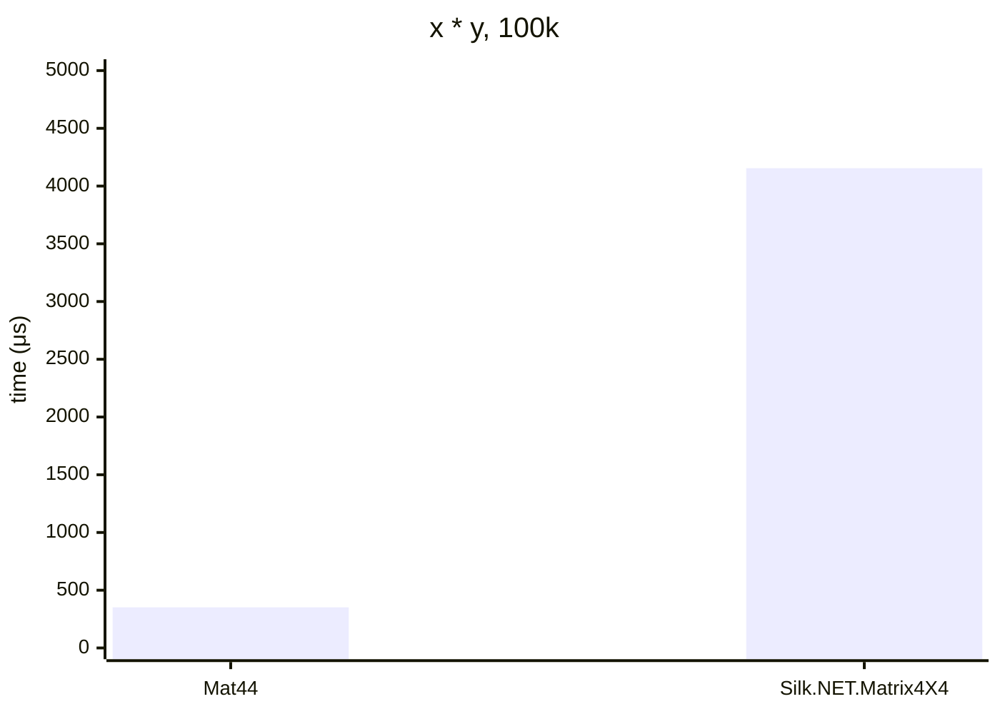

# .NET 10.0.626.17701, X64 RyuJIT x86-64-v4, Windows 11 26200.8246

# AMD Ryzen 9 7900X 4.70GHz



## Mat44&lt;double&gt;

<details>
<summary>asm</summary>

```assembly
; System.Numerics.Bench.StressMat44`1[[System.Double, System.Private.CoreLib]].Multiply()
       sub       rsp,28
       xor       eax,eax
M00_L00:
       mov       rdx,[rcx+10]
       mov       r8,[rcx+8]
       mov       r10,r8
       mov       r9d,[r10+8]
       cmp       eax,r9d
       jae       near ptr M00_L01
       mov       r11,rax
       shl       r11,7
       lea       r10,[r10+r11+10]
       vmovsd    xmm0,qword ptr [r10]
       vmovsd    xmm1,qword ptr [r10+8]
       vmovsd    xmm2,qword ptr [r10+10]
       vmovsd    xmm3,qword ptr [r10+18]
       vmovsd    xmm4,qword ptr [r10+20]
       vmovsd    xmm5,qword ptr [r10+28]
       vmovsd    xmm16,qword ptr [r10+30]
       vmovsd    xmm17,qword ptr [r10+38]
       vmovsd    xmm18,qword ptr [r10+40]
       vmovsd    xmm19,qword ptr [r10+48]
       vmovsd    xmm20,qword ptr [r10+50]
       vmovsd    xmm21,qword ptr [r10+58]
       vmovsd    xmm22,qword ptr [r10+60]
       vmovsd    xmm23,qword ptr [r10+68]
       vmovsd    xmm24,qword ptr [r10+70]
       vmovsd    xmm25,qword ptr [r10+78]
       lea       r10d,[rax+1]
       cmp       r10d,r9d
       jae       near ptr M00_L01
       mov       r9d,r10d
       shl       r9,7
       lea       r8,[r8+r9+10]
       vmovups   ymm26,[r8]
       vmovups   ymm27,[r8+20]
       vmovups   ymm28,[r8+40]
       vmovups   ymm29,[r8+60]
       vbroadcastsd ymm0,xmm0
       vbroadcastsd ymm1,xmm1
       vbroadcastsd ymm2,xmm2
       vbroadcastsd ymm3,xmm3
       vmulpd    ymm1,ymm1,ymm27
       vfmadd213pd ymm0,ymm26,ymm1
       vmulpd    ymm3,ymm3,ymm29
       vfmadd213pd ymm2,ymm28,ymm3
       vaddpd    ymm0,ymm2,ymm0
       vbroadcastsd ymm1,xmm4
       vbroadcastsd ymm2,xmm5
       vbroadcastsd ymm3,xmm16
       vbroadcastsd ymm4,xmm17
       vmulpd    ymm2,ymm2,ymm27
       vfmadd213pd ymm1,ymm26,ymm2
       vmulpd    ymm4,ymm4,ymm29
       vfmadd213pd ymm3,ymm28,ymm4
       vaddpd    ymm1,ymm3,ymm1
       vbroadcastsd ymm2,xmm18
       vbroadcastsd ymm3,xmm19
       vbroadcastsd ymm4,xmm20
       vbroadcastsd ymm5,xmm21
       vmulpd    ymm3,ymm3,ymm27
       vfmadd213pd ymm2,ymm26,ymm3
       vmulpd    ymm5,ymm5,ymm29
       vfmadd213pd ymm4,ymm28,ymm5
       vaddpd    ymm2,ymm4,ymm2
       vbroadcastsd ymm3,xmm22
       vbroadcastsd ymm4,xmm23
       vbroadcastsd ymm5,xmm24
       vbroadcastsd ymm16,xmm25
       vmulpd    ymm4,ymm4,ymm27
       vfmadd213pd ymm26,ymm3,ymm4
       vmulpd    ymm3,ymm16,ymm29
       vfmadd213pd ymm28,ymm5,ymm3
       vaddpd    ymm3,ymm28,ymm26
       cmp       eax,[rdx+8]
       jae       short M00_L01
       lea       rax,[rdx+r11+10]
       vmovups   [rax],ymm0
       vmovups   [rax+20],ymm1
       vmovups   [rax+40],ymm2
       vmovups   [rax+60],ymm3
       mov       eax,r10d
       cmp       eax,1869F
       jl        near ptr M00_L00
       vzeroupper
       add       rsp,28
       ret
M00_L01:
       call      CORINFO_HELP_RNGCHKFAIL
       int       3
; Total bytes of code 460
```
</details>

## Silk.NET.Matrix4X4&lt;double&gt;

<details>
<summary>asm</summary>

```assembly
; System.Numerics.Bench.StressMatrix4X4`1[[System.Double, System.Private.CoreLib]].Multiply()
       push      r14
       push      rdi
       push      rsi
       push      rbp
       push      rbx
       sub       rsp,470
       vmovaps   [rsp+460],xmm6
       vmovaps   [rsp+450],xmm7
       vmovaps   [rsp+440],xmm8
       vmovaps   [rsp+430],xmm9
       vmovaps   [rsp+420],xmm10
       vmovaps   [rsp+410],xmm11
       vmovaps   [rsp+400],xmm12
       vmovaps   [rsp+3F0],xmm13
       vmovaps   [rsp+3E0],xmm14
       vmovaps   [rsp+3D0],xmm15
       mov       rbx,rcx
       xor       esi,esi
M00_L00:
       mov       rdi,[rbx+10]
       mov       rdx,[rbx+8]
       mov       r8,rdx
       mov       ecx,[r8+8]
       cmp       esi,ecx
       jae       near ptr M00_L01
       mov       rbp,rsi
       shl       rbp,7
       lea       r8,[r8+rbp+10]
       vmovsd    xmm0,qword ptr [r8]
       vmovsd    xmm1,qword ptr [r8+8]
       vmovsd    xmm2,qword ptr [r8+10]
       vmovsd    xmm3,qword ptr [r8+18]
       vmovsd    xmm4,qword ptr [r8+20]
       vmovsd    xmm5,qword ptr [r8+28]
       vmovsd    xmm16,qword ptr [r8+30]
       vmovsd    xmm6,qword ptr [r8+38]
       vmovsd    xmm7,qword ptr [r8+40]
       vmovsd    xmm8,qword ptr [r8+48]
       vmovsd    xmm9,qword ptr [r8+50]
       vmovsd    xmm10,qword ptr [r8+58]
       vmovsd    xmm11,qword ptr [r8+60]
       vmovsd    qword ptr [rsp+98],xmm11
       vmovsd    xmm12,qword ptr [r8+68]
       vmovsd    qword ptr [rsp+90],xmm12
       vmovsd    xmm13,qword ptr [r8+70]
       vmovsd    xmm14,qword ptr [r8+78]
       vmovsd    qword ptr [rsp+88],xmm14
       lea       r14d,[rsi+1]
       cmp       r14d,ecx
       jae       near ptr M00_L01
       mov       r8d,r14d
       shl       r8,7
       lea       rdx,[rdx+r8+10]
       vmovsd    xmm15,qword ptr [rdx+40]
       vmovsd    xmm17,qword ptr [rdx+48]
       vmovsd    qword ptr [rsp+80],xmm17
       vmovsd    xmm18,qword ptr [rdx+50]
       vmovsd    qword ptr [rsp+78],xmm18
       vmovsd    xmm19,qword ptr [rdx+58]
       vmovsd    qword ptr [rsp+70],xmm19
       vmovdqu32 zmm20,[rdx]
       vmovdqu32 [rsp+350],zmm20
       vmovdqu32 zmm20,[rdx+40]
       vmovdqu32 [rsp+390],zmm20
       vmovsd    xmm20,qword ptr [rsp+350]
       vmovaps   xmm21,xmm20
       vmovsd    xmm22,qword ptr [rsp+358]
       vmovaps   xmm23,xmm22
       vmovsd    xmm24,qword ptr [rsp+360]
       vmovaps   xmm25,xmm24
       vmovsd    xmm26,qword ptr [rsp+368]
       vmovaps   xmm27,xmm26
       vmulsd    xmm21,xmm21,xmm0
       vmulsd    xmm23,xmm23,xmm0
       vmulsd    xmm25,xmm25,xmm0
       vmulsd    xmm0,xmm27,xmm0
       vmovsd    xmm27,qword ptr [rsp+370]
       vmovaps   xmm28,xmm27
       vmovsd    xmm29,qword ptr [rsp+378]
       vmovaps   xmm30,xmm29
       vmovsd    xmm31,qword ptr [rsp+380]
       vmovaps   xmm14,xmm31
       vmovsd    xmm12,qword ptr [rsp+388]
       vmovaps   xmm11,xmm12
       vmulsd    xmm28,xmm28,xmm1
       vmulsd    xmm30,xmm30,xmm1
       vmulsd    xmm14,xmm14,xmm1
       vmulsd    xmm1,xmm11,xmm1
       vaddsd    xmm21,xmm21,xmm28
       vaddsd    xmm23,xmm23,xmm30
       vaddsd    xmm25,xmm25,xmm14
       vaddsd    xmm0,xmm0,xmm1
       vmulsd    xmm1,xmm15,xmm2
       vmulsd    xmm28,xmm17,xmm2
       vmulsd    xmm30,xmm18,xmm2
       vmulsd    xmm2,xmm19,xmm2
       vaddsd    xmm1,xmm21,xmm1
       vaddsd    xmm21,xmm23,xmm28
       vaddsd    xmm23,xmm25,xmm30
       vaddsd    xmm0,xmm0,xmm2
       vmovsd    xmm2,qword ptr [rsp+3B0]
       vmovsd    xmm25,qword ptr [rsp+3B8]
       vmovsd    xmm28,qword ptr [rsp+3C0]
       vmovsd    xmm30,qword ptr [rsp+3C8]
       vmulsd    xmm2,xmm2,xmm3
       vmulsd    xmm25,xmm25,xmm3
       vmulsd    xmm28,xmm28,xmm3
       vmulsd    xmm3,xmm30,xmm3
       vaddsd    xmm11,xmm1,xmm2
       vaddsd    xmm14,xmm21,xmm25
       vaddsd    xmm1,xmm23,xmm28
       vmovsd    qword ptr [rsp+0C8],xmm1
       vaddsd    xmm0,xmm0,xmm3
       vmovsd    qword ptr [rsp+0C0],xmm0
       vmulsd    xmm2,xmm20,xmm4
       vmulsd    xmm3,xmm22,xmm4
       vmulsd    xmm20,xmm24,xmm4
       vmulsd    xmm4,xmm26,xmm4
       vmulsd    xmm21,xmm27,xmm5
       vmulsd    xmm22,xmm29,xmm5
       vmulsd    xmm23,xmm31,xmm5
       vmulsd    xmm5,xmm12,xmm5
       vaddsd    xmm2,xmm2,xmm21
       vaddsd    xmm3,xmm3,xmm22
       vaddsd    xmm20,xmm20,xmm23
       vaddsd    xmm4,xmm4,xmm5
       vmulsd    xmm5,xmm15,xmm16
       vmulsd    xmm21,xmm17,xmm16
       vmulsd    xmm22,xmm18,xmm16
       vmulsd    xmm16,xmm19,xmm16
       vmovsd    qword ptr [rsp+50],xmm2
       vmovsd    qword ptr [rsp+58],xmm3
       vmovsd    qword ptr [rsp+60],xmm20
       vmovsd    qword ptr [rsp+68],xmm4
       vmovsd    qword ptr [rsp+30],xmm5
       vmovsd    qword ptr [rsp+38],xmm21
       vmovsd    qword ptr [rsp+40],xmm22
       vmovsd    qword ptr [rsp+48],xmm16
       lea       rdx,[rsp+50]
       lea       r8,[rsp+30]
       lea       rcx,[rsp+330]
       call      qword ptr [7FFF43574D50]; Silk.NET.Maths.Vector4D`1[[System.Double, System.Private.CoreLib]].op_Addition(Silk.NET.Maths.Vector4D`1<Double>, Silk.NET.Maths.Vector4D`1<Double>)
       vmovdqu   ymm2,ymmword ptr [rsp+3B0]
       vmovdqu   ymmword ptr [rsp+50],ymm2
       lea       rdx,[rsp+50]
       lea       rcx,[rsp+310]
       vmovaps   xmm2,xmm6
       call      qword ptr [7FFF43575020]; Silk.NET.Maths.Vector4D`1[[System.Double, System.Private.CoreLib]].op_Multiply(Silk.NET.Maths.Vector4D`1<Double>, Double)
       lea       rcx,[rsp+2F0]
       lea       rdx,[rsp+330]
       lea       r8,[rsp+310]
       call      qword ptr [7FFF43574D50]; Silk.NET.Maths.Vector4D`1[[System.Double, System.Private.CoreLib]].op_Addition(Silk.NET.Maths.Vector4D`1<Double>, Silk.NET.Maths.Vector4D`1<Double>)
       vmovdqu   ymm2,ymmword ptr [rsp+350]
       vmovdqu   ymmword ptr [rsp+50],ymm2
       lea       rdx,[rsp+50]
       lea       rcx,[rsp+2D0]
       vmovaps   xmm2,xmm7
       call      qword ptr [7FFF43575020]; Silk.NET.Maths.Vector4D`1[[System.Double, System.Private.CoreLib]].op_Multiply(Silk.NET.Maths.Vector4D`1<Double>, Double)
       vmovdqu   ymm2,ymmword ptr [rsp+370]
       vmovdqu   ymmword ptr [rsp+50],ymm2
       lea       rdx,[rsp+50]
       lea       rcx,[rsp+2B0]
       vmovaps   xmm2,xmm8
       call      qword ptr [7FFF43575020]; Silk.NET.Maths.Vector4D`1[[System.Double, System.Private.CoreLib]].op_Multiply(Silk.NET.Maths.Vector4D`1<Double>, Double)
       lea       rcx,[rsp+290]
       lea       rdx,[rsp+2D0]
       lea       r8,[rsp+2B0]
       call      qword ptr [7FFF43574D50]; Silk.NET.Maths.Vector4D`1[[System.Double, System.Private.CoreLib]].op_Addition(Silk.NET.Maths.Vector4D`1<Double>, Silk.NET.Maths.Vector4D`1<Double>)
       vmovsd    qword ptr [rsp+390],xmm15
       vmovsd    xmm6,qword ptr [rsp+80]
       vmovsd    qword ptr [rsp+398],xmm6
       vmovsd    xmm7,qword ptr [rsp+78]
       vmovsd    qword ptr [rsp+3A0],xmm7
       vmovsd    xmm8,qword ptr [rsp+70]
       vmovsd    qword ptr [rsp+3A8],xmm8
       vmovdqu   ymm2,ymmword ptr [rsp+390]
       vmovdqu   ymmword ptr [rsp+50],ymm2
       lea       rdx,[rsp+50]
       lea       rcx,[rsp+270]
       vmovaps   xmm2,xmm9
       call      qword ptr [7FFF43575020]; Silk.NET.Maths.Vector4D`1[[System.Double, System.Private.CoreLib]].op_Multiply(Silk.NET.Maths.Vector4D`1<Double>, Double)
       lea       rcx,[rsp+250]
       lea       rdx,[rsp+290]
       lea       r8,[rsp+270]
       call      qword ptr [7FFF43574D50]; Silk.NET.Maths.Vector4D`1[[System.Double, System.Private.CoreLib]].op_Addition(Silk.NET.Maths.Vector4D`1<Double>, Silk.NET.Maths.Vector4D`1<Double>)
       vmovdqu   ymm2,ymmword ptr [rsp+3B0]
       vmovdqu   ymmword ptr [rsp+50],ymm2
       lea       rdx,[rsp+50]
       lea       rcx,[rsp+230]
       vmovaps   xmm2,xmm10
       call      qword ptr [7FFF43575020]; Silk.NET.Maths.Vector4D`1[[System.Double, System.Private.CoreLib]].op_Multiply(Silk.NET.Maths.Vector4D`1<Double>, Double)
       lea       rcx,[rsp+210]
       lea       rdx,[rsp+250]
       lea       r8,[rsp+230]
       call      qword ptr [7FFF43574D50]; Silk.NET.Maths.Vector4D`1[[System.Double, System.Private.CoreLib]].op_Addition(Silk.NET.Maths.Vector4D`1<Double>, Silk.NET.Maths.Vector4D`1<Double>)
       vmovdqu   ymm2,ymmword ptr [rsp+350]
       vmovdqu   ymmword ptr [rsp+50],ymm2
       lea       rdx,[rsp+50]
       lea       rcx,[rsp+1F0]
       vmovsd    xmm2,qword ptr [rsp+98]
       call      qword ptr [7FFF43575020]; Silk.NET.Maths.Vector4D`1[[System.Double, System.Private.CoreLib]].op_Multiply(Silk.NET.Maths.Vector4D`1<Double>, Double)
       vmovdqu   ymm2,ymmword ptr [rsp+370]
       vmovdqu   ymmword ptr [rsp+50],ymm2
       lea       rdx,[rsp+50]
       lea       rcx,[rsp+1D0]
       vmovsd    xmm2,qword ptr [rsp+90]
       call      qword ptr [7FFF43575020]; Silk.NET.Maths.Vector4D`1[[System.Double, System.Private.CoreLib]].op_Multiply(Silk.NET.Maths.Vector4D`1<Double>, Double)
       lea       rcx,[rsp+1B0]
       lea       rdx,[rsp+1F0]
       lea       r8,[rsp+1D0]
       call      qword ptr [7FFF43574D50]; Silk.NET.Maths.Vector4D`1[[System.Double, System.Private.CoreLib]].op_Addition(Silk.NET.Maths.Vector4D`1<Double>, Silk.NET.Maths.Vector4D`1<Double>)
       vmovaps   xmm0,xmm15
       vmovaps   xmm1,xmm13
       call      qword ptr [7FFF43574ED0]; Silk.NET.Maths.Scalar.Multiply[[System.Double, System.Private.CoreLib]](Double, Double)
       vmovaps   xmm9,xmm0
       vmovaps   xmm0,xmm6
       vmovaps   xmm1,xmm13
       call      qword ptr [7FFF43574ED0]; Silk.NET.Maths.Scalar.Multiply[[System.Double, System.Private.CoreLib]](Double, Double)
       vmovaps   xmm6,xmm0
       vmovaps   xmm0,xmm7
       vmovaps   xmm1,xmm13
       call      qword ptr [7FFF43574ED0]; Silk.NET.Maths.Scalar.Multiply[[System.Double, System.Private.CoreLib]](Double, Double)
       vmovaps   xmm7,xmm0
       vxorps    ymm0,ymm0,ymm0
       vmovdqu32 [rsp+0A0],ymm0
       vmovaps   xmm0,xmm8
       vmovaps   xmm1,xmm13
       call      qword ptr [7FFF43574ED0]; Silk.NET.Maths.Scalar.Multiply[[System.Double, System.Private.CoreLib]](Double, Double)
       vmovsd    qword ptr [rsp+20],xmm0
       lea       rcx,[rsp+0A0]
       vmovaps   xmm1,xmm9
       vmovaps   xmm2,xmm6
       vmovaps   xmm3,xmm7
       call      qword ptr [7FFF43575038]; Silk.NET.Maths.Vector4D`1[[System.Double, System.Private.CoreLib]]..ctor(Double, Double, Double, Double)
       vmovdqu32 ymm0,[rsp+0A0]
       vmovdqu   ymmword ptr [rsp+50],ymm0
       lea       r8,[rsp+50]
       lea       rdx,[rsp+1B0]
       lea       rcx,[rsp+190]
       call      qword ptr [7FFF43574D50]; Silk.NET.Maths.Vector4D`1[[System.Double, System.Private.CoreLib]].op_Addition(Silk.NET.Maths.Vector4D`1<Double>, Silk.NET.Maths.Vector4D`1<Double>)
       lea       rcx,[rsp+170]
       lea       rdx,[rsp+3B0]
       vmovsd    xmm2,qword ptr [rsp+88]
       call      qword ptr [7FFF43575020]; Silk.NET.Maths.Vector4D`1[[System.Double, System.Private.CoreLib]].op_Multiply(Silk.NET.Maths.Vector4D`1<Double>, Double)
       vxorps    ymm0,ymm0,ymm0
       vmovdqu32 [rsp+0F0],zmm0
       vmovdqu32 [rsp+130],zmm0
       lea       rcx,[rsp+0D0]
       lea       rdx,[rsp+190]
       lea       r8,[rsp+170]
       call      qword ptr [7FFF43574D50]; Silk.NET.Maths.Vector4D`1[[System.Double, System.Private.CoreLib]].op_Addition(Silk.NET.Maths.Vector4D`1<Double>, Silk.NET.Maths.Vector4D`1<Double>)
       vmovsd    qword ptr [rsp+50],xmm11
       vmovsd    qword ptr [rsp+58],xmm14
       vmovsd    xmm6,qword ptr [rsp+0C8]
       vmovsd    qword ptr [rsp+60],xmm6
       vmovsd    xmm6,qword ptr [rsp+0C0]
       vmovsd    qword ptr [rsp+68],xmm6
       lea       rdx,[rsp+0D0]
       mov       [rsp+20],rdx
       lea       rdx,[rsp+50]
       lea       rcx,[rsp+0F0]
       lea       r8,[rsp+2F0]
       lea       r9,[rsp+210]
       call      qword ptr [7FFF43574EB8]; Silk.NET.Maths.Matrix4X4`1[[System.Double, System.Private.CoreLib]]..ctor(Silk.NET.Maths.Vector4D`1<Double>, Silk.NET.Maths.Vector4D`1<Double>, Silk.NET.Maths.Vector4D`1<Double>, Silk.NET.Maths.Vector4D`1<Double>)
       cmp       esi,[rdi+8]
       jae       near ptr M00_L01
       vmovdqu32 zmm0,[rsp+0F0]
       vmovdqu32 [rdi+rbp+10],zmm0
       vmovdqu32 zmm0,[rsp+130]
       vmovdqu32 [rdi+rbp+50],zmm0
       mov       esi,r14d
       cmp       esi,1869F
       jl        near ptr M00_L00
       vzeroupper
       vmovaps   xmm6,[rsp+460]
       vmovaps   xmm7,[rsp+450]
       vmovaps   xmm8,[rsp+440]
       vmovaps   xmm9,[rsp+430]
       vmovaps   xmm10,[rsp+420]
       vmovaps   xmm11,[rsp+410]
       vmovaps   xmm12,[rsp+400]
       vmovaps   xmm13,[rsp+3F0]
       vmovaps   xmm14,[rsp+3E0]
       vmovaps   xmm15,[rsp+3D0]
       add       rsp,470
       pop       rbx
       pop       rbp
       pop       rsi
       pop       rdi
       pop       r14
       ret
M00_L01:
       call      CORINFO_HELP_RNGCHKFAIL
       int       3
; Total bytes of code 1830
```
```assembly
; Silk.NET.Maths.Vector4D`1[[System.Double, System.Private.CoreLib]].op_Addition(Silk.NET.Maths.Vector4D`1<Double>, Silk.NET.Maths.Vector4D`1<Double>)
       vmovsd    xmm0,qword ptr [rdx]
       vaddsd    xmm0,xmm0,qword ptr [r8]
       vmovsd    xmm1,qword ptr [rdx+8]
       vaddsd    xmm1,xmm1,qword ptr [r8+8]
       vmovsd    xmm2,qword ptr [rdx+10]
       vaddsd    xmm2,xmm2,qword ptr [r8+10]
       vmovsd    xmm3,qword ptr [rdx+18]
       vaddsd    xmm3,xmm3,qword ptr [r8+18]
       vmovsd    qword ptr [rcx],xmm0
       vmovsd    qword ptr [rcx+8],xmm1
       vmovsd    qword ptr [rcx+10],xmm2
       vmovsd    qword ptr [rcx+18],xmm3
       mov       rax,rcx
       ret
; Total bytes of code 65
```
```assembly
; Silk.NET.Maths.Vector4D`1[[System.Double, System.Private.CoreLib]].op_Multiply(Silk.NET.Maths.Vector4D`1<Double>, Double)
       vmulsd    xmm0,xmm2,qword ptr [rdx]
       vmulsd    xmm1,xmm2,qword ptr [rdx+8]
       vmulsd    xmm3,xmm2,qword ptr [rdx+10]
       vmulsd    xmm2,xmm2,qword ptr [rdx+18]
       vmovsd    qword ptr [rcx],xmm0
       vmovsd    qword ptr [rcx+8],xmm1
       vmovsd    qword ptr [rcx+10],xmm3
       vmovsd    qword ptr [rcx+18],xmm2
       mov       rax,rcx
       ret
; Total bytes of code 42
```
```assembly
; Silk.NET.Maths.Scalar.Multiply[[System.Double, System.Private.CoreLib]](Double, Double)
       vmulsd    xmm0,xmm0,xmm1
       ret
; Total bytes of code 5
```
```assembly
; Silk.NET.Maths.Vector4D`1[[System.Double, System.Private.CoreLib]]..ctor(Double, Double, Double, Double)
       vmovsd    qword ptr [rcx],xmm1
       vmovsd    qword ptr [rcx+8],xmm2
       vmovsd    qword ptr [rcx+10],xmm3
       vmovsd    xmm0,qword ptr [rsp+28]
       vmovsd    qword ptr [rcx+18],xmm0
       ret
; Total bytes of code 26
```
```assembly
; Silk.NET.Maths.Matrix4X4`1[[System.Double, System.Private.CoreLib]]..ctor(Silk.NET.Maths.Vector4D`1<Double>, Silk.NET.Maths.Vector4D`1<Double>, Silk.NET.Maths.Vector4D`1<Double>, Silk.NET.Maths.Vector4D`1<Double>)
       mov       rax,[rsp+28]
       vmovdqu   ymm0,ymmword ptr [rdx]
       vmovdqu   ymmword ptr [rcx],ymm0
       vmovdqu   ymm0,ymmword ptr [r8]
       vmovdqu   ymmword ptr [rcx+20],ymm0
       vmovdqu   ymm0,ymmword ptr [r9]
       vmovdqu   ymmword ptr [rcx+40],ymm0
       vmovdqu   ymm0,ymmword ptr [rax]
       vmovdqu   ymmword ptr [rcx+60],ymm0
       vzeroupper
       ret
; Total bytes of code 46
```
</details>
