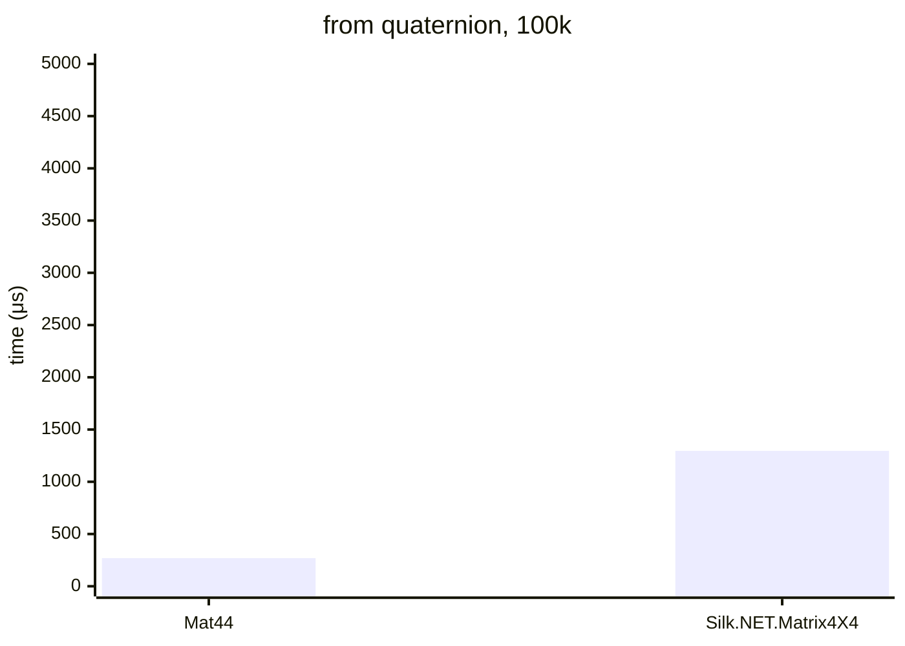

# .NET 10.0.626.17701, X64 RyuJIT x86-64-v4, Windows 11 26200.8246

# AMD Ryzen 9 7900X 4.70GHz



## Mat44&lt;double&gt;

<details>
<summary>asm</summary>

```assembly
; System.Numerics.Bench.StressMat44WithQuat`1[[System.Double, System.Private.CoreLib]].Rotation()
       sub       rsp,28
       xor       eax,eax
       vbroadcastsd ymm0,qword ptr [7FFF431CAC40]
M00_L00:
       mov       rdx,[rcx+10]
       mov       r8,[rcx+18]
       cmp       eax,[r8+8]
       jae       near ptr M00_L01
       mov       r10d,eax
       mov       r9,r10
       shl       r9,5
       vmovups   ymm1,[r8+r9+10]
       vpermq    ymm2,ymm1,0C9
       vpermq    ymm3,ymm1,0FF
       vpermq    ymm4,ymm1,0D2
       vmulpd    ymm2,ymm1,ymm2
       vmulpd    ymm3,ymm4,ymm3
       vmulpd    ymm1,ymm1,ymm1
       vaddpd    ymm5,ymm2,ymm3
       vsubpd    ymm4,ymm2,ymm3
       vaddpd    ymm5,ymm5,ymm5
       vaddpd    ymm4,ymm4,ymm4
       vpermq    ymm2,ymm1,0C9
       vaddpd    ymm1,ymm2,ymm1
       vaddpd    ymm1,ymm1,ymm1
       vsubpd    ymm1,ymm0,ymm1
       vmovaps   ymm3,ymm1
       vmovaps   ymm2,ymm4
       vunpckhpd xmm3,xmm3,xmm3
       vmovsd    xmm2,xmm2,xmm3
       vinsertf128 ymm2,ymm4,xmm2,0
       vmovaps   ymm3,ymm2
       vmovaps   ymm16,ymm5
       vunpcklpd xmm3,xmm3,xmm16
       vinsertf128 ymm2,ymm2,xmm3,0
       vextractf128 xmm3,ymm1,1
       vmovaps   ymm16,ymm4
       vunpcklpd xmm3,xmm16,xmm3
       vinsertf128 ymm3,ymm4,xmm3,0
       vmovaps   ymm16,ymm5
       vextractf32x4 xmm17,ymm3,1
       vunpckhpd xmm16,xmm16,xmm16
       vmovsd    xmm16,xmm17,xmm16
       vinsertf32x4 ymm3,ymm3,xmm16,1
       vextractf128 xmm5,ymm5,1
       vmovaps   ymm16,ymm4
       vmovsd    xmm5,xmm16,xmm5
       vinsertf128 ymm4,ymm4,xmm5,0
       vextractf128 xmm5,ymm4,1
       vmovsd    xmm1,xmm5,xmm1
       vinsertf128 ymm4,ymm4,xmm1,1
       cmp       eax,[rdx+8]
       jae       short M00_L01
       shl       r10,7
       lea       rdx,[rdx+r10+10]
       vmovups   [rdx],ymm2
       vmovups   [rdx+20],ymm3
       vmovups   [rdx+40],ymm4
       vmovups   ymm1,[7FFF431CAC60]
       vmovups   [rdx+60],ymm1
       inc       eax
       cmp       eax,186A0
       jl        near ptr M00_L00
       vzeroupper
       add       rsp,28
       ret
M00_L01:
       call      CORINFO_HELP_RNGCHKFAIL
       int       3
; Total bytes of code 322
```
</details>

## Silk.NET.Matrix4X4&lt;double&gt;

<details>
<summary>asm</summary>

```assembly
; System.Numerics.Bench.StressMatrix4X4WithQuaternion`1[[System.Double, System.Private.CoreLib]].Rotation()
       push      rdi
       push      rsi
       push      rbx
       sub       rsp,0C0
       mov       rbx,rcx
       xor       esi,esi
M00_L00:
       mov       rdi,[rbx+10]
       mov       rdx,[rbx+28]
       cmp       esi,[rdx+8]
       jae       short M00_L01
       mov       rcx,rsi
       shl       rcx,5
       vmovdqu   ymm0,ymmword ptr [rdx+rcx+10]
       vmovdqu   ymmword ptr [rsp+20],ymm0
       lea       rdx,[rsp+20]
       lea       rcx,[rsp+40]
       call      qword ptr [7FFF43564CF0]; Silk.NET.Maths.Matrix4X4.CreateFromQuaternion[[System.Double, System.Private.CoreLib]](Silk.NET.Maths.Quaternion`1<Double>)
       cmp       esi,[rdi+8]
       jae       short M00_L01
       mov       rax,rsi
       shl       rax,7
       vmovdqu32 zmm0,[rsp+40]
       vmovdqu32 [rdi+rax+10],zmm0
       vmovdqu32 zmm0,[rsp+80]
       vmovdqu32 [rdi+rax+50],zmm0
       inc       esi
       cmp       esi,186A0
       jl        short M00_L00
       vzeroupper
       add       rsp,0C0
       pop       rbx
       pop       rsi
       pop       rdi
       ret
M00_L01:
       call      CORINFO_HELP_RNGCHKFAIL
       int       3
; Total bytes of code 143
```
```assembly
; Silk.NET.Maths.Matrix4X4.CreateFromQuaternion[[System.Double, System.Private.CoreLib]](Silk.NET.Maths.Quaternion`1<Double>)
       sub       rsp,88
       vmovsd    xmm0,qword ptr [rdx]
       vmovsd    xmm1,qword ptr [rdx+8]
       vmovsd    xmm2,qword ptr [rdx+10]
       vmovsd    xmm3,qword ptr [rdx+18]
       mov       rax,255CA728DE0
       vmovdqu32 zmm4,[rax]
       vmovdqu32 [rsp+8],zmm4
       vmovdqu32 zmm4,[rax+40]
       vmovdqu32 [rsp+48],zmm4
       vmulsd    xmm4,xmm0,xmm0
       vmulsd    xmm5,xmm1,xmm1
       vmulsd    xmm16,xmm2,xmm2
       vmulsd    xmm17,xmm0,xmm1
       vmulsd    xmm18,xmm2,xmm3
       vmulsd    xmm19,xmm2,xmm0
       vmulsd    xmm20,xmm1,xmm3
       vmulsd    xmm1,xmm1,xmm2
       vmulsd    xmm0,xmm0,xmm3
       vmovdqu32 zmm2,[rsp+8]
       vmovdqu32 [rcx],zmm2
       vmovdqu32 zmm2,[rsp+48]
       vmovdqu32 [rcx+40],zmm2
       vaddsd    xmm2,xmm5,xmm16
       vmovsd    xmm3,qword ptr [7FFF431BBDE0]
       vmulsd    xmm2,xmm2,xmm3
       vmovsd    xmm21,qword ptr [7FFF431BBDE8]
       vsubsd    xmm2,xmm21,xmm2
       vmovsd    qword ptr [rcx],xmm2
       vaddsd    xmm2,xmm17,xmm18
       vmulsd    xmm2,xmm2,xmm3
       vmovsd    qword ptr [rcx+8],xmm2
       vsubsd    xmm2,xmm19,xmm20
       vmulsd    xmm2,xmm2,xmm3
       vmovsd    qword ptr [rcx+10],xmm2
       vsubsd    xmm2,xmm17,xmm18
       vmulsd    xmm2,xmm2,xmm3
       vmovsd    qword ptr [rcx+20],xmm2
       vaddsd    xmm2,xmm16,xmm4
       vmulsd    xmm2,xmm2,xmm3
       vsubsd    xmm2,xmm21,xmm2
       vmovsd    qword ptr [rcx+28],xmm2
       vaddsd    xmm2,xmm1,xmm0
       vmulsd    xmm2,xmm2,xmm3
       vmovsd    qword ptr [rcx+30],xmm2
       vaddsd    xmm2,xmm19,xmm20
       vmulsd    xmm2,xmm2,xmm3
       vmovsd    qword ptr [rcx+40],xmm2
       vsubsd    xmm0,xmm1,xmm0
       vmulsd    xmm0,xmm0,xmm3
       vmovsd    qword ptr [rcx+48],xmm0
       vaddsd    xmm0,xmm5,xmm4
       vmulsd    xmm0,xmm0,xmm3
       vsubsd    xmm0,xmm21,xmm0
       vmovsd    qword ptr [rcx+50],xmm0
       mov       rax,rcx
       vzeroupper
       add       rsp,88
       ret
; Total bytes of code 330
```
</details>
