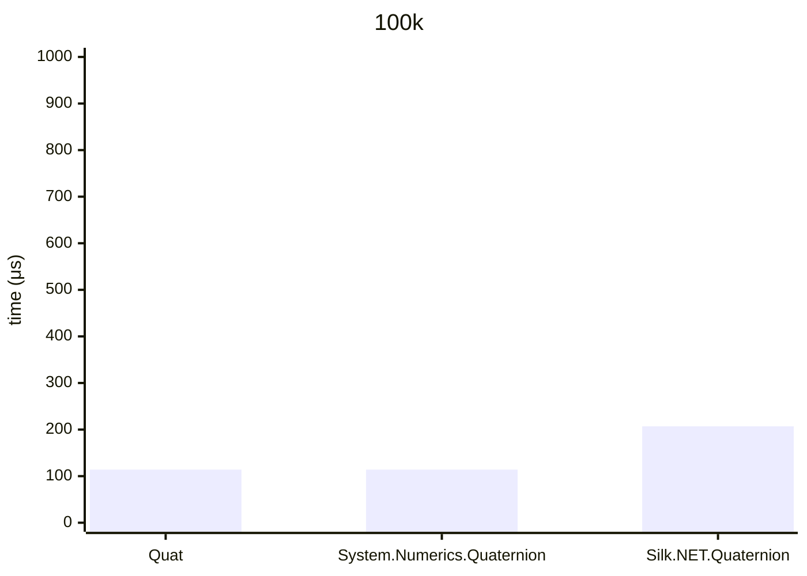
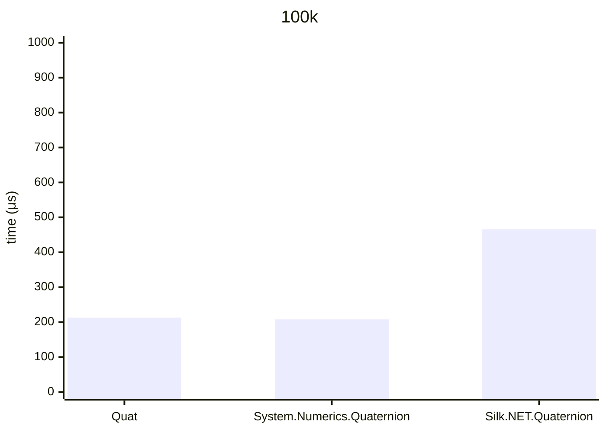

## .NET 10.0.626.17701, X64 RyuJIT x86-64-v4, Windows 11 26200.8246, AMD Ryzen 9 7900X 4.70GHz

# a * b



## Quat&lt;float&gt;

<details>
<summary>asm</summary>

```assembly
; System.Numerics.Bench.StressQuat`1[[System.Single, System.Private.CoreLib]].Multiply()
       push      rbx
       sub       rsp,20
       mov       rax,[rcx+10]
       vmovups   xmm0,[7FFF431B9A20]
       vmovups   xmm1,[7FFF431B9A30]
       vmovddup  xmm2,qword ptr [7FFF431B9A40]
       xor       edx,edx
M00_L00:
       mov       r8,rax
       mov       r10,[rcx+8]
       mov       r9,r10
       mov       r11d,[r9+8]
       cmp       edx,r11d
       jae       near ptr M00_L01
       mov       rbx,rdx
       shl       rbx,4
       vmovups   xmm3,[r9+rbx+10]
       lea       r9d,[rdx+1]
       cmp       r9d,r11d
       jae       near ptr M00_L01
       mov       r11d,r9d
       shl       r11,4
       vmovups   xmm4,[r10+r11+10]
       vmovaps   xmm5,xmm3
       vbroadcastss xmm5,xmm5
       vmovshdup xmm16,xmm3
       vbroadcastss xmm16,xmm16
       vunpckhps xmm17,xmm3,xmm3
       vbroadcastss xmm17,xmm17
       vshufps   xmm3,xmm3,xmm3,0FF
       vbroadcastss xmm3,xmm3
       vpshufd   xmm18,xmm4,0B1
       vmulps    xmm17,xmm18,xmm17
       vpshufd   xmm18,xmm4,4E
       vmulps    xmm16,xmm18,xmm16
       vpshufd   xmm18,xmm4,1B
       vmulps    xmm5,xmm18,xmm5
       vmulps    xmm3,xmm4,xmm3
       vfmadd213ps xmm5,xmm2,xmm3
       vfmadd213ps xmm16,xmm1,xmm5
       vfmadd213ps xmm17,xmm0,xmm16
       cmp       edx,[r8+8]
       jae       short M00_L01
       vmovups   [r8+rbx+10],xmm17
       mov       edx,r9d
       cmp       edx,1869F
       jl        near ptr M00_L00
       add       rsp,20
       pop       rbx
       ret
M00_L01:
       call      CORINFO_HELP_RNGCHKFAIL
       int       3
; Total bytes of code 243
```
</details>

## System.Numerics.Quaternion

<details>
<summary>asm</summary>

```assembly
; System.Numerics.Bench.StressQuaternion.Multiply()
       push      rbx
       sub       rsp,20
       mov       rax,[rcx+10]
       vmovups   xmm0,[7FFF43199E40]
       vmovddup  xmm1,qword ptr [7FFF43199E50]
       vmovups   xmm2,[7FFF43199E60]
       xor       edx,edx
M00_L00:
       mov       r8,rax
       mov       r10,[rcx+8]
       mov       r9,r10
       mov       r11d,[r9+8]
       cmp       edx,r11d
       jae       near ptr M00_L01
       mov       rbx,rdx
       shl       rbx,4
       vmovups   xmm3,[r9+rbx+10]
       lea       r9d,[rdx+1]
       cmp       r9d,r11d
       jae       near ptr M00_L01
       mov       r11d,r9d
       shl       r11,4
       vmovups   xmm4,[r10+r11+10]
       vpermilps xmm5,xmm4,4E
       vmovshdup xmm16,xmm3
       vbroadcastss xmm16,xmm16
       vmulps    xmm5,xmm16,xmm5
       vpermilps xmm16,xmm4,1B
       vmovaps   xmm17,xmm3
       vbroadcastss xmm17,xmm17
       vmulps    xmm16,xmm17,xmm16
       vshufps   xmm17,xmm3,xmm3,0FF
       vbroadcastss xmm17,xmm17
       vmulps    xmm17,xmm17,xmm4
       vfmadd213ps xmm16,xmm1,xmm17
       vfmadd213ps xmm5,xmm0,xmm16
       cmp       edx,[r8+8]
       jae       short M00_L01
       vpermilps xmm4,xmm4,0B1
       vunpckhps xmm3,xmm3,xmm3
       vbroadcastss xmm3,xmm3
       vmulps    xmm3,xmm3,xmm4
       vfmadd231ps xmm5,xmm2,xmm3
       vmovups   [r8+rbx+10],xmm5
       mov       edx,r9d
       cmp       edx,1869F
       jl        near ptr M00_L00
       add       rsp,20
       pop       rbx
       ret
M00_L01:
       call      CORINFO_HELP_RNGCHKFAIL
       int       3
; Total bytes of code 243
```
</details>

## Silk.NET.Quaternion&lt;float&gt;

<details>
<summary>asm</summary>

```assembly
; System.Numerics.Bench.StressQuaternion`1[[System.Single, System.Private.CoreLib]].Multiply()
       sub       rsp,28
       xor       eax,eax
M00_L00:
       mov       rdx,[rcx+10]
       mov       r8,[rcx+8]
       mov       r10,r8
       mov       r9d,[r10+8]
       cmp       eax,r9d
       jae       near ptr M00_L01
       mov       r11,rax
       shl       r11,4
       lea       r10,[r10+r11+10]
       vmovss    xmm0,dword ptr [r10]
       vmovss    xmm1,dword ptr [r10+4]
       vmovss    xmm2,dword ptr [r10+8]
       vmovss    xmm3,dword ptr [r10+0C]
       lea       r10d,[rax+1]
       cmp       r10d,r9d
       jae       near ptr M00_L01
       mov       r9d,r10d
       shl       r9,4
       lea       r8,[r8+r9+10]
       vmovss    xmm4,dword ptr [r8]
       vmovss    xmm5,dword ptr [r8+4]
       vmovss    xmm16,dword ptr [r8+8]
       vmovss    xmm17,dword ptr [r8+0C]
       vmulss    xmm18,xmm1,xmm16
       vmulss    xmm19,xmm2,xmm5
       vsubss    xmm18,xmm18,xmm19
       vmulss    xmm19,xmm2,xmm4
       vmulss    xmm20,xmm0,xmm16
       vsubss    xmm19,xmm19,xmm20
       vmulss    xmm20,xmm0,xmm5
       vmulss    xmm21,xmm1,xmm4
       vsubss    xmm20,xmm20,xmm21
       vmulss    xmm21,xmm0,xmm4
       vmulss    xmm22,xmm1,xmm5
       vaddss    xmm21,xmm22,xmm21
       vmulss    xmm22,xmm2,xmm16
       vaddss    xmm21,xmm22,xmm21
       vmulss    xmm0,xmm0,xmm17
       vmulss    xmm4,xmm4,xmm3
       vaddss    xmm0,xmm4,xmm0
       vaddss    xmm0,xmm0,xmm18
       vmulss    xmm1,xmm1,xmm17
       vmulss    xmm4,xmm5,xmm3
       vaddss    xmm1,xmm4,xmm1
       vaddss    xmm1,xmm1,xmm19
       vmulss    xmm2,xmm2,xmm17
       vmulss    xmm4,xmm16,xmm3
       vaddss    xmm2,xmm4,xmm2
       vaddss    xmm2,xmm2,xmm20
       vmulss    xmm3,xmm3,xmm17
       vsubss    xmm3,xmm3,xmm21
       cmp       eax,[rdx+8]
       jae       short M00_L01
       lea       rax,[rdx+r11+10]
       vmovss    dword ptr [rax],xmm0
       vmovss    dword ptr [rax+4],xmm1
       vmovss    dword ptr [rax+8],xmm2
       vmovss    dword ptr [rax+0C],xmm3
       mov       eax,r10d
       cmp       eax,1869F
       jl        near ptr M00_L00
       add       rsp,28
       ret
M00_L01:
       call      CORINFO_HELP_RNGCHKFAIL
       int       3
; Total bytes of code 327
```
</details><br/>

# a / b


### Quat&lt;float&gt;

<details>
<summary>asm</summary>

```assembly
; System.Numerics.Bench.StressQuat`1[[System.Single, System.Private.CoreLib]].Divide()
       push      rbx
       sub       rsp,40
       vmovaps   [rsp+30],xmm6
       vmovaps   [rsp+20],xmm7
       mov       rax,[rcx+10]
       vmovups   xmm0,[7FFF431CA6E0]
       vbroadcastss xmm1,dword ptr [7FFF431CA6F0]
       vmovups   xmm2,[7FFF431CA700]
       vmovups   xmm3,[7FFF431CA710]
       vmovddup  xmm4,qword ptr [7FFF431CA720]
       xor       edx,edx
M00_L00:
       mov       r8,rax
       mov       r10,[rcx+8]
       mov       r9,r10
       mov       r11d,[r9+8]
       cmp       edx,r11d
       jae       near ptr M00_L01
       mov       rbx,rdx
       shl       rbx,4
       vmovups   xmm5,[r9+rbx+10]
       lea       r9d,[rdx+1]
       cmp       r9d,r11d
       jae       near ptr M00_L01
       mov       r11d,r9d
       shl       r11,4
       vmovups   xmm6,[r10+r11+10]
       vdpps     xmm7,xmm6,xmm6,0FF
       vmulps    xmm16,xmm0,xmm6
       vdivps    xmm16,xmm16,xmm7
       vcmpnleps xmm6,xmm7,xmm1
       vandps    xmm16,xmm6,xmm16
       vmovaps   xmm17,xmm5
       vbroadcastss xmm17,xmm17
       vmovshdup xmm18,xmm5
       vbroadcastss xmm18,xmm18
       vunpckhps xmm19,xmm5,xmm5
       vbroadcastss xmm19,xmm19
       vshufps   xmm5,xmm5,xmm5,0FF
       vbroadcastss xmm5,xmm5
       vpshufd   xmm20,xmm16,0B1
       vmulps    xmm19,xmm20,xmm19
       vpshufd   xmm20,xmm16,4E
       vmulps    xmm18,xmm20,xmm18
       vpshufd   xmm20,xmm16,1B
       vmulps    xmm17,xmm20,xmm17
       vmulps    xmm5,xmm16,xmm5
       vfmadd213ps xmm17,xmm4,xmm5
       vfmadd213ps xmm18,xmm3,xmm17
       vfmadd213ps xmm19,xmm2,xmm18
       cmp       edx,[r8+8]
       jae       short M00_L01
       vmovups   [r8+rbx+10],xmm19
       mov       edx,r9d
       cmp       edx,1869F
       jl        near ptr M00_L00
       vmovaps   xmm6,[rsp+30]
       vmovaps   xmm7,[rsp+20]
       add       rsp,40
       pop       rbx
       ret
M00_L01:
       call      CORINFO_HELP_RNGCHKFAIL
       int       3
; Total bytes of code 319
```
</details>

### System.Numerics.Quaternion

<details>
<summary>asm</summary>

```assembly
; System.Numerics.Bench.StressQuaternion.Divide()
       push      rbx
       sub       rsp,40
       vmovaps   [rsp+30],xmm6
       vmovaps   [rsp+20],xmm7
       mov       rax,[rcx+10]
       vmovups   xmm0,[7FFF431C9F40]
       vbroadcastss xmm1,dword ptr [7FFF431C9F50]
       vmovups   xmm2,[7FFF431C9F60]
       vmovddup  xmm3,qword ptr [7FFF431C9F70]
       vmovups   xmm4,[7FFF431C9F80]
       xor       edx,edx
M00_L00:
       mov       r8,rax
       mov       r10,[rcx+8]
       mov       r9,r10
       mov       r11d,[r9+8]
       cmp       edx,r11d
       jae       near ptr M00_L01
       mov       rbx,rdx
       shl       rbx,4
       vmovups   xmm5,[r9+rbx+10]
       lea       r9d,[rdx+1]
       cmp       r9d,r11d
       jae       near ptr M00_L01
       mov       r11d,r9d
       shl       r11,4
       vmovups   xmm6,[r10+r11+10]
       vdpps     xmm7,xmm6,xmm6,0FF
       vmulps    xmm16,xmm0,xmm6
       vdivps    xmm16,xmm16,xmm7
       vcmpnleps xmm6,xmm7,xmm1
       vandps    xmm16,xmm6,xmm16
       vpermilps xmm17,xmm16,4E
       vmovshdup xmm18,xmm5
       vbroadcastss xmm18,xmm18
       vmulps    xmm17,xmm18,xmm17
       vpermilps xmm18,xmm16,1B
       vmovaps   xmm19,xmm5
       vbroadcastss xmm19,xmm19
       vmulps    xmm18,xmm19,xmm18
       vshufps   xmm19,xmm5,xmm5,0FF
       vbroadcastss xmm19,xmm19
       vmulps    xmm19,xmm19,xmm16
       vfmadd213ps xmm18,xmm3,xmm19
       vfmadd213ps xmm17,xmm2,xmm18
       cmp       edx,[r8+8]
       jae       short M00_L01
       vpermilps xmm16,xmm16,0B1
       vunpckhps xmm5,xmm5,xmm5
       vbroadcastss xmm5,xmm5
       vmulps    xmm5,xmm5,xmm16
       vfmadd231ps xmm17,xmm4,xmm5
       vmovups   [r8+rbx+10],xmm17
       mov       edx,r9d
       cmp       edx,1869F
       jl        near ptr M00_L00
       vmovaps   xmm6,[rsp+30]
       vmovaps   xmm7,[rsp+20]
       add       rsp,40
       pop       rbx
       ret
M00_L01:
       call      CORINFO_HELP_RNGCHKFAIL
       int       3
; Total bytes of code 319
```
</details>

### Silk.NET.Quaternion&lt;float&gt;

<details>
<summary>asm</summary>

```assembly
; System.Numerics.Bench.StressQuaternion`1[[System.Single, System.Private.CoreLib]].Divide()
       sub       rsp,28
       vmovss    xmm0,dword ptr [7FFF431CA900]
       vmovss    xmm1,dword ptr [7FFF431CA904]
       xor       eax,eax
M00_L00:
       mov       rdx,[rcx+10]
       mov       r8,[rcx+8]
       mov       r10,r8
       mov       r9d,[r10+8]
       cmp       eax,r9d
       jae       near ptr M00_L01
       mov       r11,rax
       shl       r11,4
       lea       r10,[r10+r11+10]
       vmovss    xmm2,dword ptr [r10]
       vmovss    xmm3,dword ptr [r10+4]
       vmovss    xmm4,dword ptr [r10+8]
       vmovss    xmm5,dword ptr [r10+0C]
       lea       r10d,[rax+1]
       cmp       r10d,r9d
       jae       near ptr M00_L01
       mov       r9d,r10d
       shl       r9,4
       lea       r8,[r8+r9+10]
       vmovss    xmm16,dword ptr [r8]
       vmovss    xmm17,dword ptr [r8+4]
       vmovss    xmm18,dword ptr [r8+8]
       vmovss    xmm19,dword ptr [r8+0C]
       vmulss    xmm20,xmm16,xmm16
       vmulss    xmm21,xmm17,xmm17
       vaddss    xmm20,xmm21,xmm20
       vmulss    xmm21,xmm18,xmm18
       vaddss    xmm20,xmm21,xmm20
       vmulss    xmm21,xmm19,xmm19
       vaddss    xmm20,xmm21,xmm20
       vdivss    xmm20,xmm0,xmm20
       vmulss    xmm16,xmm16,xmm20
       vmulss    xmm16,xmm16,xmm1
       vmulss    xmm17,xmm17,xmm20
       vmulss    xmm17,xmm17,xmm1
       vmulss    xmm18,xmm18,xmm20
       vmulss    xmm18,xmm18,xmm1
       vmulss    xmm19,xmm19,xmm20
       vmulss    xmm20,xmm3,xmm18
       vmulss    xmm21,xmm4,xmm17
       vsubss    xmm20,xmm20,xmm21
       vmulss    xmm21,xmm4,xmm16
       vmulss    xmm22,xmm2,xmm18
       vsubss    xmm21,xmm21,xmm22
       vmulss    xmm22,xmm2,xmm17
       vmulss    xmm23,xmm3,xmm16
       vsubss    xmm22,xmm22,xmm23
       vmulss    xmm23,xmm2,xmm16
       vmulss    xmm24,xmm3,xmm17
       vaddss    xmm23,xmm24,xmm23
       vmulss    xmm24,xmm4,xmm18
       vaddss    xmm23,xmm24,xmm23
       vmulss    xmm2,xmm2,xmm19
       vmulss    xmm16,xmm16,xmm5
       vaddss    xmm2,xmm16,xmm2
       vaddss    xmm2,xmm2,xmm20
       vmulss    xmm3,xmm3,xmm19
       vmulss    xmm16,xmm17,xmm5
       vaddss    xmm3,xmm16,xmm3
       vaddss    xmm3,xmm3,xmm21
       vmulss    xmm4,xmm4,xmm19
       vmulss    xmm16,xmm18,xmm5
       vaddss    xmm4,xmm16,xmm4
       vaddss    xmm4,xmm4,xmm22
       vmulss    xmm5,xmm5,xmm19
       vsubss    xmm5,xmm5,xmm23
       cmp       eax,[rdx+8]
       jae       short M00_L01
       lea       rax,[rdx+r11+10]
       vmovss    dword ptr [rax],xmm2
       vmovss    dword ptr [rax+4],xmm3
       vmovss    dword ptr [rax+8],xmm4
       vmovss    dword ptr [rax+0C],xmm5
       mov       eax,r10d
       cmp       eax,1869F
       jl        near ptr M00_L00
       add       rsp,28
       ret
M00_L01:
       call      CORINFO_HELP_RNGCHKFAIL
       int       3
; Total bytes of code 445
```
</details>
