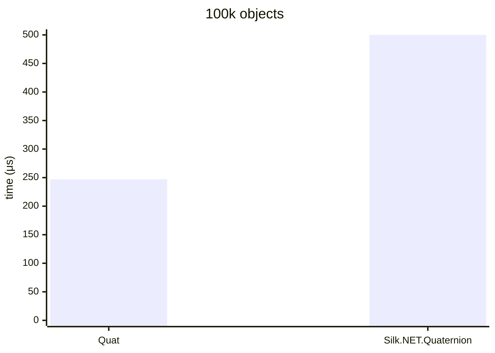
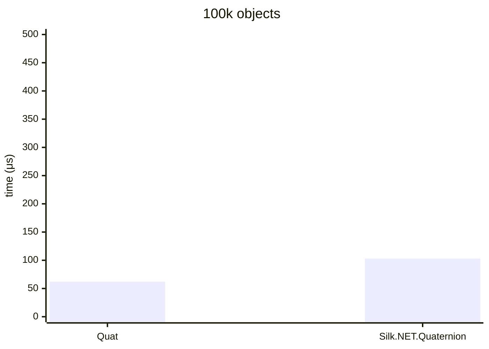
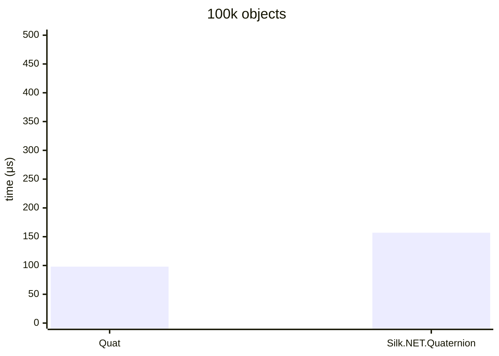

.NET 10.0.626.17701, X64 RyuJIT x86-64-v4, Windows 11 26200.8246, AMD Ryzen 9 7900X 4.70GHz

# Multiply


### Quat&lt;double&gt;

<details>
<summary>asm</summary>

```assembly
; System.Numerics.Bench.StressQuat`1[[System.Double, System.Private.CoreLib]].Multiply()
       push      rbx
       sub       rsp,20
       mov       rax,[rcx+10]
       vmovups   ymm0,[7FFF431D9AE0]
       vmovups   ymm1,[7FFF431D9B00]
       vbroadcastf128 ymm2,xmmword ptr [7FFF431D9B20]
       xor       edx,edx
M00_L00:
       mov       r8,rax
       mov       r10,[rcx+8]
       mov       r9,r10
       mov       r11d,[r9+8]
       cmp       edx,r11d
       jae       near ptr M00_L01
       mov       rbx,rdx
       shl       rbx,5
       lea       r9,[r9+rbx+10]
       vmovsd    xmm3,qword ptr [r9]
       vmovsd    xmm4,qword ptr [r9+8]
       vmovsd    xmm5,qword ptr [r9+10]
       vmovsd    xmm16,qword ptr [r9+18]
       lea       r9d,[rdx+1]
       cmp       r9d,r11d
       jae       near ptr M00_L01
       mov       r11d,r9d
       shl       r11,5
       vmovups   ymm17,[r10+r11+10]
       vbroadcastsd ymm3,xmm3
       vbroadcastsd ymm4,xmm4
       vbroadcastsd ymm5,xmm5
       vbroadcastsd ymm16,xmm16
       vshufpd   ymm18,ymm17,ymm17,5
       vmulpd    ymm5,ymm18,ymm5
       vpermq    ymm18,ymm17,4E
       vmulpd    ymm4,ymm18,ymm4
       vpermq    ymm18,ymm17,1B
       vmulpd    ymm3,ymm18,ymm3
       vmulpd    ymm16,ymm17,ymm16
       vfmadd213pd ymm3,ymm2,ymm16
       vfmadd213pd ymm4,ymm1,ymm3
       vfmadd213pd ymm5,ymm0,ymm4
       cmp       edx,[r8+8]
       jae       short M00_L01
       vmovups   [r8+rbx+10],ymm5
       mov       edx,r9d
       cmp       edx,1869F
       jl        near ptr M00_L00
       vzeroupper
       add       rsp,20
       pop       rbx
       ret
M00_L01:
       call      CORINFO_HELP_RNGCHKFAIL
       int       3
; Total bytes of code 251
```
</details>

### Silk.NET.Quaternion&lt;double&gt;

<details>
<summary>asm</summary>

```assembly
; System.Numerics.Bench.StressQuaternion`1[[System.Double, System.Private.CoreLib]].Multiply()
       sub       rsp,28
       xor       eax,eax
M00_L00:
       mov       rdx,[rcx+10]
       mov       r8,[rcx+8]
       mov       r10,r8
       mov       r9d,[r10+8]
       cmp       eax,r9d
       jae       near ptr M00_L01
       mov       r11,rax
       shl       r11,5
       lea       r10,[r10+r11+10]
       vmovsd    xmm0,qword ptr [r10]
       vmovsd    xmm1,qword ptr [r10+8]
       vmovsd    xmm2,qword ptr [r10+10]
       vmovsd    xmm3,qword ptr [r10+18]
       lea       r10d,[rax+1]
       cmp       r10d,r9d
       jae       near ptr M00_L01
       mov       r9d,r10d
       shl       r9,5
       lea       r8,[r8+r9+10]
       vmovsd    xmm4,qword ptr [r8]
       vmovsd    xmm5,qword ptr [r8+8]
       vmovsd    xmm16,qword ptr [r8+10]
       vmovsd    xmm17,qword ptr [r8+18]
       vmulsd    xmm18,xmm1,xmm16
       vmulsd    xmm19,xmm2,xmm5
       vsubsd    xmm18,xmm18,xmm19
       vmulsd    xmm19,xmm2,xmm4
       vmulsd    xmm20,xmm0,xmm16
       vsubsd    xmm19,xmm19,xmm20
       vmulsd    xmm20,xmm0,xmm5
       vmulsd    xmm21,xmm1,xmm4
       vsubsd    xmm20,xmm20,xmm21
       vmulsd    xmm21,xmm0,xmm4
       vmulsd    xmm22,xmm1,xmm5
       vaddsd    xmm21,xmm22,xmm21
       vmulsd    xmm22,xmm2,xmm16
       vaddsd    xmm21,xmm22,xmm21
       vmulsd    xmm0,xmm0,xmm17
       vmulsd    xmm4,xmm4,xmm3
       vaddsd    xmm0,xmm4,xmm0
       vaddsd    xmm0,xmm0,xmm18
       vmulsd    xmm1,xmm1,xmm17
       vmulsd    xmm4,xmm5,xmm3
       vaddsd    xmm1,xmm4,xmm1
       vaddsd    xmm1,xmm1,xmm19
       vmulsd    xmm2,xmm2,xmm17
       vmulsd    xmm4,xmm16,xmm3
       vaddsd    xmm2,xmm4,xmm2
       vaddsd    xmm2,xmm2,xmm20
       vmulsd    xmm3,xmm3,xmm17
       vsubsd    xmm3,xmm3,xmm21
       cmp       eax,[rdx+8]
       jae       short M00_L01
       lea       rax,[rdx+r11+10]
       vmovsd    qword ptr [rax],xmm0
       vmovsd    qword ptr [rax+8],xmm1
       vmovsd    qword ptr [rax+10],xmm2
       vmovsd    qword ptr [rax+18],xmm3
       mov       eax,r10d
       cmp       eax,1869F
       jl        near ptr M00_L00
       add       rsp,28
       ret
M00_L01:
       call      CORINFO_HELP_RNGCHKFAIL
       int       3
; Total bytes of code 327
```
</details><br/>

# Divide



### Quat&lt;double&gt;

<details>
<summary>asm</summary>

```assembly
; System.Numerics.Bench.StressQuat`1[[System.Double, System.Private.CoreLib]].Divide()
       push      rbx
       sub       rsp,40
       vmovaps   [rsp+30],xmm6
       vmovaps   [rsp+20],xmm7
       mov       rax,[rcx+10]
       vmovups   ymm0,[7FFF431CAE20]
       vmovsd    xmm1,qword ptr [7FFF431CAE40]
       vmovups   ymm2,[7FFF431CAE60]
       vmovups   ymm3,[7FFF431CAE80]
       vbroadcastf128 ymm4,xmmword ptr [7FFF431CAEA0]
       xor       edx,edx
M00_L00:
       mov       r8,rax
       mov       r10,[rcx+8]
       mov       r9,r10
       mov       r11d,[r9+8]
       cmp       edx,r11d
       jae       near ptr M00_L01
       mov       rbx,rdx
       shl       rbx,5
       lea       r9,[r9+rbx+10]
       vmovsd    xmm5,qword ptr [r9]
       vmovsd    xmm16,qword ptr [r9+8]
       vmovsd    xmm17,qword ptr [r9+10]
       vmovsd    xmm18,qword ptr [r9+18]
       lea       r9d,[rdx+1]
       cmp       r9d,r11d
       jae       near ptr M00_L01
       mov       r11d,r9d
       shl       r11,5
       vmovups   ymm19,[r10+r11+10]
       vmulpd    ymm6,ymm19,ymm19
       vhaddpd   ymm6,ymm6,ymm6
       vperm2f128 ymm7,ymm6,ymm6,1
       vaddpd    ymm20,ymm7,ymm6
       vmulpd    ymm19,ymm0,ymm19
       vdivsd    xmm20,xmm1,xmm20
       vbroadcastsd ymm20,xmm20
       vmulpd    ymm19,ymm20,ymm19
       vbroadcastsd ymm5,xmm5
       vbroadcastsd ymm16,xmm16
       vbroadcastsd ymm17,xmm17
       vbroadcastsd ymm18,xmm18
       vshufpd   ymm20,ymm19,ymm19,5
       vmulpd    ymm17,ymm20,ymm17
       vpermq    ymm20,ymm19,4E
       vmulpd    ymm16,ymm20,ymm16
       vpermq    ymm20,ymm19,1B
       vmulpd    ymm5,ymm20,ymm5
       vmulpd    ymm18,ymm19,ymm18
       vfmadd213pd ymm5,ymm4,ymm18
       vfmadd213pd ymm16,ymm3,ymm5
       vfmadd213pd ymm17,ymm2,ymm16
       cmp       edx,[r8+8]
       jae       short M00_L01
       vmovups   [r8+rbx+10],ymm17
       mov       edx,r9d
       cmp       edx,1869F
       jl        near ptr M00_L00
       vzeroupper
       vmovaps   xmm6,[rsp+30]
       vmovaps   xmm7,[rsp+20]
       add       rsp,40
       pop       rbx
       ret
M00_L01:
       call      CORINFO_HELP_RNGCHKFAIL
       int       3
; Total bytes of code 347
```
</details>

### Silk.NET.Quaternion&lt;double&gt;

<details>
<summary>asm</summary>

```assembly
; System.Numerics.Bench.StressQuaternion`1[[System.Double, System.Private.CoreLib]].Divide()
       sub       rsp,28
       vmovsd    xmm0,qword ptr [7FFF431AAA20]
       vmovsd    xmm1,qword ptr [7FFF431AAA28]
       xor       eax,eax
M00_L00:
       mov       rdx,[rcx+10]
       mov       r8,[rcx+8]
       mov       r10,r8
       mov       r9d,[r10+8]
       cmp       eax,r9d
       jae       near ptr M00_L01
       mov       r11,rax
       shl       r11,5
       lea       r10,[r10+r11+10]
       vmovsd    xmm2,qword ptr [r10]
       vmovsd    xmm3,qword ptr [r10+8]
       vmovsd    xmm4,qword ptr [r10+10]
       vmovsd    xmm5,qword ptr [r10+18]
       lea       r10d,[rax+1]
       cmp       r10d,r9d
       jae       near ptr M00_L01
       mov       r9d,r10d
       shl       r9,5
       lea       r8,[r8+r9+10]
       vmovsd    xmm16,qword ptr [r8]
       vmovsd    xmm17,qword ptr [r8+8]
       vmovsd    xmm18,qword ptr [r8+10]
       vmovsd    xmm19,qword ptr [r8+18]
       vmulsd    xmm20,xmm16,xmm16
       vmulsd    xmm21,xmm17,xmm17
       vaddsd    xmm20,xmm21,xmm20
       vmulsd    xmm21,xmm18,xmm18
       vaddsd    xmm20,xmm21,xmm20
       vmulsd    xmm21,xmm19,xmm19
       vaddsd    xmm20,xmm21,xmm20
       vdivsd    xmm20,xmm0,xmm20
       vmulsd    xmm16,xmm16,xmm20
       vmulsd    xmm16,xmm16,xmm1
       vmulsd    xmm17,xmm17,xmm20
       vmulsd    xmm17,xmm17,xmm1
       vmulsd    xmm18,xmm18,xmm20
       vmulsd    xmm18,xmm18,xmm1
       vmulsd    xmm19,xmm19,xmm20
       vmulsd    xmm20,xmm3,xmm18
       vmulsd    xmm21,xmm4,xmm17
       vsubsd    xmm20,xmm20,xmm21
       vmulsd    xmm21,xmm4,xmm16
       vmulsd    xmm22,xmm2,xmm18
       vsubsd    xmm21,xmm21,xmm22
       vmulsd    xmm22,xmm2,xmm17
       vmulsd    xmm23,xmm3,xmm16
       vsubsd    xmm22,xmm22,xmm23
       vmulsd    xmm23,xmm2,xmm16
       vmulsd    xmm24,xmm3,xmm17
       vaddsd    xmm23,xmm24,xmm23
       vmulsd    xmm24,xmm4,xmm18
       vaddsd    xmm23,xmm24,xmm23
       vmulsd    xmm2,xmm2,xmm19
       vmulsd    xmm16,xmm16,xmm5
       vaddsd    xmm2,xmm16,xmm2
       vaddsd    xmm2,xmm2,xmm20
       vmulsd    xmm3,xmm3,xmm19
       vmulsd    xmm16,xmm17,xmm5
       vaddsd    xmm3,xmm16,xmm3
       vaddsd    xmm3,xmm3,xmm21
       vmulsd    xmm4,xmm4,xmm19
       vmulsd    xmm16,xmm18,xmm5
       vaddsd    xmm4,xmm16,xmm4
       vaddsd    xmm4,xmm4,xmm22
       vmulsd    xmm5,xmm5,xmm19
       vsubsd    xmm5,xmm5,xmm23
       cmp       eax,[rdx+8]
       jae       short M00_L01
       lea       rax,[rdx+r11+10]
       vmovsd    qword ptr [rax],xmm2
       vmovsd    qword ptr [rax+8],xmm3
       vmovsd    qword ptr [rax+10],xmm4
       vmovsd    qword ptr [rax+18],xmm5
       mov       eax,r10d
       cmp       eax,1869F
       jl        near ptr M00_L00
       add       rsp,28
       ret
M00_L01:
       call      CORINFO_HELP_RNGCHKFAIL
       int       3
; Total bytes of code 445
```
</details></br>

# Conjugate



### Quat&lt;double&gt;

<details>
<summary>asm</summary>

```assembly
; System.Numerics.Bench.StressQuat`1[[System.Double, System.Private.CoreLib]].Conjugate()
       sub       rsp,28
       mov       rax,[rcx+10]
       vmovups   ymm0,[7FFF431B9B00]
       xor       edx,edx
M00_L00:
       mov       r8,rax
       mov       r10,[rcx+8]
       cmp       edx,[r10+8]
       jae       short M00_L01
       mov       r9,rdx
       shl       r9,5
       vmulpd    ymm1,ymm0,[r10+r9+10]
       cmp       edx,[r8+8]
       jae       short M00_L01
       vmovups   [r8+r9+10],ymm1
       inc       edx
       cmp       edx,186A0
       jl        short M00_L00
       vzeroupper
       add       rsp,28
       ret
M00_L01:
       call      CORINFO_HELP_RNGCHKFAIL
       int       3
; Total bytes of code 82
```
</details>

### Silk.NET.Quaternion&lt;double&gt;

<details>
<summary>asm</summary>

```assembly
; System.Numerics.Bench.StressQuaternion`1[[System.Double, System.Private.CoreLib]].Conjugate()
       sub       rsp,28
       vmovsd    xmm0,qword ptr [7FFF431C9BC0]
       xor       eax,eax
M00_L00:
       mov       rdx,[rcx+10]
       mov       r8,[rcx+8]
       cmp       eax,[r8+8]
       jae       short M00_L01
       mov       r10,rax
       shl       r10,5
       lea       r8,[r8+r10+10]
       vmovsd    xmm1,qword ptr [r8]
       vmovsd    xmm2,qword ptr [r8+8]
       vmovsd    xmm3,qword ptr [r8+10]
       vmovsd    xmm4,qword ptr [r8+18]
       vmulsd    xmm1,xmm1,xmm0
       vmulsd    xmm2,xmm2,xmm0
       vmulsd    xmm3,xmm3,xmm0
       cmp       eax,[rdx+8]
       jae       short M00_L01
       lea       rdx,[rdx+r10+10]
       vmovsd    qword ptr [rdx],xmm1
       vmovsd    qword ptr [rdx+8],xmm2
       vmovsd    qword ptr [rdx+10],xmm3
       vmovsd    qword ptr [rdx+18],xmm4
       inc       eax
       cmp       eax,186A0
       jl        short M00_L00
       add       rsp,28
       ret
M00_L01:
       call      CORINFO_HELP_RNGCHKFAIL
       int       3
; Total bytes of code 124
```
</details></br>

# Inverse



### Quat&lt;double&gt;

<details>
<summary>asm</summary>

```assembly
; System.Numerics.Bench.StressQuat`1[[System.Double, System.Private.CoreLib]].Inverse()
       sub       rsp,28
       mov       rax,[rcx+10]
       vmovups   ymm0,[7FFF431BA760]
       vmovsd    xmm1,qword ptr [7FFF431BA780]
       xor       edx,edx
M00_L00:
       mov       r8,rax
       mov       r10,[rcx+8]
       cmp       edx,[r10+8]
       jae       short M00_L01
       mov       r9,rdx
       shl       r9,5
       lea       r10,[r10+r9+10]
       vmovups   ymm2,[r10]
       vmovaps   ymm3,ymm2
       vmulpd    ymm3,ymm3,ymm3
       vhaddpd   ymm3,ymm3,ymm3
       vperm2f128 ymm4,ymm3,ymm3,1
       vaddpd    ymm3,ymm4,ymm3
       vmulpd    ymm2,ymm0,ymm2
       vdivsd    xmm3,xmm1,xmm3
       vbroadcastsd ymm3,xmm3
       vmulpd    ymm2,ymm3,ymm2
       cmp       edx,[r8+8]
       jae       short M00_L01
       vmovups   [r8+r9+10],ymm2
       inc       edx
       cmp       edx,186A0
       jl        short M00_L00
       vzeroupper
       add       rsp,28
       ret
M00_L01:
       call      CORINFO_HELP_RNGCHKFAIL
       int       3
; Total bytes of code 132
```
</details>

### Silk.NET.Quaternion&lt;double&gt;

<details>
<summary>asm</summary>

```assembly
; System.Numerics.Bench.StressQuaternion`1[[System.Double, System.Private.CoreLib]].Inverse()
       sub       rsp,28
       vmovsd    xmm0,qword ptr [7FFF431A9F98]
       vmovsd    xmm1,qword ptr [7FFF431A9FA0]
       xor       eax,eax
M00_L00:
       mov       rdx,[rcx+10]
       mov       r8,[rcx+8]
       cmp       eax,[r8+8]
       jae       near ptr M00_L01
       mov       r10,rax
       shl       r10,5
       lea       r8,[r8+r10+10]
       vmovsd    xmm2,qword ptr [r8]
       vmovsd    xmm3,qword ptr [r8+8]
       vmovsd    xmm4,qword ptr [r8+10]
       vmovsd    xmm5,qword ptr [r8+18]
       vmulsd    xmm16,xmm2,xmm2
       vmulsd    xmm17,xmm3,xmm3
       vaddsd    xmm16,xmm17,xmm16
       vmulsd    xmm17,xmm4,xmm4
       vaddsd    xmm16,xmm17,xmm16
       vmulsd    xmm17,xmm5,xmm5
       vaddsd    xmm16,xmm17,xmm16
       vdivsd    xmm16,xmm0,xmm16
       vmulsd    xmm2,xmm2,xmm16
       vmulsd    xmm2,xmm2,xmm1
       vmulsd    xmm3,xmm3,xmm16
       vmulsd    xmm3,xmm3,xmm1
       vmulsd    xmm4,xmm4,xmm16
       vmulsd    xmm4,xmm4,xmm1
       vmulsd    xmm5,xmm5,xmm16
       cmp       eax,[rdx+8]
       jae       short M00_L01
       lea       rdx,[rdx+r10+10]
       vmovsd    qword ptr [rdx],xmm2
       vmovsd    qword ptr [rdx+8],xmm3
       vmovsd    qword ptr [rdx+10],xmm4
       vmovsd    qword ptr [rdx+18],xmm5
       inc       eax
       cmp       eax,186A0
       jl        near ptr M00_L00
       add       rsp,28
       ret
M00_L01:
       call      CORINFO_HELP_RNGCHKFAIL
       int       3
; Total bytes of code 212
```
</details>
