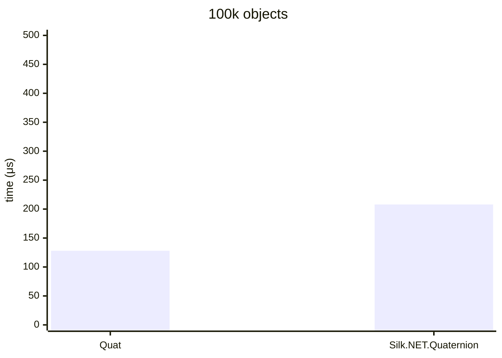
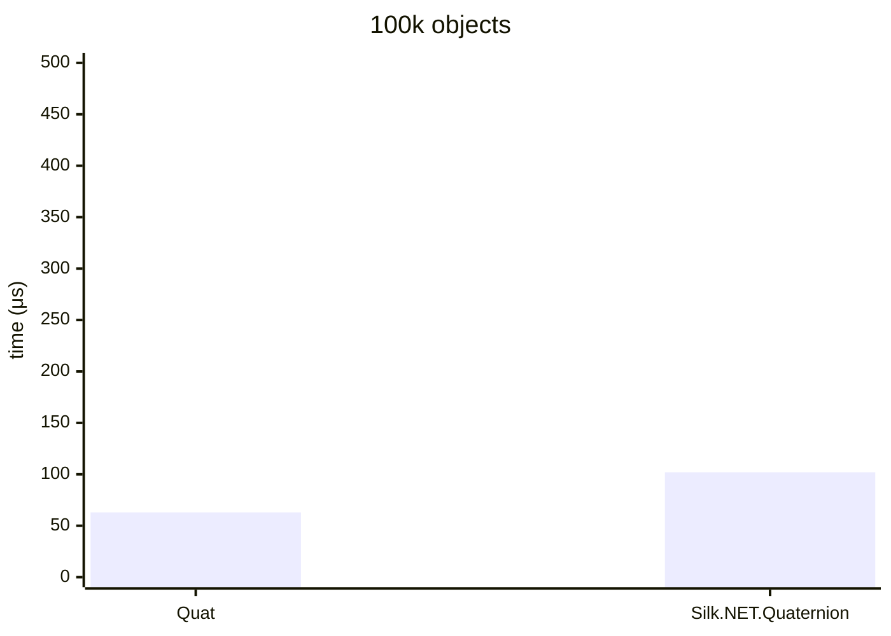
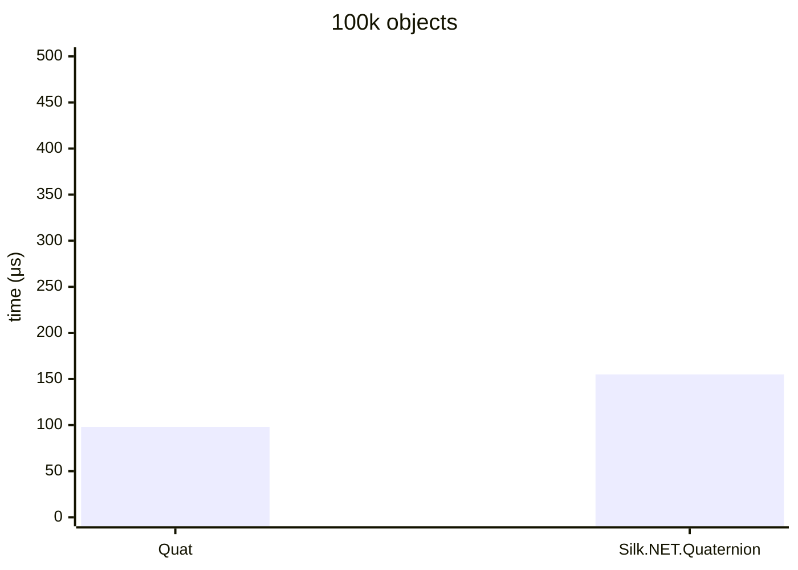

.NET 10.0.826.23019, X64 RyuJIT x86-64-v4, Windows 11 (10.0.26200.8457/25H2/2025Update/HudsonValley2), AMD Ryzen 9 7900X 4.70GHz

# Multiply



### Quat&lt;double&gt;

<details>
<summary>asm</summary>

```assembly
; System.Numerics.Bench.StressQuat`1[[System.Double, System.Private.CoreLib]].Multiply()
       push      rbx
       sub       rsp,20
       mov       rax,[rcx+10]
       xor       edx,edx
M00_L00:
       mov       r8,rax
       mov       r10,[rcx+8]
       mov       r9,r10
       mov       r11d,[r9+8]
       cmp       edx,r11d
       jae       near ptr M00_L01
       mov       rbx,rdx
       shl       rbx,5
       vmovups   ymm0,[r9+rbx+10]
       lea       r9d,[rdx+1]
       cmp       r9d,r11d
       jae       near ptr M00_L01
       mov       r11d,r9d
       shl       r11,5
       vmovups   ymm1,[r10+r11+10]
       vmovaps   ymm2,ymm0
       vmovaps   xmm3,xmm2
       vbroadcastsd ymm3,xmm3
       vpermilpd xmm2,xmm2,1
       vperm2f128 ymm0,ymm0,ymm0,1
       vpermilpd xmm4,xmm0,1
       vbroadcastsd ymm2,xmm2
       vbroadcastsd ymm0,xmm0
       vbroadcastsd ymm4,xmm4
       vpermq    ymm5,ymm1,1B
       vmulpd    ymm3,ymm5,ymm3
       vpermq    ymm5,ymm1,4E
       vmulpd    ymm2,ymm5,ymm2
       vshufpd   ymm5,ymm1,ymm1,5
       vmulpd    ymm0,ymm5,ymm0
       vmulpd    ymm1,ymm1,ymm4
       vfmadd132pd ymm3,ymm1,[7FF7FD4FC400]
       vfmadd132pd ymm2,ymm3,[7FF7FD4FC420]
       vfmadd231pd ymm2,ymm0,[7FF7FD4FC440]
       cmp       edx,[r8+8]
       jae       short M00_L01
       vmovups   [r8+rbx+10],ymm2
       mov       edx,r9d
       cmp       edx,1869F
       jl        near ptr M00_L00
       vzeroupper
       add       rsp,20
       pop       rbx
       ret
M00_L01:
       call      CORINFO_HELP_RNGCHKFAIL
       int       3
; Total bytes of code 224
```
</details>

### Silk.NET.Quaternion&lt;double&gt;

<details>
<summary>asm</summary>

```assembly
; System.Numerics.Bench.StressQuaternion`1[[System.Double, System.Private.CoreLib]].Multiply()
       sub       rsp,28
       xor       eax,eax
M00_L00:
       mov       rdx,[rcx+10]
       mov       r8,[rcx+8]
       mov       r10,r8
       mov       r9d,[r10+8]
       cmp       eax,r9d
       jae       near ptr M00_L01
       mov       r11,rax
       shl       r11,5
       lea       r10,[r10+r11+10]
       vmovsd    xmm0,qword ptr [r10]
       vmovsd    xmm1,qword ptr [r10+8]
       vmovsd    xmm2,qword ptr [r10+10]
       vmovsd    xmm3,qword ptr [r10+18]
       lea       r10d,[rax+1]
       cmp       r10d,r9d
       jae       near ptr M00_L01
       mov       r9d,r10d
       shl       r9,5
       lea       r8,[r8+r9+10]
       vmovsd    xmm4,qword ptr [r8]
       vmovsd    xmm5,qword ptr [r8+8]
       vmovsd    xmm16,qword ptr [r8+10]
       vmovsd    xmm17,qword ptr [r8+18]
       vmulsd    xmm18,xmm1,xmm16
       vmulsd    xmm19,xmm2,xmm5
       vsubsd    xmm18,xmm18,xmm19
       vmulsd    xmm19,xmm2,xmm4
       vmulsd    xmm20,xmm0,xmm16
       vsubsd    xmm19,xmm19,xmm20
       vmulsd    xmm20,xmm0,xmm5
       vmulsd    xmm21,xmm1,xmm4
       vsubsd    xmm20,xmm20,xmm21
       vmulsd    xmm21,xmm0,xmm4
       vmulsd    xmm22,xmm1,xmm5
       vaddsd    xmm21,xmm22,xmm21
       vmulsd    xmm22,xmm2,xmm16
       vaddsd    xmm21,xmm22,xmm21
       vmulsd    xmm0,xmm0,xmm17
       vmulsd    xmm4,xmm4,xmm3
       vaddsd    xmm0,xmm4,xmm0
       vaddsd    xmm0,xmm0,xmm18
       vmulsd    xmm1,xmm1,xmm17
       vmulsd    xmm4,xmm5,xmm3
       vaddsd    xmm1,xmm4,xmm1
       vaddsd    xmm1,xmm1,xmm19
       vmulsd    xmm2,xmm2,xmm17
       vmulsd    xmm4,xmm16,xmm3
       vaddsd    xmm2,xmm4,xmm2
       vaddsd    xmm2,xmm2,xmm20
       vmulsd    xmm3,xmm3,xmm17
       vsubsd    xmm3,xmm3,xmm21
       cmp       eax,[rdx+8]
       jae       short M00_L01
       lea       rax,[rdx+r11+10]
       vmovsd    qword ptr [rax],xmm0
       vmovsd    qword ptr [rax+8],xmm1
       vmovsd    qword ptr [rax+10],xmm2
       vmovsd    qword ptr [rax+18],xmm3
       mov       eax,r10d
       cmp       eax,1869F
       jl        near ptr M00_L00
       add       rsp,28
       ret
M00_L01:
       call      CORINFO_HELP_RNGCHKFAIL
       int       3
; Total bytes of code 327
```
</details><br/>

# Divide


### Quat&lt;double&gt;

<details>
<summary>asm</summary>

```assembly
; System.Numerics.Bench.StressQuat`1[[System.Double, System.Private.CoreLib]].Divide()
       push      rbx
       sub       rsp,20
       mov       rax,[rcx+10]
       vmovsd    xmm0,qword ptr [7FF7FD4DD520]
       xor       edx,edx
M00_L00:
       mov       r8,rax
       mov       r10,[rcx+8]
       mov       r9,r10
       mov       r11d,[r9+8]
       cmp       edx,r11d
       jae       near ptr M00_L01
       mov       rbx,rdx
       shl       rbx,5
       vmovups   ymm1,[r9+rbx+10]
       lea       r9d,[rdx+1]
       cmp       r9d,r11d
       jae       near ptr M00_L01
       mov       r11d,r9d
       shl       r11,5
       vmovups   ymm2,[r10+r11+10]
       vmulpd    ymm3,ymm2,ymm2
       vhaddpd   ymm3,ymm3,ymm3
       vperm2f128 ymm4,ymm3,ymm3,1
       vaddpd    ymm3,ymm4,ymm3
       vmulpd    ymm2,ymm2,[7FF7FD4DD540]
       vdivsd    xmm3,xmm0,xmm3
       vbroadcastsd ymm3,xmm3
       vmulpd    ymm2,ymm3,ymm2
       vmovaps   ymm3,ymm1
       vmovaps   xmm4,xmm3
       vbroadcastsd ymm4,xmm4
       vpermilpd xmm3,xmm3,1
       vperm2f128 ymm1,ymm1,ymm1,1
       vpermilpd xmm5,xmm1,1
       vbroadcastsd ymm3,xmm3
       vbroadcastsd ymm1,xmm1
       vbroadcastsd ymm5,xmm5
       vpermq    ymm16,ymm2,1B
       vmulpd    ymm4,ymm16,ymm4
       vpermq    ymm16,ymm2,4E
       vmulpd    ymm3,ymm16,ymm3
       vshufpd   ymm16,ymm2,ymm2,5
       vmulpd    ymm1,ymm16,ymm1
       vmulpd    ymm2,ymm2,ymm5
       vfmadd132pd ymm4,ymm2,[7FF7FD4DD560]
       vfmadd132pd ymm3,ymm4,[7FF7FD4DD580]
       vfmadd231pd ymm3,ymm1,[7FF7FD4DD5A0]
       cmp       edx,[r8+8]
       jae       short M00_L01
       vmovups   [r8+rbx+10],ymm3
       mov       edx,r9d
       cmp       edx,1869F
       jl        near ptr M00_L00
       vzeroupper
       add       rsp,20
       pop       rbx
       ret
M00_L01:
       call      CORINFO_HELP_RNGCHKFAIL
       int       3
; Total bytes of code 281
```
</details>

### Silk.NET.Quaternion&lt;double&gt;

<details>
<summary>asm</summary>

```assembly
; System.Numerics.Bench.StressQuaternion`1[[System.Double, System.Private.CoreLib]].Divide()
       sub       rsp,28
       vmovsd    xmm0,qword ptr [7FFF431AAA20]
       vmovsd    xmm1,qword ptr [7FFF431AAA28]
       xor       eax,eax
M00_L00:
       mov       rdx,[rcx+10]
       mov       r8,[rcx+8]
       mov       r10,r8
       mov       r9d,[r10+8]
       cmp       eax,r9d
       jae       near ptr M00_L01
       mov       r11,rax
       shl       r11,5
       lea       r10,[r10+r11+10]
       vmovsd    xmm2,qword ptr [r10]
       vmovsd    xmm3,qword ptr [r10+8]
       vmovsd    xmm4,qword ptr [r10+10]
       vmovsd    xmm5,qword ptr [r10+18]
       lea       r10d,[rax+1]
       cmp       r10d,r9d
       jae       near ptr M00_L01
       mov       r9d,r10d
       shl       r9,5
       lea       r8,[r8+r9+10]
       vmovsd    xmm16,qword ptr [r8]
       vmovsd    xmm17,qword ptr [r8+8]
       vmovsd    xmm18,qword ptr [r8+10]
       vmovsd    xmm19,qword ptr [r8+18]
       vmulsd    xmm20,xmm16,xmm16
       vmulsd    xmm21,xmm17,xmm17
       vaddsd    xmm20,xmm21,xmm20
       vmulsd    xmm21,xmm18,xmm18
       vaddsd    xmm20,xmm21,xmm20
       vmulsd    xmm21,xmm19,xmm19
       vaddsd    xmm20,xmm21,xmm20
       vdivsd    xmm20,xmm0,xmm20
       vmulsd    xmm16,xmm16,xmm20
       vmulsd    xmm16,xmm16,xmm1
       vmulsd    xmm17,xmm17,xmm20
       vmulsd    xmm17,xmm17,xmm1
       vmulsd    xmm18,xmm18,xmm20
       vmulsd    xmm18,xmm18,xmm1
       vmulsd    xmm19,xmm19,xmm20
       vmulsd    xmm20,xmm3,xmm18
       vmulsd    xmm21,xmm4,xmm17
       vsubsd    xmm20,xmm20,xmm21
       vmulsd    xmm21,xmm4,xmm16
       vmulsd    xmm22,xmm2,xmm18
       vsubsd    xmm21,xmm21,xmm22
       vmulsd    xmm22,xmm2,xmm17
       vmulsd    xmm23,xmm3,xmm16
       vsubsd    xmm22,xmm22,xmm23
       vmulsd    xmm23,xmm2,xmm16
       vmulsd    xmm24,xmm3,xmm17
       vaddsd    xmm23,xmm24,xmm23
       vmulsd    xmm24,xmm4,xmm18
       vaddsd    xmm23,xmm24,xmm23
       vmulsd    xmm2,xmm2,xmm19
       vmulsd    xmm16,xmm16,xmm5
       vaddsd    xmm2,xmm16,xmm2
       vaddsd    xmm2,xmm2,xmm20
       vmulsd    xmm3,xmm3,xmm19
       vmulsd    xmm16,xmm17,xmm5
       vaddsd    xmm3,xmm16,xmm3
       vaddsd    xmm3,xmm3,xmm21
       vmulsd    xmm4,xmm4,xmm19
       vmulsd    xmm16,xmm18,xmm5
       vaddsd    xmm4,xmm16,xmm4
       vaddsd    xmm4,xmm4,xmm22
       vmulsd    xmm5,xmm5,xmm19
       vsubsd    xmm5,xmm5,xmm23
       cmp       eax,[rdx+8]
       jae       short M00_L01
       lea       rax,[rdx+r11+10]
       vmovsd    qword ptr [rax],xmm2
       vmovsd    qword ptr [rax+8],xmm3
       vmovsd    qword ptr [rax+10],xmm4
       vmovsd    qword ptr [rax+18],xmm5
       mov       eax,r10d
       cmp       eax,1869F
       jl        near ptr M00_L00
       add       rsp,28
       ret
M00_L01:
       call      CORINFO_HELP_RNGCHKFAIL
       int       3
; Total bytes of code 445
```
</details></br>

# Conjugate



### Quat&lt;double&gt;

<details>
<summary>asm</summary>

```assembly
; System.Numerics.Bench.StressQuat`1[[System.Double, System.Private.CoreLib]].Conjugate()
       sub       rsp,28
       mov       rax,[rcx+10]
       xor       edx,edx
       nop       word ptr [rax+rax]
M00_L00:
       mov       r8,rax
       mov       r10,[rcx+8]
       cmp       edx,[r10+8]
       jae       short M00_L01
       mov       r9,rdx
       shl       r9,5
       vmovups   ymm0,[r10+r9+10]
       vmulpd    ymm0,ymm0,[7FF7FD4DA760]
       cmp       edx,[r8+8]
       jae       short M00_L01
       vmovups   [r8+r9+10],ymm0
       inc       edx
       cmp       edx,186A0
       jl        short M00_L00
       vzeroupper
       add       rsp,28
       ret
M00_L01:
       call      CORINFO_HELP_RNGCHKFAIL
       int       3
; Total bytes of code 88
```
</details>

### Silk.NET.Quaternion&lt;double&gt;

<details>
<summary>asm</summary>

```assembly
; System.Numerics.Bench.StressQuaternion`1[[System.Double, System.Private.CoreLib]].Conjugate()
       sub       rsp,28
       vmovsd    xmm0,qword ptr [7FFF431C9BC0]
       xor       eax,eax
M00_L00:
       mov       rdx,[rcx+10]
       mov       r8,[rcx+8]
       cmp       eax,[r8+8]
       jae       short M00_L01
       mov       r10,rax
       shl       r10,5
       lea       r8,[r8+r10+10]
       vmovsd    xmm1,qword ptr [r8]
       vmovsd    xmm2,qword ptr [r8+8]
       vmovsd    xmm3,qword ptr [r8+10]
       vmovsd    xmm4,qword ptr [r8+18]
       vmulsd    xmm1,xmm1,xmm0
       vmulsd    xmm2,xmm2,xmm0
       vmulsd    xmm3,xmm3,xmm0
       cmp       eax,[rdx+8]
       jae       short M00_L01
       lea       rdx,[rdx+r10+10]
       vmovsd    qword ptr [rdx],xmm1
       vmovsd    qword ptr [rdx+8],xmm2
       vmovsd    qword ptr [rdx+10],xmm3
       vmovsd    qword ptr [rdx+18],xmm4
       inc       eax
       cmp       eax,186A0
       jl        short M00_L00
       add       rsp,28
       ret
M00_L01:
       call      CORINFO_HELP_RNGCHKFAIL
       int       3
; Total bytes of code 124
```
</details></br>

# Inverse



### Quat&lt;double&gt;

<details>
<summary>asm</summary>

```assembly
; System.Numerics.Bench.StressQuat`1[[System.Double, System.Private.CoreLib]].Inverse()
       sub       rsp,28
       mov       rax,[rcx+10]
       vmovsd    xmm0,qword ptr [7FF7FD4EB240]
       xor       edx,edx
M00_L00:
       mov       r8,rax
       mov       r10,[rcx+8]
       cmp       edx,[r10+8]
       jae       short M00_L01
       mov       r9,rdx
       shl       r9,5
       vmovups   ymm1,[r10+r9+10]
       vmulpd    ymm2,ymm1,ymm1
       vhaddpd   ymm2,ymm2,ymm2
       vperm2f128 ymm3,ymm2,ymm2,1
       vaddpd    ymm2,ymm3,ymm2
       vmulpd    ymm1,ymm1,[7FF7FD4EB260]
       cmp       edx,[r8+8]
       jae       short M00_L01
       vdivsd    xmm2,xmm0,xmm2
       vbroadcastsd ymm2,xmm2
       vmulpd    ymm1,ymm2,ymm1
       vmovups   [r8+r9+10],ymm1
       inc       edx
       cmp       edx,186A0
       jl        short M00_L00
       vzeroupper
       add       rsp,28
       ret
M00_L01:
       call      CORINFO_HELP_RNGCHKFAIL
       int       3
; Total bytes of code 121
```
</details>

### Silk.NET.Quaternion&lt;double&gt;

<details>
<summary>asm</summary>

```assembly
; System.Numerics.Bench.StressQuaternion`1[[System.Double, System.Private.CoreLib]].Inverse()
       sub       rsp,28
       vmovsd    xmm0,qword ptr [7FFF431A9F98]
       vmovsd    xmm1,qword ptr [7FFF431A9FA0]
       xor       eax,eax
M00_L00:
       mov       rdx,[rcx+10]
       mov       r8,[rcx+8]
       cmp       eax,[r8+8]
       jae       near ptr M00_L01
       mov       r10,rax
       shl       r10,5
       lea       r8,[r8+r10+10]
       vmovsd    xmm2,qword ptr [r8]
       vmovsd    xmm3,qword ptr [r8+8]
       vmovsd    xmm4,qword ptr [r8+10]
       vmovsd    xmm5,qword ptr [r8+18]
       vmulsd    xmm16,xmm2,xmm2
       vmulsd    xmm17,xmm3,xmm3
       vaddsd    xmm16,xmm17,xmm16
       vmulsd    xmm17,xmm4,xmm4
       vaddsd    xmm16,xmm17,xmm16
       vmulsd    xmm17,xmm5,xmm5
       vaddsd    xmm16,xmm17,xmm16
       vdivsd    xmm16,xmm0,xmm16
       vmulsd    xmm2,xmm2,xmm16
       vmulsd    xmm2,xmm2,xmm1
       vmulsd    xmm3,xmm3,xmm16
       vmulsd    xmm3,xmm3,xmm1
       vmulsd    xmm4,xmm4,xmm16
       vmulsd    xmm4,xmm4,xmm1
       vmulsd    xmm5,xmm5,xmm16
       cmp       eax,[rdx+8]
       jae       short M00_L01
       lea       rdx,[rdx+r10+10]
       vmovsd    qword ptr [rdx],xmm2
       vmovsd    qword ptr [rdx+8],xmm3
       vmovsd    qword ptr [rdx+10],xmm4
       vmovsd    qword ptr [rdx+18],xmm5
       inc       eax
       cmp       eax,186A0
       jl        near ptr M00_L00
       add       rsp,28
       ret
M00_L01:
       call      CORINFO_HELP_RNGCHKFAIL
       int       3
; Total bytes of code 212
```
</details>
